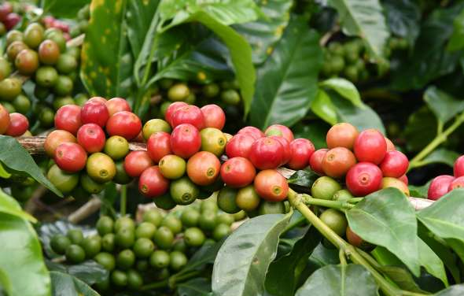

# SIPA Value Chain Analysis — Course Materials



Companion materials for the Value Chain Analysis guest lecture at Columbia's School of International and Public Affairs. The course uses coffee as the primary case study to teach a general VCA methodology.

**Browse the site: [ccerv1.github.io/value-chain-analysis](https://ccerv1.github.io/value-chain-analysis/)**

Instructor: Carl Cervone

---

## Start Here

New to the course? Read these in order:

1. **[The Coffee Value Chain: Cherry to Cup](lecture-notes/coffee-value-chain.md)** — Visual guide to every processing stage with photographs from producing countries
2. **[From Ethiopian Cherry to NYC Cup](lecture-notes/ethiopian-cherry-to-nyc-cup.md)** — Worked example tracing one kilogram from farm gate to Brooklyn pour-over, with full math
3. **[Value Chain Analysis: Lecture Notes](lecture-notes/value-chain-analysis.md)** — The analytical framework (Map / Breakdown / Benchmark), global market dynamics, and methodology
4. **Pick a case study** — [Vietnam](case-studies/vietnam.md), [Rwanda](case-studies/rwanda.md), or [Honduras](case-studies/honduras.md) to see the framework applied

---

## Course Materials

### [Lecture Notes](lecture-notes/README.md)

- [The Coffee Value Chain: Cherry to Cup](lecture-notes/coffee-value-chain.md) — Visual guide to every processing stage
- [From Ethiopian Cherry to NYC Cup](lecture-notes/ethiopian-cherry-to-nyc-cup.md) — Worked example: how $5.71 becomes $288
- [Value Chain Analysis](lecture-notes/value-chain-analysis.md) — Framework, market dynamics, methodology

### [Skills Guides](skills/README.md)

Six standalone guides, each teaching one discrete VCA skill.

1. [Mapping a Value Chain](skills/01-mapping-a-value-chain.md)
2. [Breaking Down Value Flows](skills/02-breaking-down-value-flows.md)
3. [Unit Conversion and Price Analysis](skills/03-unit-conversion-and-price-analysis.md)
4. [Benchmarking](skills/04-benchmarking.md)
5. [Prioritizing Recommendations](skills/05-prioritizing-recommendations.md)
6. [Conducting a Value Chain Deep Dive](skills/06-conducting-a-value-chain-deep-dive.md)

### [Case Studies](case-studies/README.md)

| Country | Focus | Status |
|---------|-------|--------|
| [Vietnam](case-studies/vietnam.md) | Engineered growth: 95% farmer share, highest yields, environmental cost | Current |
| [Rwanda](case-studies/rwanda.md) | Premium positioning on tiny farms: quality strategy vs living income gap | Current |
| [Honduras](case-studies/honduras.md) | Central America's quiet giant: resilience under compounding climate shocks | Current |
| [Colombia](case-studies/colombia.md) | Strong institutions, eroding margins: the FNC model under pressure | Archival |
| [Ethiopia](case-studies/ethiopia.md) | Traceability lost and found: the ECX experiment | Archival |

### [Slides](lectures/README.md)

Lecture slide decks by year (2017-2025), available as downloadable PDFs.

### [Data](data/README.md)

Downloadable datasets: USDA production, coffee prices, exports, exchange rates, and development indicators for major producing countries.

### [Reading List](reading-list/README.md)

Background readings: case study source documents, USAID/WFP methodology guides, and a coffee glossary.

### [Photos](photos/README.md)

Photographs, charts, and diagrams extracted from the lecture slides.

---

## For Developers

The data in this project can be regenerated from public sources. See [`scripts/`](https://github.com/ccerv1/value-chain-analysis/tree/main/scripts) for the Python scripts and setup instructions.

```bash
uv sync
uv run python scripts/fetch_usda_coffee.py
uv run python scripts/fetch_market_data.py
```
