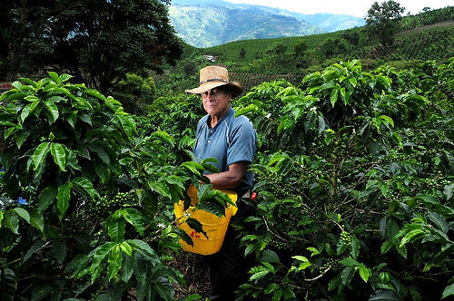
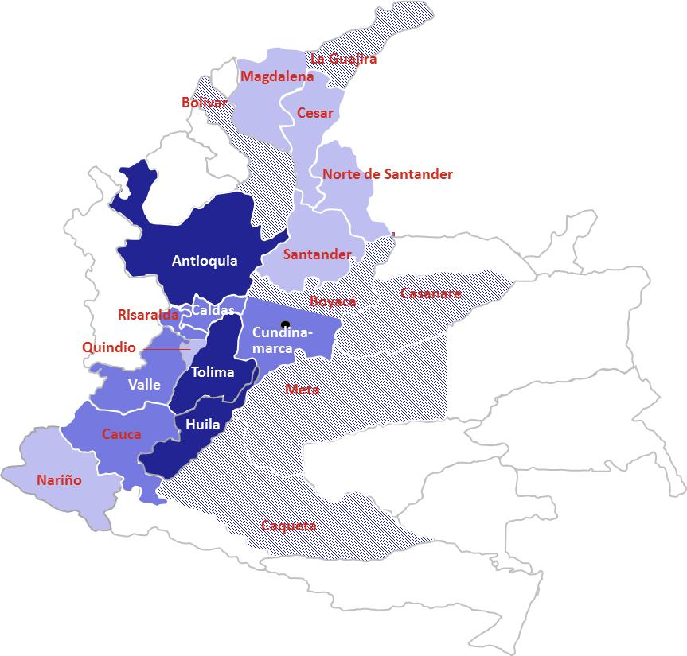

# Colombia: Strong Institutions, Eroding Margins



> **Archival note:** This case study reflects data from the 2017-2023 SIPA lectures. Some figures may be outdated. Colombia's coffee sector continues to evolve, and current conditions may differ from what is described here. The case remains valuable for understanding how institutional design shapes value chain dynamics.

## The Story

Colombia is one of the most recognized coffee origins in the world. The "Juan Valdez" brand, managed by the Federación Nacional de Cafeteros (FNC), is globally recognized. Colombian Supremo is a benchmark quality grade. The country supplies roughly 10% of global coffee volume, almost all Arabica, and commands premium prices in international markets.

The FNC is the distinctive feature of Colombia's coffee value chain — and the source of its central tension. Founded in 1927, the FNC is a unique hybrid institution: part cooperative, part research agency, part marketing organization, part quasi-governmental body. It provides extension services to farmers, operates research stations (Cenicafé), runs quality control labs, manages the Juan Valdez brand, and crucially, guarantees a purchase price to any farmer who brings coffee to an FNC buying point. This guarantee means that no Colombian coffee farmer is forced to sell at below a certain floor — a safety net that does not exist in most other origins.

But by the 2010s, the model was under strain. Farming costs had risen rapidly — labor, inputs, and land prices all increased. Coffee leaf rust (la roya) devastated production in 2008-2012, requiring expensive tree renovation. Meanwhile, the guaranteed purchase price could not fully keep pace with rising costs. The result: farmer margins eroded. The government spent an estimated $600 million subsidizing coffee farmers over several years to keep them afloat.

The tension: Colombia has arguably the strongest institutional infrastructure of any coffee-producing country. The FNC provides services that farmers in most other origins can only dream of. But that institutional strength comes at a cost — and when farming economics deteriorate, the institutions become part of the cost structure rather than a solution to it.

Colombia has approximately 550,000 coffee farmers. The sector is predominantly smallholder, but with a wider range of farm sizes than Rwanda or Ethiopia. Some Colombian farms are semi-commercial operations of 5-10 hectares; others are tiny plots of less than 1 hectare.

This is what makes Colombia worth studying closely — not just as a coffee producer, but as a case study in institutional design. The FNC model represents a deliberate, sustained attempt to redistribute value within a commodity chain toward primary producers. For roughly eight decades, it largely succeeded. Then the economics shifted. What the FNC built is genuinely impressive; what it could not control is what the case is really about.

---

## Map



**Actors:**

- **~550,000 farmers**: Mostly smallholders, wide range of farm sizes. Grow Arabica across multiple departments (Huila, Nariño, Antioquia, Tolima, Caldas, etc.). Farm size ranges from less than 1 hectare to semi-commercial operations of 5-10 hectares, with a small number of larger commercial farms.
- **FNC (Federación Nacional de Cafeteros)**: The dominant institutional player. Roles include:
  - Guaranteed purchase: any farmer can sell to FNC buying points at a published price
  - Extension services: Cenicafé research, field-level technical assistance
  - Quality control: cupping labs, export quality certification
  - Marketing: Juan Valdez brand, "100% Colombian Coffee" program
  - Price stabilization: manages the National Coffee Fund
- **Cooperatives**: FNC-affiliated cooperatives aggregate farmer production and operate buying points. They are the physical infrastructure of the guaranteed purchase system.
- **Private exporters**: Compete with the cooperative channel; some offer premiums for higher quality or certified coffees, particularly for specialty or micro-lot production from regions like Huila and Nariño.
- **Importers/traders**: International buyers, many with long-standing relationships with Colombian exporters. Colombia benefits from deep buyer familiarity — a decades-long asset built partly by FNC marketing.

**Value chain flow:**

```
Farmer → FNC Cooperative (buying point) → Exporter (cooperative or private) → International trader/importer → Roaster → Consumer
```

**Unique structural feature:** The FNC guaranteed purchase price creates a price floor that disciplines the entire chain. Private buyers must match or beat the FNC price to attract volume. This is fundamentally different from Vietnam (pure market competition) or Rwanda (CWS-mediated pricing where farmers have limited alternatives). In Colombia, the farmer always has a credible outside option.

**The National Coffee Fund:** Funded by a levy on exports, the Fund provides the financial backing for the guaranteed purchase price, the FNC's services, and stabilization payments during price downturns. It is the fiscal mechanism that makes the FNC model work — and it is why Colombia could spend an estimated $500-700 million subsidizing farmers during the 2012-2015 crisis period without the system collapsing. The mechanism was the PIC (Protección del Ingreso Cafetero), a per-unit price floor payment delivered through FNC cooperatives and funded by the national government.

---

## Breakdown

**Farmer share of export price:** Colombian farmers earn approximately 80% of the export price — typical for Latin American origins and partly a function of the FNC's institutional design. Most coffee-producing countries deliver more than 50% to the farmer. Vietnam is best in class at ~95%. Latin America is typically around 80%. Africa shows the most variation — Ethiopia around 65%, Rwanda around 54%. Colombia's figure reflects both the efficiency of the FNC channel and the price floor discipline described above.

But here is the key analytical point: **high revenue share does not equal high margins.** If costs are also high, a farmer receiving 80% of export price can still earn less net income than a farmer receiving 65% in a lower-cost production system. This is Colombia's predicament.

**Cost structure:**

Farming costs rose rapidly across the 2000s and 2010s:
- Labor costs increased as Colombia's economy grew and agricultural workers found alternative employment in construction, manufacturing, and services
- Input costs (fertilizer, pesticides, fungicides) rose with global commodity prices
- Tree renovation costs were substantial after la roya — infected trees had to be replaced, which required capital investment and several years of reduced production during the replanting period
- Land prices increased in coffee-growing regions, particularly as other land uses (cattle, urban expansion, illicit crops at the margins) competed for agricultural land

The net effect: the gap between the cost of producing a kilogram of coffee and the price received for it — the margin — compressed sharply. The FNC guaranteed price provided a floor, but the floor was below the cost of production for many farms during this period. Government subsidies filled part of the gap; some farmers exited.

**Price positioning:**

Colombia supplies roughly 10% of the global market at a premium price. Colombian green coffee typically trades at a positive differential to the ICE "C" contract (eg C + $0.15-0.30/lb), reflecting its quality reputation. The FNC's marketing investment over decades — Cenicafé's varietal development, the Juan Valdez brand, the "100% Colombian Coffee" certification program — contributes directly to this premium.

**Export channel split:**

The majority of Colombian coffee exports flow through the cooperative/FNC channel. Private exporters have grown in share, particularly for specialty and certified coffees, but the FNC remains the dominant buyer and exporter. This is different from most origins where private traders dominate.

---

## Benchmark

**Yields:** Colombia averages approximately 1.0 MT/ha — mid-range by global standards. Higher than Rwanda or Ethiopia, lower than Vietnam or Brazil. There is meaningful potential for improvement through tree renovation (newer varieties yield more) and more intensive management. But Colombia's mountainous terrain limits mechanization and raises labor costs per unit of output. The country cannot achieve Vietnam-style yields through intensification alone.

**Production trajectory:** Relatively stable over the long run, with a significant dip during the la roya crisis (2008-2012) and a recovery through renovación cafetería (government- and FNC-funded tree replacement programs). Colombia has not experienced dramatic growth (like Vietnam's robusta expansion) or prolonged stagnation (like Rwanda's decade-long plateau). Production has oscillated around 12-14 million bags.

**Price realization:** Premium positioning, well above commodity origins. Colombia benefits from both country-of-origin recognition and the FNC's quality control infrastructure. However, the premium has been partially offset by rising costs — earning more per kilogram than other origins does not resolve the cost problem.

**Comparison to peers:**

| Dimension | Colombia | Vietnam | Rwanda | Brazil |
|---|---|---|---|---|
| Volume (rough) | ~12-14M bags | ~30M bags | ~0.5M bags | ~60M bags |
| Primary type | Arabica | Robusta | Arabica | Arabica + Robusta |
| Farmer share | ~80% | ~95% | ~54% | 70-85% (varies by farm type) |
| Institutional support | Very strong (FNC) | Enabling (non-intermediating) | Moderate (building) | Weak-moderate |
| Cost competitiveness | Low | High | Low | High (mechanized) |
| Price premium | Yes | No | Emerging | Partial |
| Living income challenge | Yes | Less acute | Yes | Mixed |

**vs Vietnam:** Colombia earns more per kg but produces less per hectare. Vietnam's competitive advantage is cost and volume; Colombia's is quality and brand. The two countries are not really competing in the same market. Colombia cannot compete on cost; Vietnam cannot (currently) compete on quality reputation.

**vs Rwanda:** Similar challenges with farmer income and living wage — both produce premium Arabica with strong farmer share of export price, yet both face living income shortfalls. Colombia's FNC provides institutional support (extension, research, guaranteed price) that Rwanda is only beginning to build through its exporter-led model. More institution does not automatically mean better outcomes for farmers.

**vs Brazil:** Brazil's mechanized, large-farm model has dramatically lower unit costs. Colombian coffee production is simply more expensive — the terrain, the smallholder structure, and the labor intensity all contribute. Colombia must compete on quality and brand differentiation; competing on cost is not an option.

---

## Recommendations

From the 2017-2023 lectures:

**1. Segment strategies by producer type.** A single policy for 550,000 farms misses the heterogeneity in the sector. Different farms need different interventions:
- Small subsistence farmers (<2 ha): focus on yield improvement and cost reduction through basic agronomy. Extension services and Cenicafé's improved varieties are the priority.
- Semi-commercial farms (2-10 ha): quality improvement, certification programs, direct trade relationships. These farms can capture specialty premiums if connected to the right buyers.
- Larger commercial operations (>10 ha): efficiency, diversification, potential for value addition on-farm (wet mills, micro-lots, direct export).

**2. Address the cost structure, not just price.** The problem is not primarily that Colombian farmers receive a low share of the export price (they receive 80%). The problem is that costs have risen faster than prices. Interventions focused solely on increasing the farm-gate price — without addressing labor productivity, input efficiency, or tree renovation — will require ongoing subsidy without resolving the underlying gap. Interventions should focus on reducing costs as much as increasing prices.

**3. Evaluate the FNC model.** The FNC provides enormous value but also significant cost. Are all of its functions still necessary? Are there efficiencies to be gained? Could some services be delivered differently — through digital platforms, private sector partnerships, or reformed cooperative structures? This is a politically sensitive question (the FNC has 550,000 members who vote) but an analytically important one. The system was designed in 1927; the economy has changed.

**4. Living income as explicit policy goal.** Like Rwanda, many Colombian farmers struggle to earn a living income from coffee alone — particularly smaller producers on less than 2 hectares. The policy response cannot be: "keep the FNC price floor up and hope." It must include honest accounting of what minimum farm size and productivity level generates a living income, and what to do about farmers below that threshold (diversification, off-farm income, consolidation, exit support).

---

## Discussion Questions

1. The FNC guaranteed purchase price protects farmers from the worst of price volatility. But does it also reduce incentives for quality improvement (since farmers know they have a guaranteed buyer regardless of quality)? How would you test this hypothesis empirically? What data would you need?

2. Colombia spent an estimated $600 million subsidizing coffee farmers during the 2008-2014 period. Was this a good use of public resources? What alternatives might have achieved the same goals at lower cost — or different goals more effectively?

3. Compare Colombia's institutional model (FNC) to Vietnam's model (minimal institutional intermediation, near-pure market competition). What are the tradeoffs? Under what conditions does each model work better — for whom?

4. If you were advising the Colombian government, would you recommend reforming the FNC, expanding it, or leaving it unchanged? What specific changes would you propose, and what political economy obstacles would you anticipate?

5. Colombia and Rwanda both produce premium Arabica with strong farmer share of export price, yet both face living income challenges. What does this tell us about the limits of value chain interventions for addressing farmer poverty? What would need to be true for value chain reform to be sufficient?

---

*This case study is part of a series for the Value Chain Analysis course. See also: [Vietnam](vietnam.md), [Rwanda](rwanda.md), [Ethiopia](ethiopia.md) (archival). For the analytical framework, see the [Skills Guides](../skills/README.md) and [Lecture Notes](../lecture-notes/value-chain-analysis.md).*
