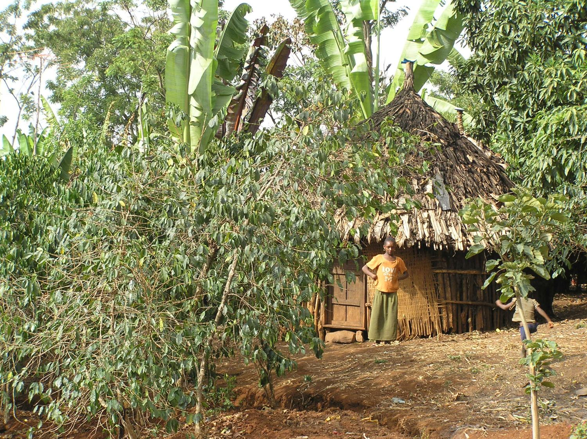

# Ethiopia: Traceability Lost and Found

*Value Chain Analysis — Columbia SIPA*

> **Archival note:** This case study reflects data from the 2017-2020 SIPA lectures. Ethiopia's coffee sector has undergone significant changes since, including ECX reforms that have restored some traceability. Current conditions may differ materially from what is described here. The case remains valuable as a study of how market design choices affect value chain performance.

---

## The Story

Ethiopia is the birthplace of coffee. The country has extraordinary genetic diversity in its Arabica varieties, a centuries-old coffee culture, and some of the most distinctive flavor profiles in the world. Ethiopian Yirgacheffe, Sidamo, and Harrar are recognized grades that command premiums in specialty markets.

The country is also one of the most complex origins to analyze. Ethiopia has two distinct coffee value chains — washed and unwashed (natural) — that involve different actors, different processing, and different economics. Washed coffee, processed through cooperatives, earns a significant quality premium. Unwashed coffee, which represents the majority of production, is simpler to process but trades at lower prices.

Between 2003 and 2012, the value of Ethiopia's coffee exports quadrupled. But here is the critical finding: export volumes stayed essentially flat over the same period. The quadrupling of revenue came overwhelmingly from rising global coffee prices. Ethiopian production increased modestly over the period, but nowhere near enough to explain the revenue growth. The country rode a price wave without changing its underlying economics.

Then came the Ethiopia Commodity Exchange (ECX). Launched in 2008, the ECX was designed to solve real problems: intermediaries had exploited information asymmetry to underpay farmers, price manipulation was common, and the quality of market data was poor. The ECX aimed to bring transparency, standardized grading, and efficient price discovery to Ethiopia's agricultural commodity markets. For most commodities, it arguably succeeded. For coffee, the design had a critical flaw: most coffee — with the exception of cooperative-channel coffee — had to be traded through the exchange, where the ECX assigned quality grades and pooled coffees by region.

The unintended consequence was devastating for specialty coffee. The ECX eliminated traceability — the ability to trace a specific coffee back to a specific cooperative, washing station, or region at a granular level. When a buyer purchased "ECX Grade 2 Sidamo," they could not know which specific washing station produced it. For the specialty market, which values provenance and pays premiums for traceable, high-quality lots, this was a deal-breaker.

The market responded. Ethiopia's export differentials — the premium above the C price — dropped after the ECX eliminated traceability. Specialty buyers signaled reduced demand for Ethiopian coffee. The country was destroying value by making its best coffees anonymous.

Cooperatives, however, could bypass the ECX. The cooperative channel maintained direct traceability — a cooperative could sell a specific lot from a specific washing station directly to an international buyer. This created a two-tier system: cooperative coffee with traceability and premiums, and ECX coffee without.

TechnoServe, an international NGO, introduced a new value chain model that worked within the cooperative channel. By improving wet processing quality, strengthening cooperative management, and connecting cooperatives directly with specialty buyers, the program helped farmers earn a higher share of the export price. Total value creation from the TechnoServe-supported cooperative model exceeded $20 million per year.

Ethiopia's central tension: the best coffee genetics on the planet, undermined by a market design that made its best lots anonymous.

---

## Map

**Actors:**

- **An estimated 4-5 million smallholder farmers (the exact count is disputed).** Ethiopia has an enormous number of coffee farmers — estimates vary widely, and the exact number is one of the open questions in the industry. Most are very small-scale, growing coffee alongside food crops, often in semi-forest or garden systems.
- **Collectors (sebsabis).** Local traders who buy cherry from farmers and aggregate it for sale to larger buyers. Operate in both washed and unwashed channels.
- **Cooperatives.** Farmer-owned organizations that operate washing stations and can export directly, bypassing the ECX. Historically the quality channel.
- **The ECX (Ethiopia Commodity Exchange).** The mandatory trading platform for most non-cooperative coffee. Grades coffee by quality and pools by region. Eliminates individual lot traceability.
- **Exporters.** Purchase from the ECX or directly from cooperatives. Arrange international sale and shipping.

**Two parallel chains:**

1. **Unwashed/natural channel** (majority of volume): Farmer → Collector → ECX → Exporter → Importer. Cherry is dried with the fruit on, processed at dry mills, traded through the ECX. Lower quality, lower price, no traceability.

2. **Washed/cooperative channel** (minority of volume, higher value): Farmer → Cooperative washing station → Cooperative union → Exporter/Direct buyer → Importer. Cherry is wet-processed at the cooperative's washing station. Higher quality, higher price, full traceability.

The cooperative channel is the only path to full traceability and specialty premiums — which is why interventions like TechnoServe's focused on strengthening this channel.

---

## Breakdown

**Export revenue growth.** Ethiopia's coffee export revenues quadrupled between 2003/04 and 2011/12. Export volumes stayed flat. The revenue growth was entirely price-driven — Ethiopia benefited from rising global coffee prices without increasing production. This is a cautionary data point: headline revenue growth can mask stagnation in underlying productive capacity.

**Washed vs. unwashed premium.** Ethiopian washed coffee earns a significant premium over unwashed. The exact differential varies, but it is substantial enough to justify the additional processing cost. The premium was undermined when the ECX pooled washed and unwashed coffees under common regional grades, collapsing the price signal that had previously rewarded quality investment.

**Export differentials declined.** After the ECX eliminated traceability, Ethiopia's differential over the ICE "C" price dropped. Specialty buyers who had been paying premiums for traceable Ethiopian lots reduced their purchases or shifted to other origins. The market was sending a clear signal: traceability has economic value, and destroying it destroys value.

**The cooperative channel margin.** Cooperatives can bypass the ECX, but the cooperative channel takes approximately 35% of the value between farmer and export. This covers wet processing costs (washing station operation), cooperative overhead, cooperative union levies, and transport. Whether 35% is excessive depends on the services provided and the alternatives available to farmers. In most cases, the premium earned through the cooperative channel more than offsets the margin taken — farmers in the cooperative channel capture a higher absolute share of the export price than farmers in the unwashed channel, even accounting for the 35% margin.

**TechnoServe intervention.** TechnoServe introduced a model that improved wet processing quality at cooperative washing stations, strengthened cooperative governance and management, and connected cooperatives with specialty buyers willing to pay premiums for traceable, high-quality lots. The results:
- Farmers earned a higher share of the export price
- Total value creation exceeded $20 million per year
- The model demonstrated that quality-focused interventions could work at scale in the cooperative channel

**Farmer share.** Farmer share data for Ethiopia is harder to pin down than for Vietnam or Rwanda due to the complexity of the chain and the variation between washed and unwashed channels — roughly 55-65% depending on channel. In the 2010/11 data from the lectures, farmers in the unwashed channel captured a lower share than those in the cooperative washed channel — consistent with the broader pattern that disintermediated, traceable chains return more value to producers.

---

## Benchmark

**Yields.** Ethiopia has the lowest farm yields among major coffee origins — below 0.5 MT/ha. For comparison:

| Origin | Yield (MT/ha) |
|---|---|
| Vietnam | 3.0+ |
| Brazil | 1.5-2.0 |
| Colombia | ~1.0 |
| Rwanda | ~0.6 |
| Ethiopia | <0.5 |

The low yields reflect semi-forest and garden production systems (low-density planting), minimal input use, old tree stock, and limited extension services reaching the vast majority of farmers. There is enormous upside potential — but also cultural and ecological reasons to preserve traditional production systems, which maintain genetic biodiversity and forest cover.

**Price positioning.** Ethiopia is a high-price origin when traceability is maintained. Yirgacheffe, Sidamo, and Harrar command specialty premiums. The ECX undermined this positioning for non-cooperative coffee by making provenance anonymous at the point of trade.

**Comparison to peers:**

- *vs. Vietnam:* Opposite model in almost every dimension. Vietnam has the highest yields, lowest per-kg prices, and shortest chain. Ethiopia has the lowest yields, high per-kg prices (when traceable), and a complex multi-channel chain. Vietnam's strength is efficiency; Ethiopia's is differentiation. Neither approach is strictly superior — it depends on what the market rewards.

- *vs. Colombia:* Both are premium Arabica origins with strong quality reputations. Colombia has much stronger centralized institutions (the FNC) that manage branding, extension, and price floors. Ethiopia has greater variety diversity and a more distinctive flavor profile but weaker institutional infrastructure.

- *vs. Rwanda:* Similar structural challenges — small farms, low yields, living income gaps, dependence on development interventions to improve quality. Rwanda has invested more systematically in CWS infrastructure; Ethiopia has greater scale and variety diversity. The two-channel problem (cooperative/traceable vs. middleman/anonymous) appears in both countries.

---

## Recommendations

From the 2017-2020 lectures:

**1. Restore and expand traceability.** The ECX experiment demonstrated that traceability has quantifiable economic value. Specialty buyers pay more when they can trace coffee to a specific origin, cooperative, or washing station. Policy reforms should prioritize enabling traceability throughout the chain, not just in the cooperative channel.

**2. Support cooperative channel development.** The cooperative channel is the proven path to quality premiums and farmer value capture. Strengthening cooperative governance, improving wet processing quality, and connecting cooperatives with specialty buyers — as TechnoServe demonstrated — creates measurable value. The $20M+/year figure from a single intervention suggests the returns to additional investment in this channel are substantial.

**3. Increase yields.** Ethiopia has the lowest yields among major origins. Even modest improvements — from 0.4 to 0.8 MT/ha — would roughly double farmer income per hectare without any change in price. Tree renovation, input access, and extension services are the levers. The challenge is reaching millions of dispersed farmers in remote areas. This is an area where the cooperative structure could help: cooperatives provide a natural platform for extension delivery.

**4. Address the washed/unwashed quality gap.** Expanding wet processing capacity — more washing stations, more cooperative infrastructure — would shift volume from the lower-value unwashed channel to the higher-value washed channel. This requires capital investment and training but the per-unit economics are favorable.

---

## Discussion Questions

1. The ECX was designed to bring transparency and efficiency to agricultural markets. For most commodities, it arguably succeeded. Why did it fail for specialty coffee? What does this tell us about the difference between commodity markets and specialty markets?

2. TechnoServe's intervention created $20M+/year in value through the cooperative channel. What are the limits of this model? Could it scale to cover all of Ethiopia's coffee production, or is it inherently limited to the cooperative segment?

3. Ethiopia's low yields are partly a function of traditional semi-forest production systems that maintain biodiversity and forest cover. Is there a tradeoff between yield improvement and environmental conservation? How should policymakers navigate this tradeoff?

4. Compare Ethiopia's dual-channel system (washed cooperative + unwashed ECX) with Rwanda's dual-channel system (CWS + middleman). What structural similarities and differences exist? What can each country learn from the other?

5. If you were designing a commodity exchange for Ethiopian coffee from scratch, what would you do differently from the ECX? How would you balance market efficiency, price transparency, and traceability?

---

*This case study is part of a series for the Value Chain Analysis course. See also: [Vietnam](vietnam.md), [Rwanda](rwanda.md), [Colombia](colombia.md) (archival). For the analytical framework, see the [Skills Guides](../skills/README.md) and [Lecture Notes](../lecture-notes/value-chain-analysis.md).*

*Data last verified: March 2026*
