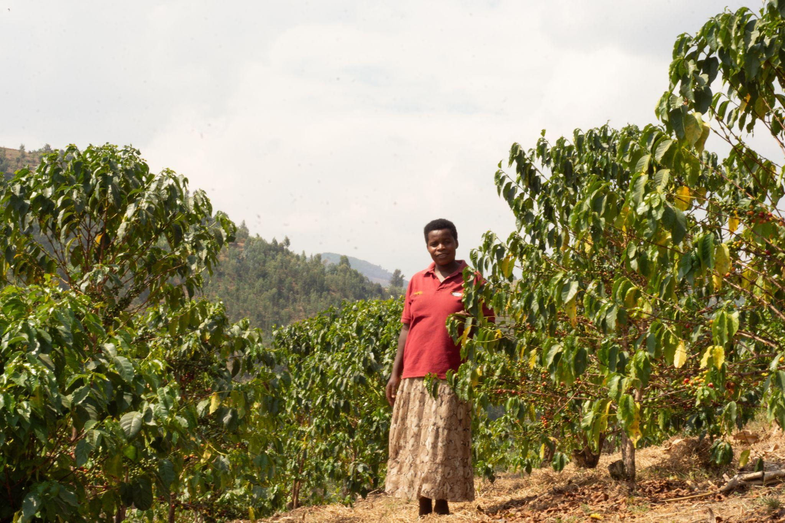
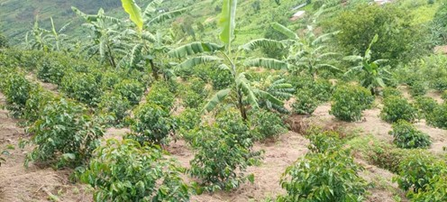
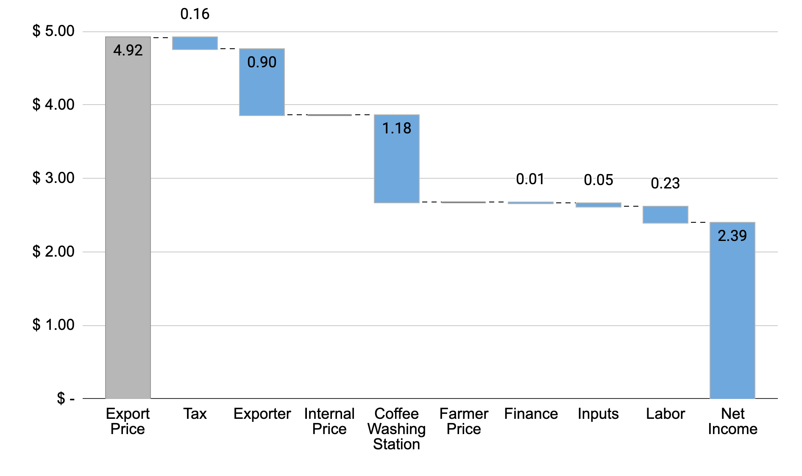
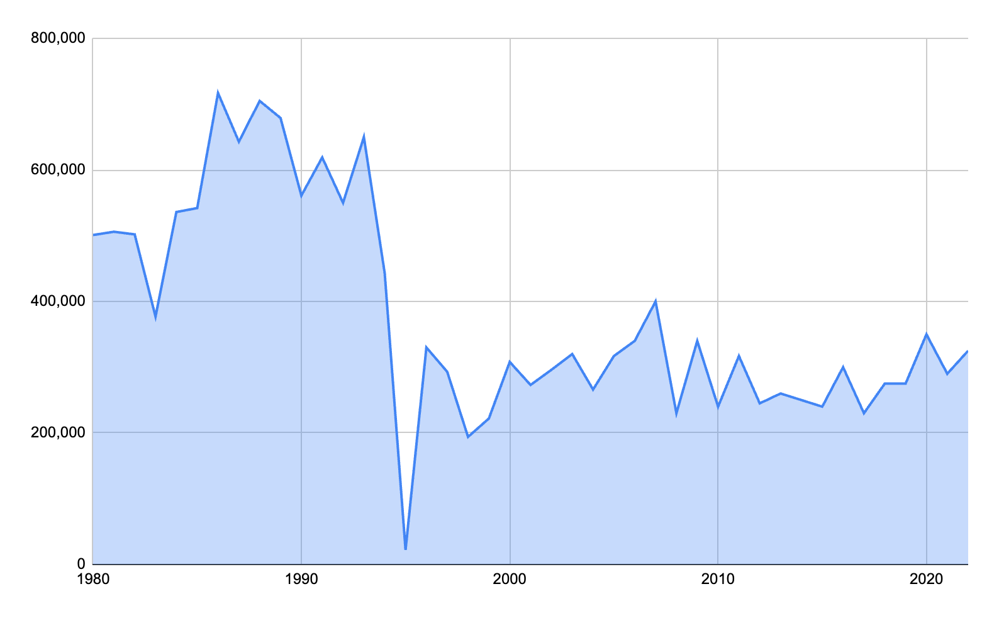

# Rwanda: Premium Positioning on Tiny Farms

*Value Chain Analysis — Columbia SIPA*

---

## The Story

Rwanda produces less than 1% of global coffee. It cannot compete on volume. The country's terrain — steep volcanic hillsides, fragmented smallholder plots, no coastal access — makes the scale game impossible. So Rwanda decided not to play it.

Instead, beginning in the early 2000s and accelerating after the government's Vision 2020 strategy, Rwanda made a deliberate bet on quality. The logic was simple: if you can't be the biggest, be the best. The mechanism for that bet was infrastructure — specifically, a national network of coffee washing stations (CWS) that could transform hand-picked cherry from 350,000 scattered smallholders into traceable, fully washed Arabica capable of earning specialty premiums in New York, London, and Tokyo.

That infrastructure now numbers roughly 312 coffee washing stations. These are not small operations. A CWS requires capital investment in de-pulping machines, fermentation tanks, raised drying beds, and water systems. It requires trained staff to manage the critical 24-72 hour fermentation window that separates clean specialty coffee from flat, fermented commodity. And it requires trust — farmers must deliver fresh cherry within hours of picking, which means the CWS must be close enough to reach by foot or motorbike and must be known to pay fairly and on time.

The CWS network is where Rwanda's value chain story actually happens. It is the quality node. Before the CWS boom, most Rwandan coffee was sun-dried naturals of inconsistent quality, sold into commodity pools. After it, Rwanda began appearing on specialty café menus as a named origin — "Rwanda Nyamasheke," "Rwanda Gitesi" — with flavor notes of stone fruit, black tea, and brown sugar that reflected both the high-altitude terroir and the quality of processing.

Government support was essential. The Rwanda Development Board, USAID's SPREAD program, and a constellation of other donors provided subsidized loans for CWS construction, technical assistance for quality improvement, and marketing support at international trade shows. This was not a pure market outcome — it was a public-private strategy executed over two decades.

The results are real. Rwanda now earns positive differentials over the Arabica "C" price in specialty markets. Its cupping scores and traceable washing station provenance make it competitive with Ethiopia and Kenya in premium segments. On a per-kilogram basis, Rwandan farmers receive more than their counterparts in most African origins.

And yet the math is brutal.

A typical Rwandan coffee farm is about 0.1 hectares — roughly a quarter-acre. At average yields of around 600 kg of green coffee equivalent per hectare, that farm produces about 60 kg of exportable green coffee per year. At a farmer price of approximately $2.67/kg green equivalent, the farmer earns about $160 per year from coffee.

The living income requirement for a typical Rwandan family is around $2,500 per year.

The gap is $2,340. Premium positioning has not closed it. Even doubled premiums would not close it. The constraint is not the price — it is the volume. When the farm is small enough, the math doesn't work regardless of how well you position the product.

This is Rwanda's central tension: a quality strategy that has genuinely worked at the supply chain level, delivering higher per-kilogram prices and international recognition, while leaving the fundamental income problem unsolved. The farmer who picks coffee by hand, carries cherry to the washing station, and waits 30 days for payment may be contributing to a cup sold for $7 in Brooklyn — and still earning less in a year than the Brooklyn barista earns in a week.

The sector is also in transition. Historically, cooperatives owned and operated most washing stations. Cooperatives pooled farmer cherry, shared processing costs, and in principle passed profits back to members. Increasingly, private exporters are building or acquiring stations — integrating processing and export into a single vertically-coordinated operation. The top 3 exporters are estimated to represent a majority of export volume (the One Acre Fund analysis cited over 70%, though exact market shares shift year to year). This consolidation brings genuine benefits: private investors can move faster, maintain equipment better, and offer more consistent purchase prices. But it also shifts power. When the washing station is owned by the exporter rather than the cooperative, the farmer's ability to negotiate or switch channels diminishes.

The honest question for Rwanda's coffee sector is not whether the quality strategy was the right choice — it almost certainly was, given the country's constraints. The question is what comes next. Can yield improvements and continued quality investment deliver meaningfully higher incomes within the value chain? Or must Rwanda's farmers be understood as multi-crop, diversified rural households for whom coffee is one income source among several — and the value chain's job is simply to make that one source as efficient as possible?

That question has no clean answer. What follows is the analytical framework to sharpen it.

---

## Map

### Actors

**~350,000 smallholder farmers**
Most cultivate less than 1 acre (0.4 hectares) of Arabica alongside food crops — beans, bananas, maize. Coffee is a cash crop, not a subsistence crop. Farmers harvest cherry by hand, typically over a 2-3 month picking season (April-June, with some secondary crops). At most farms, coffee represents one income stream among several. Delivery options: bring cherry to the nearest CWS or sell to a passing middleman.

**~312 coffee washing stations (CWS)**
The critical quality node in the chain. CWS de-pulp incoming cherry (removing the fruit skin), ferment the beans in water for 24-72 hours to remove the mucilage, wash with clean water, and dry on raised beds for 2-3 weeks. This fully washed process is what enables Rwanda's specialty positioning. CWS process an estimated 60-80% of Rwanda's total coffee volume. They are both privately owned and cooperative-operated, though the balance is shifting toward private ownership.

**Middlemen**
Handle 20-40% of volume as "ordinary" or semi-washed coffee. Middlemen buy cherry directly from farmers — often at the farm gate or roadside — and aggregate volume for sale to exporters or small processors. This channel serves farmers who are too far from a CWS, need cash immediately rather than waiting for CWS payment cycles, or whose cherry quality does not meet CWS standards. The trade-off is price: middleman channel coffee earns lower prices.

**~100 exporters**
Aggregate parchment coffee from multiple washing stations, arrange dry milling (hulling the parchment to reveal green bean, then grading by size and density), and export. The market is concentrated — a handful of large exporters (including Rwacof/Sucafina and Rwanda Trading Company) handle a majority of volume, with the top 3 estimated at over 70% (per One Acre Fund analysis). Increasingly, leading exporters are vertically integrated, owning their own washing stations and sometimes their own dry mills. This blurs the traditional actor boundary between "processor" and "exporter."

**Importers**
98% of Rwanda's coffee is consumed outside the country. Specialty importers — green coffee traders and direct-trade roaster-buyers — are the primary destination for high-quality fully washed lots. Standard commercial buyers purchase lower-grade volume.

### Two Parallel Channels

**CWS channel (60-80% of volume)**
Farmer → CWS → Exporter → Importer

Produces fully washed Arabica. Higher quality, traceable to individual washing station lots, capable of earning specialty premiums. This is the channel Rwanda's quality strategy is built on.

**Middleman channel (20-40% of volume)**
Farmer → Middleman → Exporter → Importer

Produces semi-washed or "ordinary" coffee. Lower quality, less traceable, sold at commodity prices. This channel is not going away — it serves real functions (immediate payment, geographic access) — but it produces less value per kilogram.

The structural shift from cooperative-led to exporter-led washing stations is redrawing the map. As private exporters acquire or build CWS, the line between "CWS" and "exporter" blurs. What was once a chain — farmer to cooperative CWS to independent exporter — increasingly becomes a vertically coordinated system where one private company manages processing, dry milling, and export.

*Source: One Acre Fund analysis.*

---

## Breakdown

Rwandan farmers earn approximately 54% of the export price — near the low end globally, where most countries deliver more than 50% to the farmer. Here is the math.

### The Conversion (from the 2025 lecture)

Starting inputs:
- Export price: $2.23/lb green (Arabica ICE "C" of $1.83 + market differential of +$0.40)
- Farmer price: 500 RWF/kg cherry

**Step 1 — Convert cherry price to USD:**
500 RWF/kg cherry × 0.00076 USD/RWF = **$0.38/kg cherry**

**Step 2 — Convert to per-pound:**
$0.38/kg cherry × 0.45 kg/lb = **$0.17/lb cherry**

**Step 3 — Account for cherry-to-green conversion ratio (approximately 7:1 by weight):**
$0.17/lb cherry × 7 lb cherry/lb green = **$1.20/lb green**

**Step 4 — Farmer share:**
$1.20 / $2.23 = **54%**

In per-kilogram terms: export price ≈ $4.92/kg green. Farmer receives ≈ $2.67/kg green equivalent.

### Where Does the Other 46% Go?

The gap between the farmer price and the export price is not rent extraction — it reflects real costs in a capital-intensive supply chain.

**CWS processing costs.** Wet processing requires equipment (de-pulpers, fermentation tanks, raised drying tables), water, electricity, and trained labor. Capital costs for constructing a CWS run into hundreds of thousands of dollars. Ongoing operational costs are substantial. The CWS must be paid.

**Transport.** Rwanda is landlocked. All exports must move by road to Mombasa (Kenya) or Dar es Salaam (Tanzania) — roughly 1,500-2,000 km. Transport costs are meaningful and non-negotiable. Additionally, coffee moves from hillside farms to CWS, CWS to dry mill, dry mill to transit port. Each leg has cost.

**Dry milling and export preparation.** Converting CWS parchment to exportable green requires hulling, grading, sorting, and quality control. Specialty buyers expect tight size and density grades and thorough defect removal.

**Government levies and sector investment.** Rwanda taxes coffee exports to fund agricultural extension services, quality inspection programs, sector promotion at trade shows, and the cupping labs that underpin its specialty positioning. These are real public goods, funded through the value chain.

**Exporter margin.** Thin by global standards — Rwandan exporters operate in a competitive market — but necessary to attract private investment into infrastructure.

*Note: Cost of production estimates do not include costs for installation of wet milling equipment, tree renovation, or financing costs.*

### The Living Income Gap

| Item | Value |
|------|-------|
| Farm size | 0.1 hectare |
| Farm yield | 600 kg green/hectare |
| Farm production | ~60 kg green/year |
| Farmer price | $2.67/kg green |
| **Annual coffee income** | **~$160** |
| Living income requirement | ~$2,500/year |
| **Gap** | **~$2,340/year** |

The scale of the gap reveals something important about the limits of value chain interventions. If the farmer currently captures 54% of the export price, and we imagine the theoretically impossible scenario where the farmer captures 100% — zero cost to processing, transport, milling, or export — the farmer's income would rise from $160 to approximately $296/year. Still less than 12% of the living income threshold.

The constraint is not efficiency or equity in the value chain. The constraint is farm size. On a 0.1-hectare plot, no price is high enough.

This does not mean value chain improvements are irrelevant. Higher prices and better farm practices improve farmer welfare at the margin. But it does mean that closing the income gap requires something the value chain alone cannot deliver: more production per household, through larger farms, higher yields, or additional income sources.

---

## Benchmark

### Yields

Rwanda's average yield of approximately 0.6 MT/ha is mid-range among major origins. Ethiopia, the world's most important specialty origin, averages below 0.5 MT/ha — but Ethiopia's farms are larger and production is more extensive. Vietnam tops the global table at 3+ MT/ha, the result of modern varieties, high inputs, and irrigation on relatively flat terrain. Colombia sits around 0.8-1.0 MT/ha.

Rwanda's hilly terrain and small plot sizes impose structural limits on yield improvement. Tractors cannot operate on many slopes. Irrigation infrastructure is difficult to install and maintain. But agronomic improvements — better variety selection, fertilizer use, shade management, tree renovation — could realistically push yields from 0.6 to 1.0+ MT/ha on farms where conditions permit.

### Production Trend

Stable but flat since 2000. Rwanda has not experienced the dramatic volume growth of Vietnam or Brazil, nor the production declines seen in some Central American origins affected by coffee leaf rust. The sector is mature relative to its small base. Total production typically ranges between 15,000-30,000 MT of green coffee per year — less than Ethiopia produces in a single month.

### Price Positioning

Rwanda has genuinely achieved premium positioning relative to most African origins. Its fully washed Arabica earns positive differentials over the Arabica "C" price in specialty markets — meaning buyers pay above the commodity benchmark specifically for Rwandan provenance and quality. This is the payoff for two decades of quality infrastructure investment.

Not all Rwandan coffee is specialty. The 20-40% that moves through the middleman channel earns commodity or near-commodity prices. But the CWS channel's output has established Rwanda as a recognized premium origin.

### Comparison to Peers

**vs. Vietnam:** Rwanda earns a higher price per kilogram — often 2-3x more per kg at the farm gate. But Vietnam's yields are 5x higher. The income per hectare comparison is not close: a Vietnamese coffee farmer on 1 hectare earns more in a good year than a Rwandan farmer might earn in a decade. Rwanda's quality premium is real but cannot compensate for the volume gap.

**vs. Colombia:** Both countries face rising costs and persistent farmer income pressure despite premium positioning. Colombia's institutional model — the Federación Nacional de Cafeteros (FNC) as a quasi-government actor managing marketing, extension, and price floors — differs sharply from Rwanda's shift toward private exporter dominance. Both models have strengths and fragilities.

**vs. Ethiopia:** Similar farm sizes, similar yield challenges, similar terrain complexity. Ethiopia has benefited from extraordinary wild genetic diversity and longstanding specialty market recognition (Yirgacheffe, Sidama, Harrar). Rwanda has invested more systematically in wet processing infrastructure. Ethiopia's cooperative export model has been subject to significant policy uncertainty; Rwanda's regulatory environment has been more stable.

---

## Recommendations

The impact-feasibility matrix below assesses four commonly discussed interventions for Rwanda's coffee value chain.

| Recommendation | Impact | Feasibility | Position |
|----------------|--------|-------------|----------|
| Improve smallholder yields and quality | High | High | Top priority |
| Transfer higher share of export price to farmers | High | Medium | Meaningful but limited |
| Export roasted coffee direct to consumers | High | Low | Aspirational |
| Boost local coffee consumption | Low | Low | Not a priority |

**Improve smallholder yields and quality — top priority.** This is the only lever that can materially close the income gap within the coffee sector. A farm producing 60 kg/year at $2.67/kg earns $160. A farm producing 150 kg/year at $3.20/kg (higher yield + higher quality premium) earns $480 — still far below a living income, but three times higher. Yield improvement through tree renovation, certified input use, and agronomy training is the most direct path. It is also feasible: Rwanda has extension infrastructure, existing CWS relationships with farmers, and documented agronomic best practices for high-altitude Arabica.

**Transfer a higher share of export price to farmers — meaningful but limited.** Structural reform of how value is distributed — through cooperative ownership models, transparent pricing mechanisms, or competitive cherry buying — can improve farmer share at the margin. But as the living income math shows, even a theoretical 100% farmer share cannot close the gap. This intervention is worth pursuing for equity and governance reasons, but should not be mistaken for a solution to the income problem.

**Export roasted coffee direct to consumers — aspirational.** Value-added export (roasted, packaged, ready for retail) would in theory capture significantly more value domestically. In practice, Rwanda lacks the roasting infrastructure, cold-chain logistics, retail relationships, and brand presence in consuming markets to pursue this at scale. A few small specialty exporters are experimenting with it. It is a long-term aspiration, not a near-term lever.

**Boost local coffee consumption — not a priority.** 98% of Rwanda's coffee is consumed abroad. The domestic market is tiny, most of the population drinks tea, and increasing domestic consumption at the margins would have negligible income effects for farmers. Resources spent here are better deployed elsewhere.

**The honest conclusion:** no single value chain intervention can close the $2,340/year living income gap. The most promising path combines:

1. Yield improvement — from 600 toward 1,000+ kg/ha through tree renovation, inputs, and agronomy training
2. Quality improvement — higher cupping scores translate to higher premiums, especially as specialty market competition intensifies
3. Livelihood diversification — accepting that coffee is one income source among several for Rwandan rural households, and that the value chain's job is to make that source as reliable and well-compensated as possible

This third point is uncomfortable for a value chain analysis course focused on coffee. But intellectual honesty requires it. The farm size constraint is structural. Premium positioning has done real work. The next increment of improvement will come from within the chain — but closing the gap entirely requires a broader rural development lens.

---

## Discussion Questions

1. Can a country producing less than 1% of global coffee realistically sustain a premium pricing strategy? What happens if other small African origins — Burundi, DRC, Uganda — adopt the same quality-positioning strategy? Is there a ceiling on how much specialty demand can absorb?

2. The living income gap is approximately $2,340/year. Design a combination of interventions — within and beyond the coffee value chain — that could plausibly close it for a typical Rwandan coffee household. Be specific about magnitudes and timelines.

3. Rwanda's coffee sector is transitioning from cooperative-led to exporter-led processing. What are the potential benefits and risks of this shift for farmers? How should policymakers respond — and what tools do they actually have available?

4. Rwanda is landlocked — all coffee exports must transit through Kenya (Mombasa) or Tanzania (Dar es Salaam). How does this geographic constraint affect costs, negotiating leverage, and supply chain resilience? What, if anything, can be done about it?

5. Compare Rwanda's approach — premium quality, small volume — to Vietnam's approach — commodity volume, maximum efficiency. Under what conditions does each strategy make sense? Could Rwanda plausibly pursue a Vietnam-like strategy? Should it want to?

---

*This case study is part of a series for the Value Chain Analysis course. See also: [Vietnam](vietnam.md), [Colombia](colombia.md) (archival), [Ethiopia](ethiopia.md) (archival). For the analytical framework, see the [Skills Guides](../skills/README.md) and [Lecture Notes](../lecture-notes/value-chain-analysis.md).*
