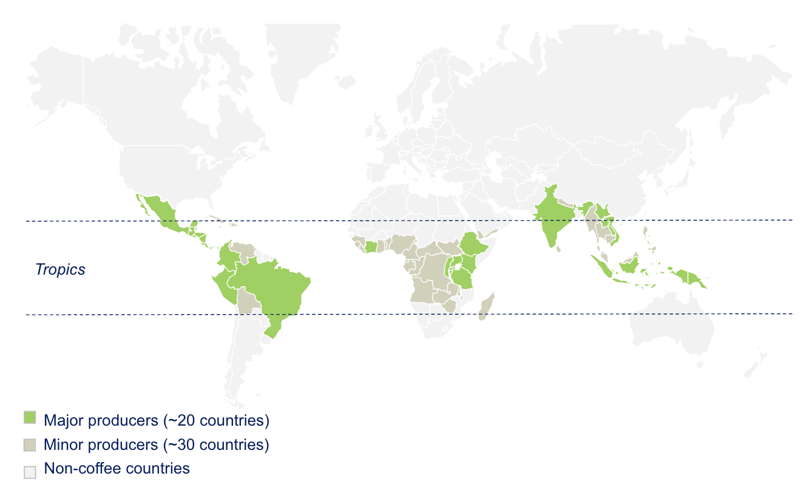

# From Cherry to Cup

Coffee grows in a belt around the tropics, roughly between the Tropics of Cancer and Capricorn. The largest producers are Brazil, Vietnam, Colombia, Indonesia, and Ethiopia.

Here is what happens to coffee on its journey from cherry to cup.

---

## 1. Growing

Coffee is a fruit that grows on trees in tropical climates, roughly between the Tropics of Cancer and Capricorn. There are two commercially important species: **Arabica**, which accounts for about 60% of global production and is prized for its complex flavor, and **Robusta**, which accounts for the remaining 40% and is hardier, higher-yielding, and more bitter.

A coffee tree takes 3-4 years to produce its first harvest. Trees can be productive for decades with good management. Some trees are still producing coffee after 100 years.

There are approximately **12.5 million coffee farms** worldwide (per Enveritas estimates). Over 95% are smallholders — farms smaller than 5 hectares. Many are far smaller: a typical Rwandan farm is 0.1 hectares; a typical Vietnamese farm is about 1 hectare. Some very large mechanized farms exist, particularly in Brazil, but they are the exception.

---

## 2. Harvesting

On smallholder farms, coffee cherries are **harvested by hand**. Pickers select ripe cherries (bright red) and leave unripe ones (green) on the tree to be picked in a later pass. This selective picking is labor-intensive but produces higher-quality coffee.

On large mechanized farms in Brazil, **mechanical harvesters** strip all cherries from the tree at once — ripe and unripe together. This is far more efficient but requires subsequent sorting to remove unripe cherries.

The critical fact about cherry is that it must be processed quickly after picking, **within hours, not days**, or it begins to ferment and degrade. This time pressure shapes the entire logistics of the post-harvest chain.

A coffee cherry has several layers: the outer skin, a layer of sweet fruit pulp (mucilage), a papery parchment layer, a thin silverskin, and finally the seed, which is what we call the coffee bean. Most cherries contain two beans, facing each other flat-side in.

---

## 3. Wet Processing

There are two main processing methods. In the **washed** (wet) process, more common with Arabica coffee, the cherry is mechanically **de-pulped** within hours of picking. A machine strips the outer skin and most of the fruit from the bean.

The de-pulped beans are then placed in **fermentation tanks** filled with water for 12-72 hours. Fermentation breaks down the remaining mucilage (the sticky fruit layer). After fermentation, the beans are **washed** in channels with clean water to remove all traces of fruit.

In the **natural** (dry) process, more common with Robusta coffee and in regions with limited water, the whole cherry is dried with the fruit still on the bean. No de-pulping, no fermentation, no washing. The fruit dries and is later removed mechanically. This method is simpler but requires careful management to avoid mold and off-flavors.

Historically, the choice between washed and natural processing was driven by water availability, infrastructure, and climate. Up until the mid 2000s, most of the premium market was filled with washed Arabica coffee, whereas most of the commodity market was satisfied with naturally-processed Arabica and Robusta coffee. Nowadays, the high end of the market features both washed and naturally-processed coffees (and a variety of other unique and interesting processing methods somewhere in between). However, the low end of the market is still dominated by naturally-processed coffee.

---

## 4. Drying

After washing, the beans, now called **parchment coffee** (because the bean is still wrapped in its papery parchment hull), are spread on raised drying beds or patios. Drying takes 7-14 days depending on weather and humidity. The target moisture content is 10-12%.

Raised beds (also called African beds) allow air circulation beneath the coffee, producing more even drying and better quality. Patio drying is cheaper but slower. Mechanical dryers exist for high-volume operations.

Proper drying is critical for quality, to prevent mold, and to ensure coffee flavors remain stable during storage and transport.

---

## 5. Dry Milling

At the dry mill, the parchment hull is removed (hulled) to reveal the **green coffee bean**. Green coffee is then **graded** by size (using screens with different hole sizes), by density (using air tables or gravity separators), and by color (using electronic optical sorters that detect defects).

Milling is capital-intensive and concentrated. A country with hundreds of thousands of farms may have only dozens of dry mills. The mill is where individual farm lots are typically blended into larger export lots, though specialty coffee increasingly preserves lot separation through the mill.

The output is **green coffee** — the traded commodity. It is commonly packed into 60-kg jute bags, palletized, and loaded into shipping containers for export.

---

## 6. Export and Shipping

Green coffee is stored in warehouses, often at the port, before being loaded into **shipping containers**. A standard container holds approximately 300 bags (18 metric tons) of green coffee.

Coffee is traded internationally in US dollars, priced either as a differential to the ICE "C" futures contract (for Arabica) or to the ICE London contract (for Robusta). The **FOB price** (Free On Board), the price at the port of export, is the standard reference point for value chain analysis.

Export is the narrowest point in the hourglass. Roughly 12.5 million farms feed into fewer than 10,000 international traders. This concentration gives traders significant market and information advantages.

---

## 7. Roasting

Roasting transforms green coffee into the brown, aromatic product consumers recognize. Green coffee that costs $3-5 per kilogram wholesale becomes roasted coffee that retails for $10-40 per kilogram. Roasting is where a disproportionate share of the value is added. 

Once coffee is roasted, it becomes perishable. This is an important reason why very few producers roast their own coffee.

Roasters blend coffees from different origins and roast to specific profiles depending on the target market and the characteristics of the beans. Because coffee is both perishable and seasonal, it is important for large roasters to have multiple sources of coffee with similar flavor profiles and to have the flexibility to match the season and the market.

---

## 8. Quality Control

**Cupping** is the standardized method for evaluating coffee quality. Small samples are roasted, ground, steeped in hot water, and then tasted by trained cuppers who score the coffee on aroma, flavor, acidity, body, balance, and overall impression.

The SCA (Specialty Coffee Association) cupping protocol scores coffee on a 100-point scale. Coffee scoring **80 or above** is classified as specialty grade. This threshold is the dividing line between the commercial and specialty markets, and it carries significant price implications.

Cupping happens at multiple points in the chain, at the washing station (to assess processing quality), at the dry mill (to grade before export), and at the importer/roaster (to verify what was purchased).

---

## 9. Retail and Consumption

Roasted coffee is ground, packaged, and sold through retail channels (supermarkets, specialty shops, online) or brewed and sold by the cup in cafes and restaurants.

A kilogram of green coffee produces roughly **50 cups** of brewed coffee (others get around 55-65 cups per kilogram). At a retail price of $4-6 per cup, that kilogram generates $200+ in consumer revenue. The farmer who grew it received $3-5. Understanding where the difference goes, and what can be changed, is the core question of value chain analysis.
