# Value Chain Analysis — Complete Course Materials

*Single-document version for editing. Each section corresponds to a page on the site.*

---

<!-- ================================================ -->
<!-- PAGE: Introduction > Why VCA? -->
<!-- SOURCE: site/introduction/why-vca.md -->
<!-- ================================================ -->

# Why Do Value Chain Analysis?

Value chain analysis is a practical framework for understanding how things are made, who does what, who gets paid what, and where leverage exists for change. It is used across development, business, finance, and technology. Today we apply it to coffee.

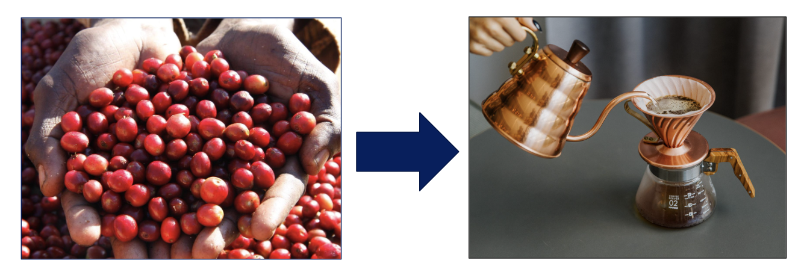

## How much value does the farmer capture?

One of the most common questions I have gotten from students over the years is:

*"What share of the price the consumer pays actually goes back to the farmer?"*

I have been tracking this anecdotally every year as part of the lecture:

| Year | Farm-gate price ($/kg green) | NYC specialty cup | Farmer's share of retail |
|------|------------------------------|-------------------|--------------------------|
| 2026 | ~$5.67 | ~$5.75 | ~2.0% |
| 2025 | ~$4.50 | ~$6.00 | ~1.5% |
| 2024 | ~$4.00 | ~$6.00 | ~1.3% |
| 2023 | ~$4.00 | ~$5.00 | ~1.6% |
| 2022 | ~$4.00 | ~$4.00 | ~2.0% |

The quick version of the answer is: **1-2%**. The farmer's share of the retail cup price has stayed between 1-2% for as long as I have been measuring it. Absolute prices have changed but the structural ratio hasn't much.

Why? And what, if anything, can be done about it?

Today you'll learn how to derive the answer to this question yourself. More importantly, you'll learn a framework for analyzing value chains and diagnosing where the problems are. Let's walk through the math for this year's numbers.

## Basic coffee value chain math

An Ethiopian farmer picks coffee cherry from her trees and sells it at the local market. That cherry is processed, exported, roasted, and eventually brewed into a pour-over at a specialty cafe here in New York City.

There are some physical conversions to keep in mind:

- Six kilos of *cherry coffee* yield about one kilogram of *green coffee*.
- One kilogram of green coffee yields about 50 cups of brewed coffee. (We'll assume it's strong, pour-over coffee.)

There are also some currency conversions:

- Consumers in the US pay for cups of coffee in dollars
- Farmers in Ethiopia sell cherry in Ethiopian birr (ETB). The exchange rate is about 127 ETB/USD.

Finally, we need to know the prices at the start and end of the value chain:

- Farm-gate cherry price: **120 ETB/kg** ([Sucafina 2025/26 harvest report](https://sucafina.com/emea/news/ethiopia-2025-26-harvest-update))
- Brewed specialty coffee price: **$5.75/cup** (average pour-over price at a specialty cafe near Columbia's campus in March 2026 according to ChatGPT)

Now we do some math:

1. Convert the farm-gate cherry price to USD:
120 ETB/kg ÷ 127 ETB/USD = **$0.94/kg cherry**

2. Convert the cherry to green equivalent:
$0.94/kg cherry x 6 = **$5.67/kg green equivalent**

3. Convert the green equivalent to cups:
$5.67/kg green equivalent ÷ 50 cups/kg green = **$0.1134/cup**

4. Calculate the farmer's share of the retail price:
$0.1134/cup ÷ $5.75/cup = **2.0%**

So, the farmer captures 2% of the retail value.

## Is 2% a lot or a little?

In objective terms, 2% may seem like very little. After the coffee leaves their farm, it undergoes a series of value-adding steps: processing, export, roasting, distribution, and ultimately brewing into a cup of coffee. 

The final stage -- from roasted bean to cup -- generates more than 80% of the retail value. Example: You can buy specialty Ethiopian coffee for approximately $20 per 12 ounce bag at the supermarket, which is about $1.20 per cup ($20 / 0.75 pounds per bag x 2.2 pounds per kilo = $60 per kg / 50 cups per kg = $1.20 per cup). This is mostly a function of rent and labor costs.

On the other hand, the farmer's share of the export price is about 70%. After it leaves their farm, there are various stages of post-harvest processing, transport, quality control, and more. Is this a good or bad ratio? If we want to improve the farmer's income, is the best lever to increase her share of the export or retail price? 

Or is it to keep the same share but boost the outright price? Lower her own cost of production, making her profit margin higher? Grow more coffee so her income per hectare is higher? Grow less coffee and switch to a higher-value crop?

The answer is: it depends on the context.

Value chain analysis is more than just calculating who earns what in a food system. It's about putting numbers like 70% of the export price into context and then determining what can be done to improve the situation.

Let's jump in!

---

<!-- ================================================ -->
<!-- PAGE: Introduction > Session Objectives -->
<!-- SOURCE: site/introduction/objectives.md -->
<!-- ================================================ -->

# Session Objectives

After this lecture, you should be able to:

- **Convert** between local farm-gate prices and international standards
- **Map** the actors in a value chain and trace how value flows between them
- **Benchmark** a country's performance against peers
- **Diagnose** where the real problems (and opportunities) are
- **Recommend** interventions that are both high-impact and feasible

The goal is not just to understand coffee. It is to learn a methodology you can apply to any agricultural commodity in any country.


---

<!-- ================================================ -->
<!-- PAGE: Introduction > Session Overview -->
<!-- SOURCE: site/introduction/overview.md -->
<!-- ================================================ -->

# Session Overview

1. **[Coffee 101](../lecture-notes/coffee-value-chain.md)** -- The product, the processing chain, the market structure

2. **The VCA Framework** -- Five analytical skills, each producing a specific output:

    - [Mapping value chain actors](../skills/01-mapping-a-value-chain.md) -- Identify who does what and how they relate to each other
    - [Breaking down value flows](../skills/02-breaking-down-value-flows.md) -- Trace costs and revenues through the chain
    - [Dealing with unit conversions](../skills/03-unit-conversion-and-price-analysis.md) -- Convert between local and international units
    - [Benchmarking](../skills/04-benchmarking.md) -- Compare performance across countries and time
    - [Formulating recommendations](../skills/05-prioritizing-recommendations.md) -- Prioritize interventions using an impact-feasibility matrix

3. **[Case Studies](../case-studies/README.md)** -- Five countries, same analytical framework, different answers

4. **[Practical Tips](../lecture-notes/practical-tips.md)** -- Fieldwork advice and using AI for your own analysis


---

<!-- ================================================ -->
<!-- PAGE: Coffee 101 > From Cherry to Cup -->
<!-- SOURCE: lecture-notes/coffee-value-chain.md -->
<!-- ================================================ -->

# From Cherry to Cup

Here is what happens to coffee on its journey from cherry to cup.

---

## 1. Growing


Coffee is a fruit that grows on trees in tropical climates, roughly between the Tropics of Cancer and Capricorn. There are two commercially important species: **Arabica**, which accounts for about 60% of global production and is prized for its complex flavor, and **Robusta**, which accounts for the remaining 40% and is hardier, higher-yielding, and more bitter.

A coffee tree takes 3-4 years to produce its first harvest. Trees can be productive for decades with good management. Some trees are still producing coffee after 100 years.

There are approximately **12.5 million coffee farms** worldwide (per Enveritas estimates). Over 95% are smallholders — farms smaller than 5 hectares. Many are far smaller: a typical Rwandan farm is 0.1 hectares; a typical Vietnamese farm is about 1 hectare. Some very large mechanized farms exist, particularly in Brazil, but they are the exception.

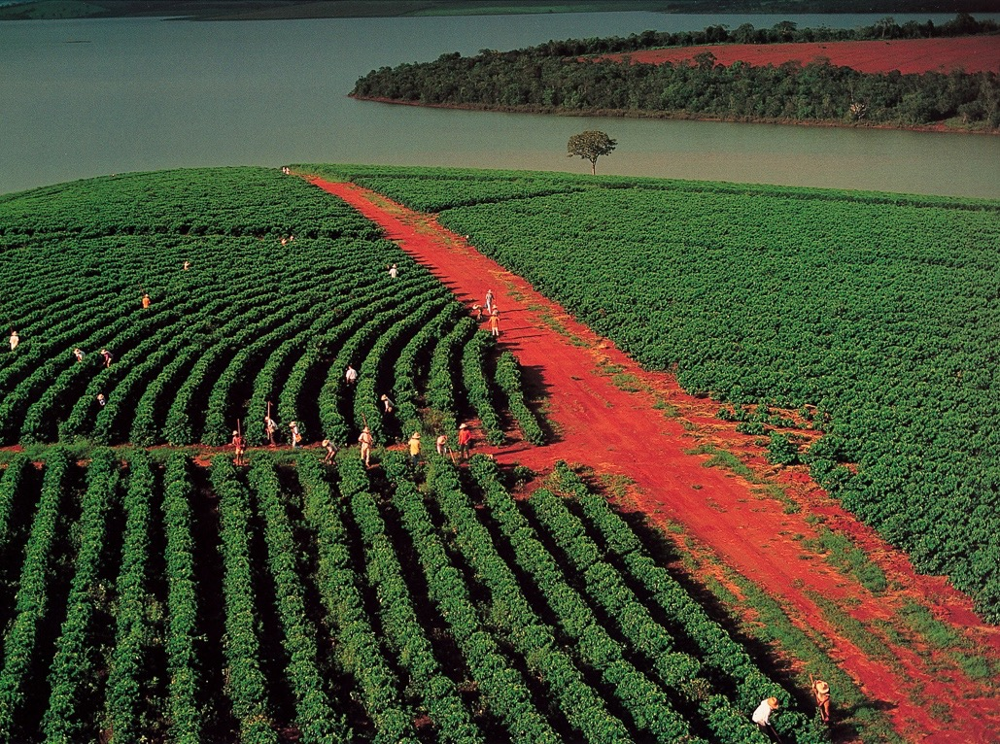

---

## 2. Harvesting

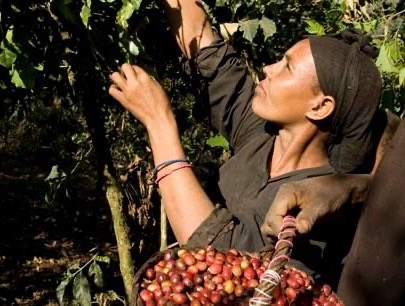

On smallholder farms, coffee cherries are **harvested by hand**. Pickers select ripe cherries (bright red) and leave unripe ones (green) on the tree to be picked in a later pass. This selective picking is labor-intensive but produces higher-quality coffee.

On large mechanized farms in Brazil, **mechanical harvesters** strip all cherries from the tree at once — ripe and unripe together. This is far more efficient but requires subsequent sorting to remove unripe cherries.

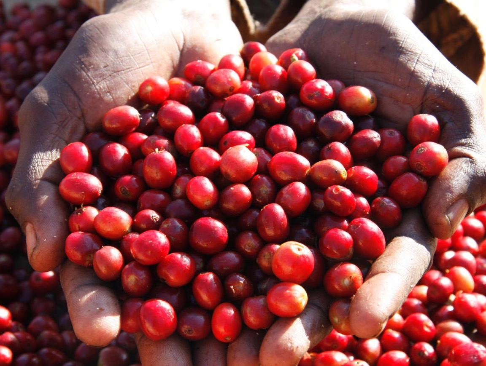

The critical fact about cherry is that it must be processed quickly after picking, **within hours, not days**, or it begins to ferment and degrade. This time pressure shapes the entire logistics of the post-harvest chain.

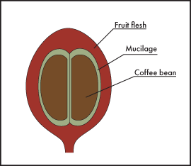

A coffee cherry has several layers: the outer skin, a layer of sweet fruit pulp (mucilage), a papery parchment layer, a thin silverskin, and finally the seed, which is what we call the coffee bean. Most cherries contain two beans, facing each other flat-side in.

---

## 3. Wet Processing

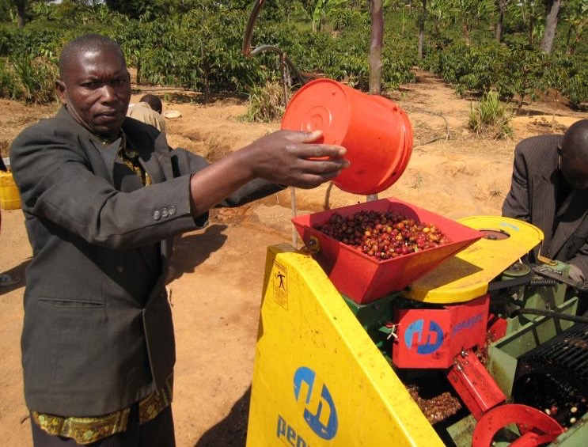

There are two main processing methods. In the **washed** (wet) process, more common with Arabica coffee, the cherry is mechanically **de-pulped** within hours of picking. A machine strips the outer skin and most of the fruit from the bean.

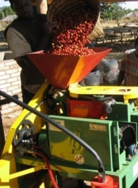

The de-pulped beans are then placed in **fermentation tanks** filled with water for 12-72 hours. Fermentation breaks down the remaining mucilage (the sticky fruit layer). After fermentation, the beans are **washed** in channels with clean water to remove all traces of fruit.

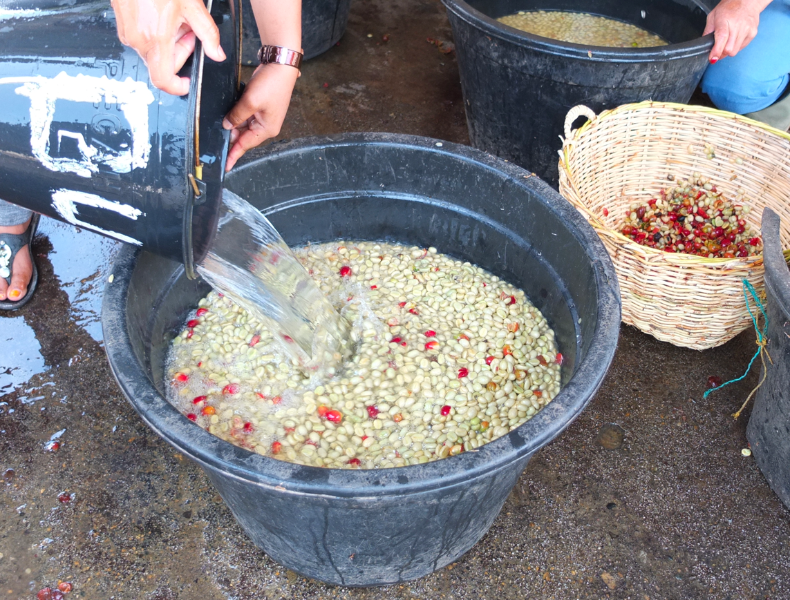

In the **natural** (dry) process, more common with Robusta coffee and in regions with limited water, the whole cherry is dried with the fruit still on the bean. No de-pulping, no fermentation, no washing. The fruit dries and is later removed mechanically. This method is simpler but requires careful management to avoid mold and off-flavors.

Historically, the choice between washed and natural processing was driven by water availability, infrastructure, and climate. Up until the mid 2000s, most of the premium market was filled with washed Arabica coffee, whereas most of the commodity market was satisfied with naturally-processed Arabica and Robusta coffee. Nowadays, the high end of the market features both washed and naturally-processed coffees (and a variety of other unique and interesting processing methods somewhere in between). However, the low end of the market is still dominated by naturally-processed coffee.

---

## 4. Drying

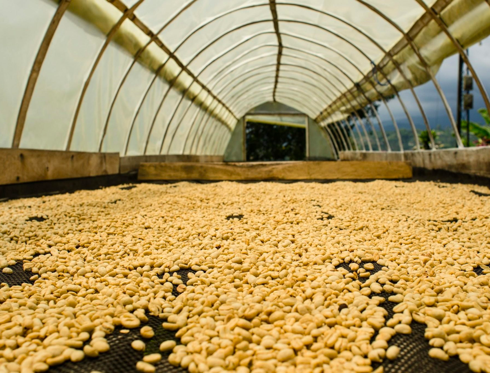

After washing, the beans, now called **parchment coffee** (because the bean is still wrapped in its papery parchment hull), are spread on raised drying beds or patios. Drying takes 7-14 days depending on weather and humidity. The target moisture content is 10-12%.

Raised beds (also called African beds) allow air circulation beneath the coffee, producing more even drying and better quality. Patio drying is cheaper but slower. Mechanical dryers exist for high-volume operations.

Proper drying is critical for quality, to prevent mold, and to ensure coffee flavors remain stable during storage and transport.

---

## 5. Dry Milling

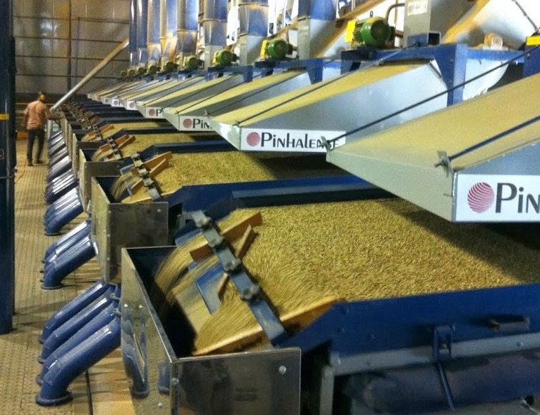

At the dry mill, the parchment hull is removed (hulled) to reveal the **green coffee bean**. Green coffee is then **graded** by size (using screens with different hole sizes), by density (using air tables or gravity separators), and by color (using electronic optical sorters that detect defects).

Milling is capital-intensive and concentrated. A country with hundreds of thousands of farms may have only dozens of dry mills. The mill is where individual farm lots are typically blended into larger export lots, though specialty coffee increasingly preserves lot separation through the mill.

The output is **green coffee** — the traded commodity. It is commonly packed into 60-kg jute bags, palletized, and loaded into shipping containers for export.

---

## 6. Export and Shipping

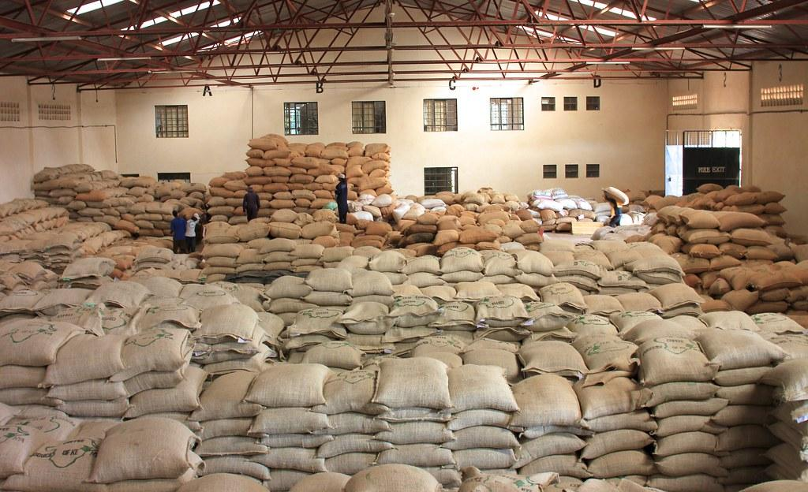

Green coffee is stored in warehouses, often at the port, before being loaded into **shipping containers**. A standard container holds approximately 300 bags (18 metric tons) of green coffee.

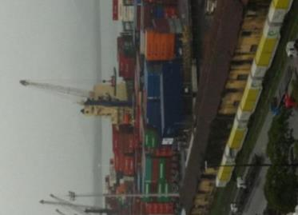

Coffee is traded internationally in US dollars, priced either as a differential to the ICE "C" futures contract (for Arabica) or to the ICE London contract (for Robusta). The **FOB price** (Free On Board), the price at the port of export, is the standard reference point for value chain analysis.

Export is the narrowest point in the hourglass. Roughly 12.5 million farms feed into fewer than 10,000 international traders. This concentration gives traders significant market and information advantages.

---

## 7. Roasting

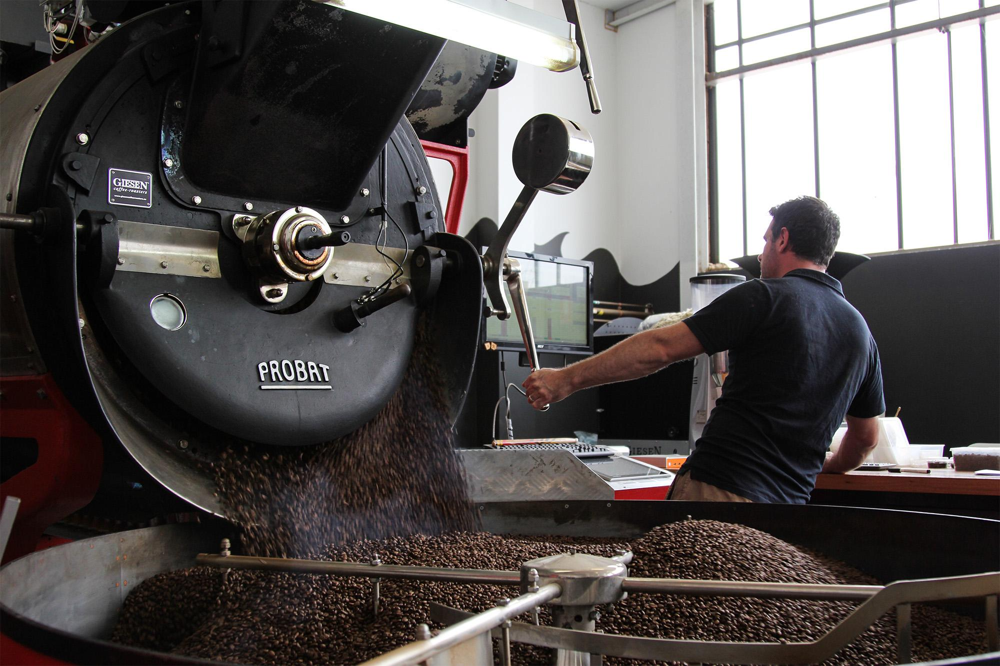

Roasting transforms green coffee into the brown, aromatic product consumers recognize. Green coffee that costs $3-5 per kilogram wholesale becomes roasted coffee that retails for $10-40 per kilogram. Roasting is where a disproportionate share of the value is added. 

Once coffee is roasted, it becomes perishable. This is an important reason why very few producers roast their own coffee.

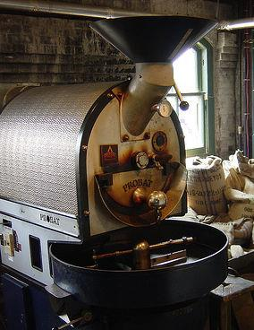

Roasters blend coffees from different origins and roast to specific profiles depending on the target market and the characteristics of the beans. Because coffee is both perishable and seasonal, it is important for large roasters to have multiple sources of coffee with similar flavor profiles and to have the flexibility to match the season and the market.
---

## 8. Quality Control

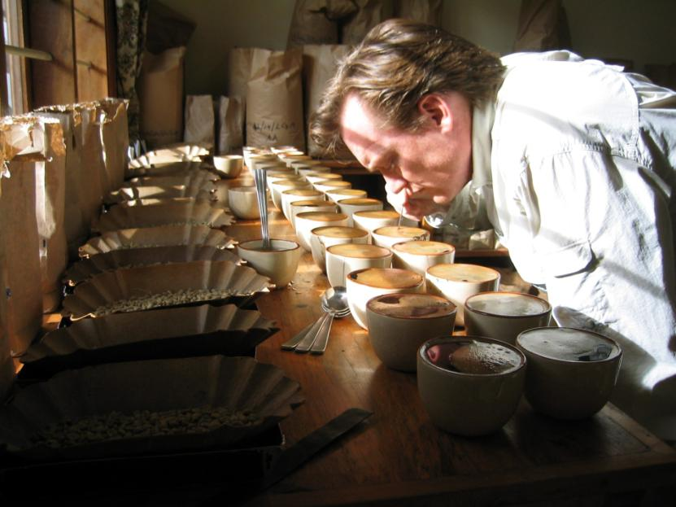

**Cupping** is the standardized method for evaluating coffee quality. Small samples are roasted, ground, steeped in hot water, and then tasted by trained cuppers who score the coffee on aroma, flavor, acidity, body, balance, and overall impression.

The SCA (Specialty Coffee Association) cupping protocol scores coffee on a 100-point scale. Coffee scoring **80 or above** is classified as specialty grade. This threshold is the dividing line between the commercial and specialty markets, and it carries significant price implications.

Cupping happens at multiple points in the chain, at the washing station (to assess processing quality), at the dry mill (to grade before export), and at the importer/roaster (to verify what was purchased).

---

## 9. Retail and Consumption

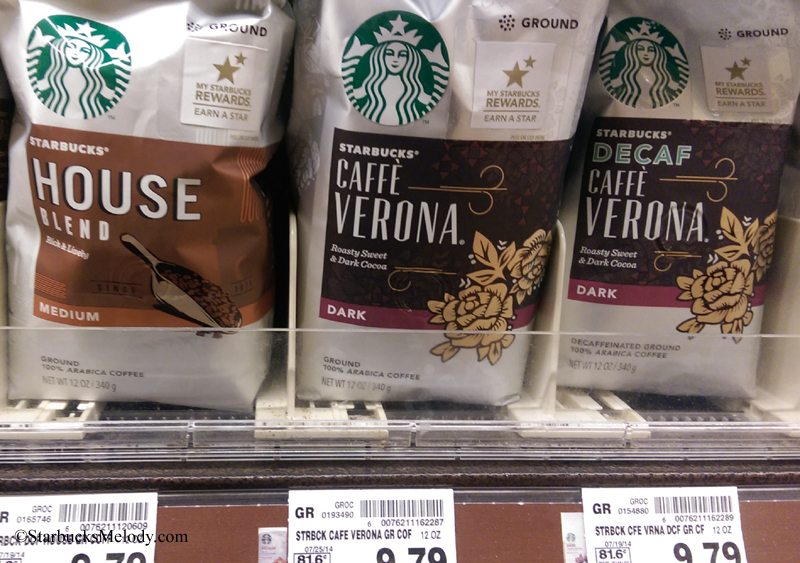

Roasted coffee is ground, packaged, and sold through retail channels (supermarkets, specialty shops, online) or brewed and sold by the cup in cafes and restaurants.


A kilogram of green coffee produces roughly **50 cups** of brewed coffee (others get around 55-65 cups per kilogram). At a retail price of $4-6 per cup, that kilogram generates $200+ in consumer revenue. The farmer who grew it received $3-5. Understanding where the difference goes, and what can be changed, is the core question of value chain analysis.


---

<!-- ================================================ -->
<!-- PAGE: Coffee 101 > Key Takeaways -->
<!-- SOURCE: lecture-notes/coffee-key-takeaways.md -->
<!-- ================================================ -->

# Key Takeaways

The coffee value chain has an hourglass structure:

| Stage | Actors | Scale |
|-------|--------|-------|
| Farms | ~12,500,000 | Wide |
| Mills | <1,000,000 | Narrowing |
| Traders | <10,000 | **Pinch point** |
| Roasters | <100,000 | Widening |
| Retailers | >1,000,000 | Wide |
| Consumers | >1,000,000,000 | Very wide |

The chain fans out at the farm level, narrows dramatically at the trading and export stage, and fans out again at the consumer end. This hourglass shape has important implications for bargaining power, information flow, and price transmission.

This course focuses on the upstream stages -- cherry, parchment, and green -- from farm to export. This is where most development interventions target, where the economics are most opaque, and where the data challenges are greatest.


---

<!-- ================================================ -->
<!-- PAGE: VCA Framework > Mapping Value Chain Actors -->
<!-- SOURCE: skills/01-mapping-a-value-chain.md -->
<!-- ================================================ -->

# Mapping Value Chain Actors

## What It Is

Value chain mapping is the process of identifying all actors at each stage of a product's journey from raw input to final consumer, understanding what each actor does, and tracing how they relate to one another. For a bag of coffee on a grocery shelf, that means following the product backward through the retailer, the roaster, the importer, the exporter, the miller, the processor, the farmer, and the input supplier — and then mapping forward again with clarity about who does what, who transacts with whom, and what the chain looks like structurally. The map is not the analysis; it is the foundation on which all subsequent analysis rests.

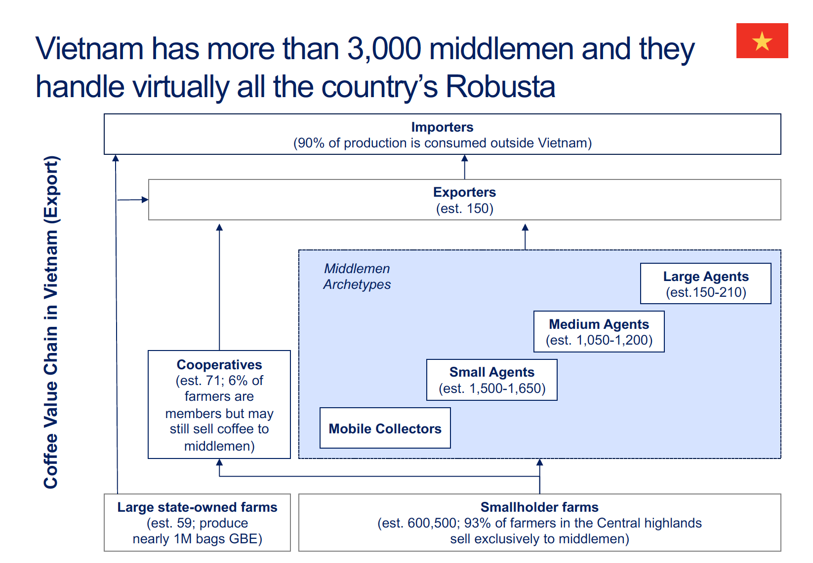{: .framework-img }

## Why It Matters

Without a good map, the analysis falls apart in predictable ways. You miss actors who capture value invisibly — the village aggregator who takes 15% margin without appearing in any official data. You attribute costs to the wrong stage — blaming farm-level productivity when the real constraint is post-harvest processing losses. You overlook parallel channels that serve entirely different markets with different economics — the domestic roaster operating on different price signals than the specialty exporter. And your recommendations target the wrong leverage points — pushing for farmer training when the binding constraint is trader monopoly power. A sloppy map produces a sloppy analysis. The map is where you earn the right to have an opinion about the rest of the chain.

## How to Do It

1. **Identify the end product and work backward.** Start with the cup of coffee. Then trace: who roasted it? Who exported the green coffee? Who milled the parchment? Who processed the cherry? Who grew it? Who supplied the inputs — seedlings, fertilizer, tools? Working backward forces you to stay anchored to an actual product rather than drifting into abstraction. It also helps you notice where the chain splits (one roaster may source from multiple exporters across multiple origins) and where it consolidates.

2. **List actors at each stage.** For coffee: approximately 12.5 million farms globally (over 95% smallholders, per Enveritas) → fewer than 1 million mills → fewer than 10,000 traders → fewer than 100,000 roasters → more than 1 million retailers → more than 1 billion consumers. The hourglass shape — wide at the farm and consumer level, narrow at the trading pinch point — is a defining structural feature of commodity chains. That pinch point matters enormously for understanding who has power and why.

3. **Map relationships.** There are three types worth distinguishing. Vertical relationships are buyer-seller transactions: the farmer sells cherry to the wet mill, the mill sells parchment to the exporter. Horizontal relationships connect actors at the same stage: cooperatives, farmer associations, trader networks, trade groups. Institutional relationships involve the actors who shape the rules without directly transacting: government regulators, agricultural extension services, certification bodies, development donors. All three types affect how value flows and who captures it.

4. **Distinguish parallel channels.** Most value chains are not linear — they branch. In coffee: washed versus natural processing channels involve different technology, different labor requirements, and different quality profiles. Cooperative versus private trading channels involve different governance structures and different price-setting mechanisms. Export versus domestic market channels serve different consumers at different price points. Each parallel channel may involve a completely different cast of actors with different economics. Map them separately before trying to compare them.

5. **Draw it.** The generic coffee chain runs: Input Supply → Production → Processing → Wholesale → Export → then splits to Global Market and Local Market. Label each node with the actor types and approximate numbers. The drawing does not need to be precise to be useful — it needs to be legible enough that someone unfamiliar with the chain can quickly grasp the structure, the scale of each stage, and where the chain branches. A hand-drawn diagram that gets shared and discussed is more valuable than a polished graphic that sits in a slide deck.

## Common Mistakes

1. **Assuming the chain is linear when it branches.** Most agricultural value chains have parallel channels that involve different actors, different economics, and different quality outcomes. In Ethiopia, washed coffee moves through cooperatives under the union export structure while natural-process coffee often moves through private collectors and the Ethiopian Commodity Exchange — completely different institutional arrangements, different price signals, different quality regimes. A map that misses this conflates two very different chains.

2. **Missing informal actors.** Mobile collectors, village aggregators, informal processors — these actors are invisible in official statistics but often handle significant volumes and capture real margin. In Vietnam, the highly competitive middleman economy is precisely why farmers capture roughly 95% of the export price; the middlemen compete the margin away. Ignoring them would lead you to misattribute farmer income to something else entirely.

3. **Conflating roles.** A cooperative that both processes wet cherry and exports green coffee occupies two stages of the chain. An exporter who also runs washing stations is both a processor and a trader. Map the functions, not just the organizations. A single organization can appear at multiple nodes. This matters for analysis: when you ask who captures value at the processing stage, the answer may be the same entity that captures value at the export stage, and that vertical integration is itself a finding.

4. **Drawing the map before talking to people.** A desk-based map is a hypothesis, not a finding. The real chain often looks meaningfully different from what secondary sources suggest — actors that official data ignores, stages that are combined or split differently in practice, channels that have emerged or collapsed since the last study was done. Treat your initial map as something to be tested and corrected through stakeholder interviews before you finalize it.

5. **Ignoring the local consumption channel.** Many value chain practitioners focus exclusively on the export chain because that is where the foreign exchange and the development funding are. But in countries like Brazil, where roughly 40% of production is consumed domestically, or Ethiopia, where there is a significant urban coffee culture and ceremonial consumption tradition, the domestic channel is economically important and serves different quality and price segments. Leaving it out produces an incomplete picture of the chain and may lead you to miss the most viable market opportunity for some producers.


---

<!-- ================================================ -->
<!-- PAGE: VCA Framework > Breaking Down Value Flows -->
<!-- SOURCE: skills/02-breaking-down-value-flows.md -->
<!-- ================================================ -->

# Breaking Down Value Flows

## What It Is
Tracing how money moves through the value chain — who pays whom, how much, and what costs each actor bears. The breakdown reveals where value accumulates, where margins are thin, and where the economics create winners and losers.

{: .framework-img }

## Why It Matters
Without a breakdown, you cannot tell whether the problem is low prices, high costs, or value captured by intermediaries. A farmer earning 50% of the export price might be doing well (if the export price is high and costs are low) or might be in poverty (if the export price is low and costs consume most of what they earn). The breakdown gives you the full picture.

## How to Do It
Step-by-step, using coffee examples:

1. **Start at the export price.** This is the most publicly available data point. Sources: COMTRADE (UN trade database), national coffee boards, ICO data. Export prices are quoted in standard units — typically USD/lb or USD/kg of green coffee. For example, Rwanda Arabica might export at $2.23/lb green, while Vietnam Robusta exports at about $4.95/kg green.

2. **Work backward to the farm-gate price.** Farmer prices require literature review or field interviews. They are quoted in local currency per local unit of whatever product form the farmer sells (often cherry, not green). Key challenge: converting from local units to international standards (see Skill 3).

3. **Identify costs and margins at each intermediate stage.** Between the farmer and the export point, there are processing costs (wet milling, dry milling), transport costs, taxes and fees, and trader margins. Each needs to be estimated. Interview actors at each stage. Ask: what do you pay for the product? What do you sell it for? What are your costs?

4. **Build a waterfall chart.** The standard visualization. Bars show how value accumulates from farmer cost of production through each intermediate stage to the export price. Reading left to right: farmer costs → farmer margin → processing costs → transport → taxes/fees → trader margin → export price. Each bar is a segment. The total height is the export price.

5. **Estimate on-farm costs of production.** Notoriously hard for smallholders. Family labor is rarely costed. Land has no formal market price. Inputs may be subsidized. Published estimates vary widely. Approach with caution and state your assumptions.

Example breakdowns from real coffee value chains:

**Vietnam Robusta.** Farmers earn ~95% of the export price ($4.95/kg green, March 2025). Collector and exporter margins are razor-thin, less than 1% each. Why? Intense competition among hundreds of thousands of middlemen, no cooperative or government intermediary taking a cut.

**Rwanda Arabica.** Farmers earn about 54% of the export price ($4.92/kg green). The remaining ~46% goes to coffee washing station costs (equipment, water, labor), transport, export processing, and institutional support (partly funded by tax). The "missing" value is not waste. It is the cost of infrastructure and quality processing. Rwanda is at the low end globally; most countries deliver more than 50% to the farmer.

## Common Mistakes

1. **Confusing price with margin.** A farmer who receives $2.67/kg green is not "earning" $2.67. Their costs of production might be $2.00, leaving a margin of $0.67. Price tells you revenue; margin tells you profit. Always try to get both.

2. **Forgetting transport and processing losses.** Physical losses during post-harvest processing must be accounted for. The cherry-to-green conversion reduces the weight by 80-85%. Transport losses (spoilage, spillage, theft) tend to be minor and can be excluded for coffee (they are often significant for other crops). If you don't account for these weight transformations, your waterfall will not balance.

3. **Using stale price data without adjusting.** Coffee prices and exchange rates are volatile. A breakdown based on 2020 prices is not valid in 2025. Always specify the time period and, if possible, normalize to current market conditions.

4. **Ignoring seasonal variation.** Farm-gate prices vary significantly during the harvest season — oflow at the start when farmers are eager for cash, and higher at peak harvest when buyers are struggling to complete their orders. A single "average" price may hide important dynamics.

5. **Treating "farmer share" as a sufficient metric on its own.** A farmer earning 95% of the export price (Vietnam) sounds great until you realize the export price for Robusta is lower than Arabica. A farmer earning 54% (Rwanda) of a higher Arabica price may or may not earn more in absolute terms. Always look at absolute income per hectare, not just share.


---

<!-- ================================================ -->
<!-- PAGE: VCA Framework > Dealing with Unit Conversions -->
<!-- SOURCE: skills/03-unit-conversion-and-price-analysis.md -->
<!-- ================================================ -->

# Dealing with Unit Conversions

## What It Is
Converting between the units that local actors use and the international standards needed for cross-country comparison. Coffee farmers sell cherry by the kilo in local currency. Exporters sell green coffee by the pound in US dollars. Comparing these prices requires converting currency, weight, and product form — and getting any one wrong invalidates the entire analysis.

{: .framework-img }

## Why It Matters
Without proper conversions, you cannot compare across countries or even across stages of the same value chain. A price in RWF/kg cherry is not directly comparable to a price in USD/lb green. Most errors in VCA work trace back to a conversion mistake — wrong cherry-to-green ratio, wrong exchange rate, or mixing up kilograms and pounds halfway through. This skill is mechanical but unforgiving.

## How to Do It
Walk through the Rwanda example step by step:

**Starting points:**
- Export price: $2.23 per pound green coffee
- Farmer price: 500 RWF per kilogram cherry coffee

**Step 1: Convert currency (RWF → USD)**
(500 RWF / kg cherry) × (0.00076 USD/RWF) = $0.38 / kg cherry

**Step 2: Convert weight (kg → lb)**
($0.38 / kg cherry) × (0.45 kg/lb) = $0.17 / lb cherry

**Step 3: Convert product form (cherry → green)**
($0.17 / lb cherry) × (7 cherry/green) = $1.20 / lb green

**Step 4: Calculate farmer share**
($1.20 / lb green) / ($2.23 / lb green) = 54% farmer share

The conversion ratio of 7:1 (cherry to green) is specific to Rwanda, where high altitude pushes the ratio to the upper end of the Arabica range. Across Arabica origins generally, the ratio runs from about 6:1 to 7:1, driven by species, varietal, and agro-climatic conditions (including altitude) — not by the processing method. A washed and a natural coffee from the same origin will have essentially the same net cherry-to-green conversion. Robusta has a lower ratio of approximately 5:1, reflecting the different bean size and density.

## Key Conversion Factors for Coffee

| Conversion | Factor | Notes |
|-----------|--------|-------|
| Cherry to green (Arabica) | ~6:1 to 7:1 | Varies by varietal and agro-climate (including altitude). Rwanda ~7:1, most other origins ~6.25:1 |
| Cherry to green (Robusta) | ~5:1 | Lower ratio, reflecting different bean characteristics |
| Parchment to green | ~1.25:1 | Hulling removes the parchment layer |
| Kilograms to pounds | 1 kg = 2.205 lb | Or: 1 lb = 0.4536 kg |
| Bags to kg | 1 bag = 60 kg | Standard international jute bag |
| Bags to pounds | 1 bag = 132.28 lb | |

Common currencies encountered in coffee VCA:

- BRL (Brazil), VND (Vietnam), COP (Colombia), ETB (Ethiopia), RWF (Rwanda), UGX (Uganda), KES (Kenya), GTQ (Guatemala), HNL (Honduras)
- Always specify the date of the exchange rate used — currencies in producing countries can fluctuate significantly

## Common Mistakes

1. **Using the wrong cherry-to-green ratio for the species or origin.** The ratio varies by species (Arabica vs Robusta) and by varietal and agro-climate within Arabica — not by processing method. Using Rwanda's 7:1 ratio for a lower-altitude Arabica origin where 6.25:1 is correct will overstate the farmer's effective price in green-equivalent terms. Using an Arabica ratio for Robusta (which should be ~5:1) makes the error even larger. Always confirm the species and the locally accepted conversion factor.

2. **Mixing up "per kg" and "per lb" midway through a calculation.** This is embarrassingly common. Once you start a calculation in one unit system, stay in it until the end. Or convert everything to one standard (USD/kg green) at the outset.

3. **Not specifying which product form a price refers to.** "$3 per kilo" is meaningless without knowing whether it is per kilo of cherry, parchment, or green. Cherry at $3/kg is a high price. Green at $3/kg is a low price. Always label your units completely.

4. **Forgetting that exchange rates fluctuate.** A farm-gate price collected in March may look very different when converted at December exchange rates. For countries with significant currency volatility (Ethiopia is a prime example after the 2024 birr float), this can shift the analysis materially. State the exchange rate and date explicitly.

5. **Confusing FOB (export) price with farmgate price.** The FOB (Free On Board) price is what the buyer pays at the port of export. The farmgate price is what the farmer receives. The difference between them is the supply chain cost. These are fundamentally different numbers — do not use one where the other is needed.


---

<!-- ================================================ -->
<!-- PAGE: VCA Framework > Benchmarking -->
<!-- SOURCE: skills/04-benchmarking.md -->
<!-- ================================================ -->

# Benchmarking

## What It Is
Comparing a value chain's performance against relevant peers to identify strengths, weaknesses, and opportunities. Numbers in isolation mean nothing. A yield of 1.5 MT/ha sounds fine until you learn Vietnam achieves 3+ MT/ha. A farmer share of 54% sounds reasonable until you learn Vietnam's farmers capture 95%. Benchmarking provides the context that turns data into insight.

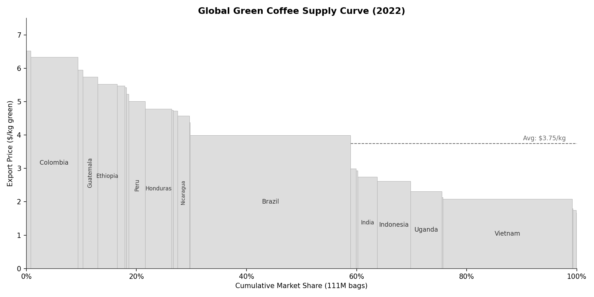{: .framework-img }

## Why It Matters
Without benchmarks, you cannot distinguish between "this is how the sector works everywhere" and "this is a problem specific to this country that can be fixed." A low farmer share of export price might reflect exploitative intermediaries — or it might reflect legitimate processing costs in a country that produces washed Arabica (which costs more to process than unwashed Robusta). Only comparison reveals which explanation fits.

## How to Do It

1. **Choose comparators carefully.** Three types:
   - **Peer countries, same crop**: Rwanda vs Colombia vs Ethiopia (all Arabica producers with significant smallholder sectors). Vietnam vs Brazil Robusta (high-volume producers).
   - **Same country, different crops**: Coffee vs tea vs cocoa in a given country — reveals whether problems are coffee-specific or agriculture-wide.
   - **Same country, different time periods**: How has Vietnam's yield changed since 2000? Has Rwanda's farmer share improved since the CWS program launched?

2. **Select the right metrics.** Core metrics for coffee VCA benchmarking:
   - **Farm yields** (metric tons green coffee per hectare): The single most important productivity metric. Range across major origins: Vietnam 3+ MT/ha (highest), Brazil 1.5-2.0, Costa Rica ~1.5, Colombia ~1.0, Honduras ~0.8, Rwanda ~0.6, Indonesia ~0.6, Ethiopia <0.5 (lowest among major origins).
   - **Prices received** (USD/kg green equivalent): What farmers actually get. Reflects quality, market positioning, and supply chain efficiency.
   - **Farmer share of export price**: Percentage of FOB price reaching the farmer. Most countries are above 50%. Vietnam and Brazil are best in class at >90%. Latin America (Colombia, Honduras) typically ~80%. Africa shows the most variation: Ethiopia ~55-65% (varies by channel — cooperative washed is higher, unwashed/ECX is lower), Rwanda ~54% (the low end globally).
   - **Cost of production** (USD/kg green): What it costs to grow. If cost exceeds price, farmers are losing money.
   - **Export volume and market share**: How much the country contributes to global supply. Brazil ~35%, Vietnam ~20%, Colombia ~10%, Rwanda <1%.

3. **Normalize for comparability.** Same units (USD/kg green), same product form, same or comparable time period. Comparing a 2018 Rwanda price to a 2025 Vietnam price without adjusting for the coffee market swing is meaningless.

4. **Interpret differences.** Not all gaps are fixable. Differences may be:
   - **Structural**: Vietnam's high yields partly reflect Robusta (inherently higher-yielding than Arabica), flat terrain, and irrigation infrastructure. Rwanda cannot replicate this with hillside Arabica plots.
   - **Policy-driven**: Vietnam's government provided land rights, credit access, and competition-friendly regulation. These are replicable with political will.
   - **Market-driven**: Rwanda earns a premium price per kg because of quality positioning. Vietnam earns less per kg but far more per hectare.

## Common Mistakes

1. **Comparing Robusta and Arabica without adjusting.** These are fundamentally different products with different agronomy, different price levels, and different markets. Vietnam (Robusta) vs Colombia (Arabica) is an apples-to-oranges comparison unless you account for the species difference. Compare Robusta to Robusta, Arabica to Arabica, or explicitly note the comparison is cross-species and adjust accordingly.

2. **Cherry-picking comparators to support a predetermined conclusion.** If you want to make Rwanda look good, compare it to Burundi. If you want to make it look bad, compare it to Vietnam. Honest benchmarking selects comparators based on structural similarity (farm size, species, market position), not on which comparison produces the desired result.

3. **Treating national averages as representative.** A national average yield of 1.0 MT/ha might mask a range from 0.3 (neglected smallholdings) to 2.5 (well-managed commercial farms). If your recommendations target the average farmer, you are targeting nobody. Where possible, benchmark at the regional or producer-segment level.

4. **Ignoring context that explains differences.** Vietnam's yields are high partly because of massive irrigation in the Central Highlands — which consumes 2,822 tons of water per household per year. The yield benchmark looks impressive until you factor in the environmental cost. Always ask: what is the story behind the number?

5. **Benchmarking on a single metric.** A country with high yields but low prices (Vietnam) and a country with low yields but high prices (Ethiopia) look very different depending on which metric you choose. Use multiple metrics. The most useful analysis compares income per hectare (yield × price - cost), which integrates all three dimensions.


---

<!-- ================================================ -->
<!-- PAGE: VCA Framework > Formulating Recommendations -->
<!-- SOURCE: skills/05-prioritizing-recommendations.md -->
<!-- ================================================ -->

# Formulating Recommendations

## What It Is

Translating VCA findings into actionable, prioritized interventions. Not just "what should change" but "what should change first, for whom, and who pays." A VCA without recommendations is an academic exercise. Recommendations without prioritization are a wish list. The value of VCA work lies in identifying the 2-3 interventions that are both high-impact and feasible for a specific context.

{: .framework-img }

## Why It Matters

Every VCA produces a long list of potential interventions. Donors want to fund something. Governments want to show results. The pressure to recommend everything is strong. But resources are finite, attention is finite, and doing too many things at once usually means doing none of them well. Prioritization is the discipline that separates useful analysis from generic consulting.

## How to Do It

1. **Generate candidate interventions from each stage of the analysis.**
   - From the Map: Are there missing actors or broken linkages? Could a new channel be created?
   - From the Breakdown: Where are margins concentrated? Where are costs excessive? Is the farmer share appropriate for the level of service provided?
   - From the Benchmark: Where does this country underperform peers? What are peers doing differently?

   Four generic recommendations appear in almost every coffee VCA:
   - Help smallholders improve quality and productivity
   - Transfer a higher share of the export price to the farmer
   - Export roasted coffee direct to consumers
   - Boost local coffee consumption

2. **Plot on the impact-feasibility matrix.** A 2x2 grid:
   - High impact + High feasibility = priority (do this first)
   - High impact + Low feasibility = worth pursuing but harder
   - Low impact + High feasibility = easy wins, limited value
   - Low impact + Low feasibility = don't bother

   Where each recommendation lands depends entirely on country context:
   - "Transfer higher share to farmer" is LOW priority in Vietnam (already 95%) but HIGH priority in Rwanda (~54%)
   - "Boost local consumption" is feasible in Colombia (strong domestic market, Juan Valdez brand) but very low feasibility in Rwanda (98% of coffee is exported, tiny domestic market)
   - "Export roasted coffee" is high impact everywhere but low feasibility everywhere — roasting infrastructure, quality control, and market access are massive barriers

3. **Segment by producer type.** What works for a 5-hectare commercial farm in Vietnam (with irrigation and direct access to traders) will not work for a 0.1-hectare subsistence farm in Rwanda (coffee grown on a hillside alongside beans and bananas). Different farm types need different interventions:
   - Subsistence smallholders: basic agronomy training, access to inputs, guaranteed purchase
   - Semi-commercial farmers: quality improvement, cooperative strengthening, certification
   - Commercial farms: market diversification, environmental sustainability, value addition

4. **Sequence: what is the first move?** Even among high-priority recommendations, some must precede others. You cannot improve coffee quality if farmers lack basic inputs. You cannot strengthen cooperatives if they do not exist yet. Identify prerequisites and logical ordering.

## Common Mistakes

1. **Recommending things that require actors to behave against their economic interest.** "Middlemen should accept lower margins" is not a recommendation — it is a fantasy. If middlemen earn thin margins (as in Vietnam, where collector margins are <1%), there is nothing to compress. If they earn large margins, ask why: is it market power, or is it compensation for real risk and cost (transport, storage, credit provision)?

2. **Confusing "would be nice" with "is feasible given institutional capacity."** Exporting roasted coffee direct to consumers sounds great. But it requires roasting equipment, quality control labs, export packaging, food safety certification, international marketing, and distribution contracts with retailers in consuming countries. This is not a near-term recommendation for most countries.

3. **One-size-fits-all recommendations across different producer segments.** "Improve farmer productivity" means completely different things for a Brazilian estate with 500 hectares and a Rwandan hillside farm with 0.1 hectares. Specify who the recommendation targets, what it involves for them, and what scale of impact is realistic.

4. **Ignoring who pays for the intervention.** Every recommendation has a cost. Farmer training costs money — who runs it and who funds it? Price transparency platforms cost money — who builds and maintains them? Cooperative strengthening costs money — who provides the technical assistance? If your recommendation does not include a realistic funding mechanism, it is incomplete.

5. **Recommendations that do not connect back to specific findings from the analysis.** If your benchmarking showed that yields are the primary gap, but your recommendations focus on price transparency, there is a disconnect. Every recommendation should trace directly to a finding from the Map, Breakdown, or Benchmark step. If you cannot point to the evidence, the recommendation is not grounded.


---

<!-- ================================================ -->
<!-- PAGE: Case Studies > Overview -->
<!-- SOURCE: case-studies/README.md -->
<!-- ================================================ -->

# Case Studies

Each case study follows the same analytical structure: Story, Map, Breakdown, Benchmark, Recommendations, Discussion Questions. Click to expand any case below, or open the full page.

---

??? note "Vietnam: Engineered Growth and Its Limits — [Read full case](vietnam.md)"

    Vietnam barely grew coffee before the 1990s. Through deliberate government policy, the country went from near-zero to the world's second-largest coffee producer in about 15 years. Today approximately 600,000 farmers supply roughly 20% of global coffee volume, almost entirely Robusta.

    **Key numbers:** Farmers earn ~95% of the export price (best in class). Yields are the highest globally at 3+ MT/ha. But the environmental footprint is enormous: coffee irrigation in the Central Highlands consumes an estimated 2,822 tons of water per household per year.

    **Central tension:** By almost every conventional measure, Vietnam's coffee sector is a success story. High productivity, efficient market structure, strong farmer returns. And yet the water drawdown is unsustainable and the monoculture concentration amplifies shocks.

??? note "Rwanda: Premium Positioning on Tiny Farms — [Read full case](rwanda.md)"

    Rwanda produces less than 1% of global coffee but has positioned itself as a premium origin through investment in coffee washing stations and quality infrastructure. Farmers earn ~54% of the export price.

    **Key numbers:** A typical farm is 0.1 hectares. At average yields of ~600 kg/ha, the farmer earns about $160/year from coffee. The living income requirement is ~$2,500/year. Even doubling the farmer share would not close the gap.

    **Central tension:** Premium positioning has delivered higher per-kilogram prices, but the fundamental constraint is farm size. No value chain intervention can close a $2,340/year living income gap on a 0.1-hectare plot.

??? note "Honduras: Central America's Quiet Giant — [Read full case](honduras.md)"

    Honduras is the largest coffee producer in Central America and the sixth-largest in the world. Production quadrupled from 1990 to 2017, then crashed after Hurricanes Eta and Iota in 2020.

    **Key numbers:** 5,800 thousand bags (2025), 100% Arabica, ~80% farmer share. Currently at 76% of the 2017 peak. GDP per capita of $3,400, over 40% rural population.

    **Central tension:** Not about institutional design, market structure, or quality positioning. It is about resilience: how does a smallholder-dominated, export-dependent sector survive compounding climate shocks?

??? note "Colombia: Strong Institutions, Eroding Margins — [Read full case](colombia.md)"

    *Archival case from 2017-2023 lectures. Market data may be outdated but the institutional analysis remains relevant.*

    Colombia has arguably the strongest institutional infrastructure of any coffee-producing country. The FNC provides extension services, research, quality control, and a guaranteed purchase price. Farmers earn ~80% of the export price.

    **Central tension:** Institutional strength came at a cost. When farming economics deteriorated (la roya, rising costs), the government spent an estimated $500-700M on farmer subsidies. The question: when does institutional support become institutional cost?

??? note "Ethiopia: Traceability Lost and Found — [Read full case](ethiopia.md)"

    *Archival case from 2017-2020 lectures. Ethiopia's coffee sector has changed significantly since, including ECX reforms.*

    Ethiopia is the birthplace of coffee, with extraordinary genetic diversity and some of the most distinctive flavor profiles in the world. The ECX was designed to solve real problems (price manipulation, information asymmetry) but eliminated traceability for specialty coffee, destroying premiums.

    **Central tension:** The best coffee genetics on the planet, undermined by a market design that made its best lots anonymous. The cooperative channel demonstrated that traceability has quantifiable economic value ($20M+/year from TechnoServe interventions).


---

<!-- ================================================ -->
<!-- PAGE: Case Studies > Vietnam: Engineered Growth and Its Limits -->
<!-- SOURCE: case-studies/vietnam.md -->
<!-- ================================================ -->

# Vietnam: Engineered Growth and Its Limits

## The Story

Vietnam barely grew coffee before the 1990s. What happened next was not an accident of geography or comparative advantage. It was a policy project. Through deliberate government intervention, the country went from near-zero to the world's second-largest coffee producer in about 15 years. Today approximately 600,000 farmers supply roughly 20% of global coffee volume, almost entirely Robusta.

The growth was engineered. The government treated coffee as a strategic export crop and built the conditions for expansion from the ground up. Land reform gave farmers secure ownership of their plots, a precondition for any long-term investment in perennial crops. Credit programs put capital in farmers' hands. Extension services transferred agronomic knowledge. And crucially, the government chose not to control the marketing chain: private collectors, traders, and exporters competed freely for farmers' coffee.

Farmers responded rationally. With secure tenure, access to credit, and functioning input markets, they invested in their land. The result was explosive expansion across the Central Highlands, primarily Dak Lak, Lam Dong, and Gia Lai provinces, driven by thousands of individual household decisions, each responding to the same clear incentives.

The sector's growth metrics are extraordinary by any standard. Vietnam achieved the highest farm-level yields in the global coffee industry, over three metric tons of green coffee per hectare. Farmers earn approximately 95% of the export price (per the Enveritas 2020 Vietnam Country Report), the highest farmer share among major origins. The supply chain between farmer and export ship is as lean and competitive as any agricultural market you will find.

Most Vietnamese coffee farms are around one hectare. By global standards, every one of these farmers is "small." But they operate like commercial enterprises, not subsistence farmers. They purchase inputs (fertilizer, irrigation equipment), hire labor during harvest, and sell into deep competitive markets where price discovery happens continuously. The smallholder label understates the sophistication of the operation.

---

But the growth came with costs that conventional metrics do not fully capture.

Robusta requires irrigation. Intensive Robusta production in the Central Highlands consumes an estimated 2,822 tons of water per household per year. To calibrate that figure: total urban household water use in Vietnam runs around 137 tons per year; rural and agricultural households use about 144 tons. Coffee irrigation is not a rounding error. It is the dominant water use in the entire region, by a wide margin.

The expansion phase also involved substantial deforestation, as highland forest was cleared for new coffee plots. That environmental legacy is baked into the landscape in ways that cannot easily be reversed.

And monoculture dependency on a single crop, one that trades at a discount to Arabica and faces growing climate pressure in the Central Highlands, creates structural fragility that yield statistics obscure. When Robusta prices collapsed in the early 2000s, Vietnamese farmers had little to fall back on.

The central tension in the Vietnam case is this: by almost every conventional measure of value chain performance, Vietnam's coffee sector is a success story. High productivity. Efficient market structure. Strong farmer returns relative to export value. Rapid integration into global markets. The policy levers that drove this success (land tenure, competitive markets, enabling infrastructure) are genuinely replicable and instructive for other origins.

And yet. The environmental footprint is enormous. The water drawdown is unsustainable in a region facing climate stress. The monoculture concentration amplifies price and climate shocks. Sustainability considerations that conventional VCA does not easily quantify sit alongside the clean price-share metrics.

Vietnam forces a question that every value chain analysis eventually has to answer: what counts as success, over what time horizon, and for whom?

---

## Map

The Vietnamese coffee value chain is remarkably short and, structurally, highly competitive. There are few actors between farmer and export, and no dominant institutional layer extracting rent.

**Actors and their roles:**

**~600,000 smallholder farmers** (~1 hectare each). Grow, harvest, and typically perform initial processing (drying the cherry) before selling. Unlike wet-processed Arabica origins, most Robusta in Vietnam moves as natural/dry-processed coffee, which means farmers retain more of the processing step and receive value accordingly.

**Collectors and local traders**, a highly competitive middleman economy. Thousands of mobile collectors traverse rural areas, buying cherry or dried cherry directly from farmers. This is not a thin market with one or two buyers per village. Collectors compete aggressively for volume, which has a direct and profound effect on farmer pricing. Competition among buyers means margins get competed away, and the surplus flows to farmers.

**Exporters** consolidate volumes, process coffee to export standard (green bean specification), and arrange shipping. Exporter margins are very slim; the economics of the downstream chain do not leave much to capture. Vietnam exports enormous volumes of undifferentiated commodity Robusta, which disciplines margins further.

**International traders and importers** purchase FOB Vietnam and distribute to roasters globally. Robusta is a commodity market; buyers are price-sensitive and sourcing decisions are made on cost.

The chain, simplified: **Farmer → Collector → Exporter → International Trader**

There is no dominant cooperative sector. No government marketing board intermediating between farmers and the market, extracting fees or adding processing costs. The government's role is enabling (policy, infrastructure, research, credit facilitation) rather than intermediating. This is a structural choice, and it matters enormously for the farmer share calculation.

This stands in sharp contrast to other major origins. Colombia has the Federacion Nacional de Cafeteros (FNC), a powerful cooperative-like institution that sets minimum prices, runs export operations, and manages the Juan Valdez brand, adding institutional overhead but also providing services. Ethiopia has the Ethiopia Commodity Exchange (ECX), which adds a transaction layer between farmers and exporters. Rwanda relies heavily on washing stations, which add processing infrastructure costs between farm and export. Vietnam has none of these layers. The chain is lean because the policy choice was to let it be lean.

*Source: "An analysis of the role of middlemen in coffee supply chains: Vietnam Country Report," prepared by Enveritas, January 2020.*

---

## Breakdown

Vietnamese farmers earn approximately **95% of the export price**, one of the highest farmer shares anywhere in the global coffee sector.

At March 2025 prices:

| Actor | Price/kg (green equivalent) | Share |
|---|---|---|
| Farmer | ~$4.70 | ~95% |
| Collector margin | <$0.05 | <1% |
| Exporter margin | <$0.20 | <4% |
| **Export price (FOB)** | **~$4.95** | **100%** |

Why is the farmer share so high? Three reinforcing structural factors:

**1. Intense competition among collectors.** With thousands of middlemen competing for the same coffee across the Central Highlands, individual collectors cannot unilaterally hold down farmgate prices. A collector who tries to pay farmers less loses volume to a competitor willing to pay more. This competitive pressure is the primary mechanism driving surplus to farmers. It is not the result of farmer organizing, fair trade premiums, or government price floors. It is market structure.

**2. No institutional intermediary.** Unlike Rwanda, where washing stations add cost (and value through quality upgrading), or Ethiopia, where the ECX adds a transaction layer between producers and exporters, Vietnam's chain has minimal institutional overhead. There is no body taking a cut for coordination, certification, or quality management.

**3. Simple processing.** Robusta is predominantly processed as natural/dry; farmers dry the cherry themselves. This means less capital-intensive infrastructure between farm and export. No washing station to build and amortize means no washing station to pay for.

Contrast this with Rwanda, where farmers earn about 54% of the export price. The remaining ~46% in Rwanda is not simply margin captured by exploitative middlemen — much of it pays for washing station infrastructure, quality programs, and institutional support that Rwanda has deliberately built. The higher farmer share in Vietnam reflects a different supply chain design choice, not a moral achievement. It also reflects a commodity market rather than a specialty market, where there is simply less margin in the chain to distribute.

This is a useful analytical point. A high farmer share is not always the right goal. In Rwanda, the washing station infrastructure, even though it "costs" farmers a share of price, enables the quality that commands premium Arabica prices in the first place. Vietnam's 95% farmer share is partly a function of selling an undifferentiated commodity where there is little to share.

---

## Benchmark

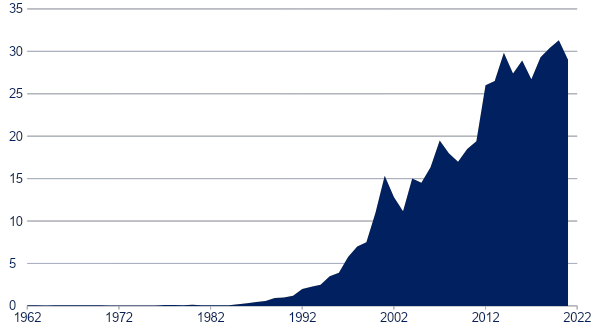

**Yields.** Vietnam has the highest coffee farm yields in the world.

| Origin | Yield (MT green/ha) |
|---|---|
| Vietnam | 3.0+ |
| Brazil (Robusta/Conillon) | 1.5–2.0 |
| Costa Rica | ~1.5 |
| Colombia | ~1.0 |
| Honduras | ~0.8 |
| Rwanda | ~0.6 |
| Ethiopia | <0.5 |

The yield gap between Vietnam and other origins is not marginal. It is structural. Vietnam's yields are driven by intensive fertilizer application, heavy irrigation, high planting density, productive Robusta varieties suited to the Central Highlands, and favorable growing conditions. These are not easily replicated; they require capital, water access, and agronomic knowledge at scale. But they also extract a corresponding environmental cost.

**Income per hectare.** The yield advantage reframes the price disadvantage. Robusta trades at a significant discount to Arabica. But because yields are so high, income per hectare in Vietnam is competitive with, and often exceeds, Arabica origins.

A Vietnamese farmer producing 3 MT/ha at $4.95/kg earns roughly **$14,850/ha** in gross revenue. A Colombian farmer producing 1 MT/ha at a higher specialty Arabica price of, say, $6.00/kg earns **$6,000/ha**. The productivity advantage more than compensates for the price differential.

This is not a universal argument for Robusta. It is specific to Vietnam's context: available water, appropriate climate, and accumulated agronomic capacity. Origins without those inputs cannot simply switch to intensive Robusta production and expect the same result.

**Market position.** Vietnam supplies approximately 20% of global coffee volume. It is the dominant global Robusta supplier and effectively a price-setter in the Robusta market. When Vietnamese production is large, global Robusta prices fall; when it is disrupted, prices rise. This is a different kind of market power than a specialty origin commands: volume-based rather than quality-based.

**Environmental footprint.** The yields come at an environmental cost that has no clean parallel in the benchmark table.

Total water demand for coffee irrigation in Vietnam's Central Highlands is estimated at **2,822 tons per household per year**. For context: total urban household water use is about 137 tons per year. Coffee irrigation is more than 20 times the baseline household water requirement. The region's groundwater table is declining. Climate models project increasing drought frequency in the Central Highlands. The water math is, on a long time horizon, a problem.

No other major origin runs an irrigation program of this intensity. The high yields are, in part, purchased with water.

---

## Recommendations

The standard VCA recommendation toolkit (transfer more value to farmers, reduce intermediary extraction, invest in certification and premiums) largely does not apply in Vietnam. The chain is already efficient on the pricing dimension. The levers for improvement are elsewhere.

| Recommendation | Impact | Feasibility | Position |
|---|---|---|---|
| Reduce water footprint (irrigation efficiency, shade-grown programs) | High | Medium | Priority — but requires changing practices that have been highly profitable |
| Export roasted coffee direct to consumers | High | Low | Attractive value capture but faces massive market access and brand barriers |
| Boost local coffee consumption | Medium | High | Vietnam's domestic coffee culture is growing; relatively tractable |
| Transfer higher share to farmer | Low | N/A | Already at ~95%; essentially no margin left to redistribute |

The last row is the most important benchmark in the table. In most country cases, "increase farmer share of value" appears as a top recommendation. In Vietnam, it is irrelevant. The chain has already competed margins down to near zero. This should not be taken as evidence that the work is done — the remaining work is on different dimensions.

**Water sustainability** is the highest-priority structural issue. Vietnam's yield advantage is partly built on irrigation intensity that is not environmentally sustainable in a warming, drying Central Highlands. Drip irrigation adoption, shade-grown programs that reduce water demand, and groundwater recharge investments are all technically available. The barrier is economic: current practices are profitable, and farmers have little individual incentive to reduce water use when the resource is shared. This is a classic commons problem, and it will require policy intervention — not just market signals — to address.

**Roasted coffee export** is the value addition opportunity most frequently cited in Vietnam policy discussions. Currently, Vietnam exports almost entirely as green bean commodity; the roasting margin accrues elsewhere. Building a Vietnamese consumer brand with global reach is plausible in theory but extremely difficult in practice — market access, cold-chain logistics, consumer trust in origin branding, and competition from established global roasters are all substantial barriers. The recommendation belongs in the "monitor and invest selectively" category, not "priority action."

**Domestic consumption** is the quietly tractable opportunity. Vietnam has a vibrant coffee culture. The ca phe sua da (iced milk coffee) tradition is genuinely distinctive and growing. Domestic consumption growth supports local roasters, adds value before export, and reduces exposure to global commodity price volatility. The market is developing without much intervention; modest policy support (reducing taxes on domestic roasting equipment, promoting Vietnamese coffee identity in tourism) could accelerate it.

The overall picture: Vietnam's value chain is close to optimized on the metrics that conventional VCA prioritizes. The next phase of development is not about who captures what share of a fixed pie. It is about whether the production system is sustainable enough to keep baking the pie at all.

---

## Discussion Questions

1. Which aspects of Vietnam's coffee value chain could be considered "best in class"? Which aspects should other countries try to replicate, and which are unique to Vietnam's context?

2. Vietnam's farmers earn 95% of the export price — the highest share among major origins. What structural and policy factors enable this, and could they be replicated in a country like Rwanda or Ethiopia?

3. The environmental footprint of Vietnamese coffee production is substantial. Is this an externality that the value chain should internalize? If so, who should bear the cost — farmers, exporters, roasters, or consumers? What mechanisms could be used?

4. Vietnam's success was built on Robusta, which trades at a lower price than Arabica. Is there a case for Vietnam to shift toward higher-value Arabica production, or does the yield advantage of Robusta make it the rational choice?

5. What would happen to Vietnamese coffee farmers if global Robusta prices dropped by 30% for two consecutive years? How does their cost structure and lack of diversification affect their resilience compared to farmers in more diversified origins?

---

*This case study is part of a series for the Value Chain Analysis course. See also: [Rwanda](rwanda.md), [Colombia](colombia.md) (archival), [Ethiopia](ethiopia.md) (archival).*

*Data last verified: March 2026*


---

<!-- ================================================ -->
<!-- PAGE: Case Studies > Rwanda: Premium Positioning on Tiny Farms -->
<!-- SOURCE: case-studies/rwanda.md -->
<!-- ================================================ -->

# Rwanda: Premium Positioning on Tiny Farms

## The Story

Rwanda produces less than 1% of global coffee. It cannot compete on volume. The country's terrain (steep volcanic hillsides, fragmented smallholder plots, no coastal access) makes the scale game impossible. So Rwanda decided not to play it.

Instead, beginning in the early 2000s and accelerating after the government's Vision 2020 strategy, Rwanda made a deliberate bet on quality. The logic was simple: if you can't be the biggest, be the best. The mechanism for that bet was infrastructure — specifically, a national network of coffee washing stations (CWS) that could transform hand-picked cherry from 350,000 scattered smallholders into traceable, fully washed Arabica capable of earning specialty premiums in New York, London, and Tokyo.

That infrastructure now numbers roughly 312 coffee washing stations. These are not small operations. A CWS requires capital investment: de-pulping machines, fermentation tanks, raised drying beds, and water systems. It requires trained staff to manage the critical 24-72 hour fermentation window that separates clean specialty coffee from flat, fermented commodity. And it requires trust. Farmers must deliver fresh cherry within hours of picking, which means the CWS must be close enough to reach by foot or motorbike and must be known to pay fairly and on time.

The CWS network is where Rwanda's value chain story actually happens. It is the quality node. Before the CWS boom, most Rwandan coffee was sun-dried naturals of inconsistent quality, sold into commodity pools. After it, Rwanda began appearing on specialty café menus as a named origin, "Rwanda Nyamasheke," "Rwanda Gitesi," with flavor notes of stone fruit, black tea, and brown sugar that reflected both the high-altitude terroir and the quality of processing.

Government support was essential. The Rwanda Development Board, USAID's SPREAD program, and a constellation of other donors provided subsidized loans for CWS construction, technical assistance for quality improvement, and marketing support at international trade shows. This was not a pure market outcome. It was a public-private strategy executed over two decades.

The results are real. Rwanda now earns positive differentials over the Arabica "C" price in specialty markets. Its cupping scores and traceable washing station provenance make it competitive with Ethiopia and Kenya in premium segments. On a per-kilogram basis, Rwandan farmers receive more than their counterparts in most African origins.

And yet the math is brutal.

A typical Rwandan coffee farm is about 0.1 hectares, roughly a quarter-acre. At average yields of around 600 kg of green coffee equivalent per hectare, that farm produces about 60 kg of exportable green coffee per year. At a farmer price of approximately $2.67/kg green equivalent, the farmer earns about $160 per year from coffee.

The living income requirement for a typical Rwandan family is around $2,500 per year.

The gap is $2,340. Premium positioning has not closed it. Even doubled premiums would not close it. The constraint is not the price. It is the volume. When the farm is small enough, the math doesn't work regardless of how well you position the product.

This is Rwanda's central tension: a quality strategy that has genuinely worked at the supply chain level, delivering higher per-kilogram prices and international recognition, while leaving the fundamental income problem unsolved. The farmer who picks coffee by hand, carries cherry to the washing station, and waits 30 days for payment may be contributing to a cup sold for $7 in Brooklyn, and still earning less in a year than the Brooklyn barista earns in a week.

The sector is also in transition. Historically, cooperatives owned and operated most washing stations. Cooperatives pooled farmer cherry, shared processing costs, and in principle passed profits back to members. Increasingly, private exporters are building or acquiring stations, integrating processing and export into a single vertically-coordinated operation. The top 3 exporters are estimated to represent a majority of export volume (the One Acre Fund analysis cited over 70%, though exact market shares shift year to year). This consolidation brings genuine benefits. Private investors can move faster, maintain equipment better, and offer more consistent purchase prices. But it also shifts power. When the washing station is owned by the exporter rather than the cooperative, the farmer's ability to negotiate or switch channels diminishes.

The honest question for Rwanda's coffee sector is not whether the quality strategy was the right choice — it almost certainly was, given the country's constraints. The question is what comes next: Can yield improvements and continued quality investment deliver meaningfully higher incomes within the value chain? Or must Rwanda's farmers be understood as multi-crop, diversified rural households for whom coffee is one income source among several, and the value chain's job is simply to make that one source as efficient as possible?

That question has no clean answer. What follows is the analytical framework to sharpen it.

---

## Map


**~350,000 smallholder farmers**
Most cultivate less than 1 acre (0.4 hectares) of Arabica alongside food crops: beans, bananas, maize. Coffee is a cash crop, not a subsistence crop. Farmers harvest cherry by hand, typically over a 2-3 month picking season (April-June, with some secondary crops). At most farms, coffee represents one income stream among several. Delivery options are to bring cherry to the nearest CWS or sell to a passing middleman.

**~312 coffee washing stations (CWS)**
The critical quality node in the chain. CWS de-pulp incoming cherry (removing the fruit skin), ferment the beans in water for 24-72 hours to remove the mucilage, wash with clean water, and dry on raised beds for 2-3 weeks. This fully washed process is what enables Rwanda's specialty positioning. CWS process an estimated 60-80% of Rwanda's total coffee volume. They are both privately owned and cooperative-operated, though the balance is shifting toward private ownership.

**Middlemen**
Handle 20-40% of volume as "ordinary" or semi-washed coffee. Middlemen buy cherry directly from farmers, often at the farm gate or roadside, and aggregate volume for sale to exporters or small processors. This channel serves farmers who are too far from a CWS, need cash immediately rather than waiting for CWS payment cycles, or whose cherry quality does not meet CWS standards. The trade-off is price. Middleman channel coffee earns lower prices.

**~100 exporters**
Aggregate parchment coffee from multiple washing stations, arrange dry milling (hulling the parchment to reveal green bean, then grading by size and density), and export. The market is concentrated. A handful of large exporters (including Rwacof/Sucafina and Rwanda Trading Company) handle a majority of volume, with the top 3 estimated at over 70% (per One Acre Fund analysis). Increasingly, leading exporters are vertically integrated, owning their own washing stations and sometimes their own dry mills. This blurs the traditional actor boundary between "processor" and "exporter."

**Importers**
98% of Rwanda's coffee is consumed outside the country. Specialty importers (green coffee traders and direct-trade roaster-buyers) are the primary destination for high-quality fully washed lots. Standard commercial buyers purchase lower-grade volume.

**Two parallel channels:**

**CWS channel (60-80% of volume)**
Farmer → CWS → Exporter → Importer

Produces fully washed Arabica. Higher quality, traceable to individual washing station lots, capable of earning specialty premiums. This is the channel Rwanda's quality strategy is built on.

**Middleman channel (20-40% of volume)**
Farmer → Middleman → Exporter → Importer

Produces semi-washed or "ordinary" coffee. Lower quality, less traceable, sold at commodity prices. This channel is not going away; it serves real functions (immediate payment, geographic access). But it produces less value per kilogram.

The structural shift from cooperative-led to exporter-led washing stations is redrawing the map. As private exporters acquire or build CWS, the line between "CWS" and "exporter" blurs. What was once a chain (farmer to cooperative CWS to independent exporter) increasingly becomes a vertically coordinated system where one private company manages processing, dry milling, and export.

*Source: One Acre Fund analysis.*

---

## Breakdown


Rwandan farmers earn approximately 54% of the export price, below the global average. Latin American origins typically deliver ~80%, and even most African origins are above 60%. Here is the math.

### The Conversion (from the 2025 lecture)

Starting inputs:

- Export price: $2.23/lb green (Arabica ICE "C" of $1.83 + market differential of +$0.40)
- Farmer price: 500 RWF/kg cherry

**Step 1 — Convert cherry price to USD:**
500 RWF/kg cherry × 0.00076 USD/RWF = **$0.38/kg cherry**

**Step 2 — Convert to per-pound:**
$0.38/kg cherry × 0.45 kg/lb = **$0.17/lb cherry**

**Step 3 — Account for cherry-to-green conversion ratio (approximately 7:1 by weight):**
$0.17/lb cherry × 7 lb cherry/lb green = **$1.20/lb green**

**Step 4 — Farmer share:**
$1.20 / $2.23 = **54%**

In per-kilogram terms: export price ≈ $4.92/kg green. Farmer receives ≈ $2.67/kg green equivalent.

### Where Does the Other 46% Go?

The gap between the farmer price and the export price is not rent extraction. It reflects real costs in a capital-intensive supply chain.

**CWS processing costs.** Wet processing requires equipment (de-pulpers, fermentation tanks, raised drying tables), water, electricity, and trained labor. Capital costs for constructing a CWS run into hundreds of thousands of dollars. Ongoing operational costs are substantial. The CWS must be paid.

**Transport.** Rwanda is landlocked. All exports must move by road to Mombasa (Kenya) or Dar es Salaam (Tanzania), roughly 1,500-2,000 km. Transport costs are meaningful and non-negotiable. Additionally, coffee moves from hillside farms to CWS, CWS to dry mill, dry mill to transit port. Each leg has cost.

**Dry milling and export preparation.** Converting CWS parchment to exportable green requires hulling, grading, sorting, and quality control. Specialty buyers expect tight size and density grades and thorough defect removal.

**Government levies and sector investment.** Rwanda taxes coffee exports to fund agricultural extension services, quality inspection programs, sector promotion at trade shows, and the cupping labs that underpin its specialty positioning. These are real public goods, funded through the value chain.

**Exporter margin.** Thin by global standards, but necessary to attract private investment into infrastructure.

*Note: Cost of production estimates do not include costs for installation of wet milling equipment, tree renovation, or financing costs.*

### The Living Income Gap

| Item | Value |
|------|-------|
| Farm size | 0.1 hectare |
| Farm yield | 600 kg green/hectare |
| Farm production | ~60 kg green/year |
| Farmer price | $2.67/kg green |
| **Annual coffee income** | **~$160** |
| Living income requirement | ~$2,500/year |
| **Gap** | **~$2,340/year** |

The scale of the gap reveals something important about the limits of value chain interventions. If the farmer currently captures 54% of the export price, and we imagine the theoretically impossible scenario where the farmer captures 100% — zero cost to processing, transport, milling, or export — the farmer's income would rise from $160 to approximately $296/year. Still less than 12% of the living income threshold.

The constraint is not efficiency or equity in the value chain; it is farm size. On a 0.1-hectare plot, no price is high enough.

This does not mean value chain improvements are irrelevant. Higher prices and better farm practices improve farmer welfare at the margin. But it does mean that closing the income gap requires something the value chain alone cannot deliver: more production per household, through larger farms, higher yields, or additional income sources.

---

## Benchmark


### Yields

Rwanda's average yield of approximately 0.6 MT/ha is mid-range among major origins. Ethiopia, the world's most important specialty origin, averages below 0.5 MT/ha, but Ethiopia's farms are larger and production is more extensive. Vietnam tops the global table at 3+ MT/ha, the result of modern varieties, high inputs, and irrigation on relatively flat terrain. Colombia sits around ~1.0 MT/ha.

Rwanda's hilly terrain and small plot sizes impose structural limits on yield improvement. Tractors cannot operate on many slopes. Irrigation infrastructure is difficult to install and maintain. But agronomic improvements (better variety selection, fertilizer use, shade management, tree renovation) could realistically push yields from 0.6 to 1.0+ MT/ha on farms where conditions permit.

### Production Trend

Stable but flat since 2000. Rwanda has not experienced the dramatic volume growth of Vietnam or Brazil, or the production declines seen in some Central American origins affected by coffee leaf rust. The sector is mature relative to its small base. Total production typically ranges between 15,000-30,000 MT of green coffee per year. Less than Ethiopia produces in a single month.

### Price Positioning

Rwanda has genuinely achieved premium positioning relative to most African origins. Its fully washed Arabica earns positive differentials over the Arabica "C" price in specialty markets, meaning buyers pay above the commodity benchmark specifically for Rwandan provenance and quality. This is the payoff for two decades of quality infrastructure investment.

Not all Rwandan coffee is specialty. The 20-40% that moves through the middleman channel earns commodity or near-commodity prices. But the CWS channel's output has established Rwanda as a recognized premium origin.

### Comparison to Peers

**vs. Vietnam:** Rwanda earns a higher price per kilogram, often 2-3x more per kg at the farm gate. But Vietnam's yields are 5x higher. The income per hectare comparison is not close. A Vietnamese coffee farmer on 1 hectare earns more in a good year than a Rwandan farmer might earn in a decade. Rwanda's quality premium is real but cannot compensate for the volume gap.

**vs. Colombia:** Both countries face rising costs and persistent farmer income pressure despite premium positioning. Colombia's institutional model (the Federación Nacional de Cafeteros as a quasi-government actor managing marketing, extension, and price floors) differs sharply from Rwanda's shift toward private exporter dominance. Both models have strengths and fragilities.

**vs. Ethiopia:** Similar farm sizes, similar yield challenges, similar terrain complexity. Ethiopia has benefited from extraordinary wild genetic diversity and longstanding specialty market recognition (Yirgacheffe, Sidama, Harrar). Rwanda has invested more systematically in wet processing infrastructure. Ethiopia's cooperative export model has been subject to significant policy uncertainty; Rwanda's regulatory environment has been more stable.

---

## Recommendations

The impact-feasibility matrix below assesses four commonly discussed interventions for Rwanda's coffee value chain.

| Recommendation | Impact | Feasibility | Position |
|----------------|--------|-------------|----------|
| Improve smallholder yields and quality | High | High | Top priority |
| Transfer higher share of export price to farmers | High | Medium | Meaningful but limited |
| Export roasted coffee direct to consumers | High | Low | Aspirational |
| Boost local coffee consumption | Low | Low | Not a priority |

**Improve smallholder yields and quality — top priority.** This is the only lever that can materially close the income gap within the coffee sector. A farm producing 60 kg/year at $2.67/kg earns $160. A farm producing 150 kg/year at $3.20/kg (higher yield + higher quality premium) earns $480, still far below a living income, but three times higher. Yield improvement through tree renovation, certified input use, and agronomy training is the most direct path. It is also feasible: Rwanda has extension infrastructure, existing CWS relationships with farmers, and documented agronomic best practices for high-altitude Arabica.

**Transfer a higher share of export price to farmers — meaningful but limited.** Structural reform of how value is distributed, through cooperative ownership models, transparent pricing mechanisms, or competitive cherry buying, can improve farmer share at the margin. But as the living income math shows, even a theoretical 100% farmer share cannot close the gap. This intervention is worth pursuing for equity and governance reasons, but should not be mistaken for a solution to the income problem.

**Export roasted coffee direct to consumers — aspirational.** Value-added export (roasted, packaged, ready for retail) would in theory capture significantly more value domestically. In practice, Rwanda lacks the roasting infrastructure, cold-chain logistics, retail relationships, and brand presence in consuming markets to pursue this at scale. A few small specialty exporters are experimenting with it. It is a long-term aspiration, not a near-term lever for income growth.

**Boost local coffee consumption — not a priority.** 98% of Rwanda's coffee is consumed abroad. The domestic market is tiny, most of the population drinks tea, and increasing domestic consumption at the margins would have negligible income effects for farmers. Resources spent here are better deployed elsewhere.

**The honest conclusion:** no single value chain intervention can close the $2,340/year living income gap. The most promising path combines:

1. Yield improvement, from 600 toward 1,000+ kg/ha through tree renovation, inputs, and agronomy training
2. Quality improvement, because higher cupping scores translate to higher premiums, especially as specialty market competition intensifies
3. Livelihood diversification, accepting that coffee is one income source among several for Rwandan rural households, and that the value chain's job is to make that source as reliable and well-compensated as possible

This third point is uncomfortable for a value chain analysis course focused on coffee. But it is the most important one. The farm size constraint is structural. Premium positioning has done real work. The next increment of improvement will come from within the chain — but closing the gap entirely requires a broader rural development lens.

---

## Discussion Questions

1. Can a country producing less than 1% of global coffee realistically sustain a premium pricing strategy? What happens if other small African origins (Burundi, DRC, Uganda) adopt the same quality-positioning strategy? Is there a ceiling on how much specialty demand can absorb?

2. The living income gap is approximately $2,340/year. Design a combination of interventions, within and beyond the coffee value chain, that could plausibly close it for a typical Rwandan coffee household. Be specific about magnitudes and timelines.

3. Rwanda's coffee sector is transitioning from cooperative-led to exporter-led processing. What are the potential benefits and risks of this shift for farmers? How should policymakers respond, and what tools do they actually have available?

4. Rwanda is landlocked, and all coffee exports must transit through Kenya (Mombasa) or Tanzania (Dar es Salaam). How does this geographic constraint affect costs, negotiating leverage, and supply chain resilience? What, if anything, can be done about it?

5. Compare Rwanda's approach (premium quality, small volume) to Vietnam's approach (commodity volume, maximum efficiency). Under what conditions does each strategy make sense? Could Rwanda plausibly pursue a Vietnam-like strategy? Should it want to?

---

*This case study is part of a series for the Value Chain Analysis course. See also: [Vietnam](vietnam.md), [Colombia](colombia.md) (archival), [Ethiopia](ethiopia.md) (archival).*

*Data last verified: March 2026*


---

<!-- ================================================ -->
<!-- PAGE: Case Studies > Honduras: Central America's Quiet Giant -->
<!-- SOURCE: case-studies/honduras.md -->
<!-- ================================================ -->

# Honduras: Central America's Quiet Giant


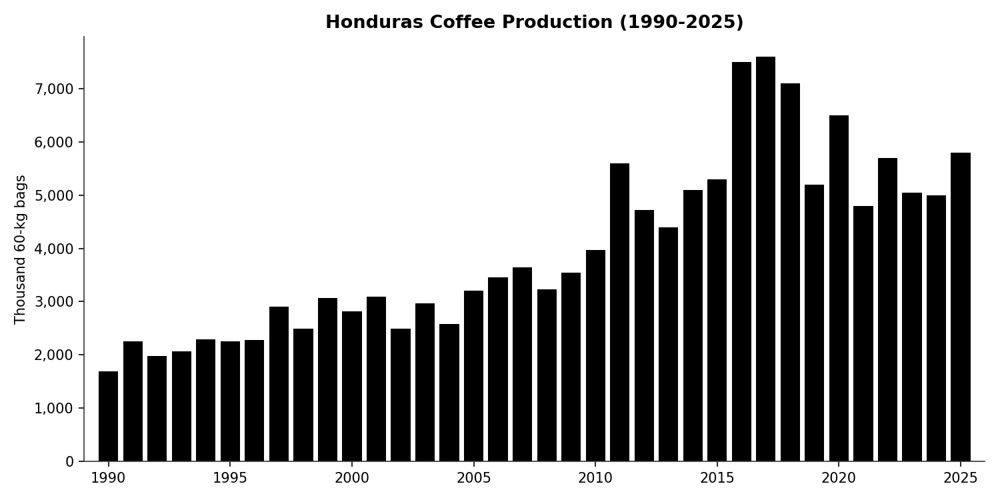

---

## The Story

Honduras is not a country most people associate with coffee. It has no Juan Valdez, no Yirgacheffe, no global brand recognition. Yet Honduras is the largest coffee producer in Central America and the sixth-largest in the world. In 2017 it produced 7.6 million bags, more than Guatemala, Costa Rica, Nicaragua, El Salvador, Peru, and Mexico individually. Coffee is the country's most important agricultural export, and the sector employs an estimated 1 million people in a country of 11 million.

The growth was rapid and recent. In 1990, Honduras produced about 1.7 million bags. By 2017, it had more than quadrupled. The expansion was driven by smallholder farmers responding to favorable prices and government programs that encouraged coffee planting — particularly in the western highlands (Copan, Ocotepeque, Lempira) and the central corridor (Comayagua, La Paz). Unlike Vietnam's state-engineered boom, Honduras's growth was more organic, driven by thousands of farmers individually deciding that coffee was a better bet than maize or beans.

Then the setbacks came in waves. Coffee leaf rust (la roya) hit Central America hard in 2012-2013, devastating yields across the region. Honduras lost an estimated 25% of its production capacity. Farmers replanted with rust-resistant varieties, and by 2016-2017 production had recovered to new highs. But the recovery was short-lived — production had already slipped from 7.6M bags in 2017 to 5.2M in 2019. Then in November 2020, Hurricanes Eta and Iota struck Honduras in rapid succession, two Category 4 storms within two weeks. The storms destroyed infrastructure, flooded farms, and displaced hundreds of thousands of people. Coffee production dropped from 6.5 million bags in 2020 to 4.8 million in 2021.

The recovery since has been partial. Production has stabilized at 5-5.8 million bags, about 76% of the 2017 peak. Whether Honduras can return to its pre-hurricane trajectory depends on continued replanting, input access, and whether global prices remain high enough to justify the investment.

Honduras's central tension is different from the other cases in this course. It is not about institutional design (Colombia), market structure (Vietnam), quality positioning (Rwanda), or traceability (Ethiopia). It is about **resilience**: how a smallholder-dominated, export-dependent coffee sector weathers the compounding shocks of climate change, disease, and natural disaster in one of the most vulnerable countries in the hemisphere.

The country has a GDP per capita of roughly $3,400, lower than Guatemala and less than half of Colombia's. Over 40% of the population is rural. Agriculture accounts for about 11% of GDP but a much larger share of rural employment. Coffee is not just an export commodity. It is a livelihood anchor for some of the poorest communities in the Western Hemisphere.

---

## Map

Honduras's coffee value chain follows the typical Central American pattern: smallholder production, intermediary aggregation, and private export.

**Actors:**

**Around 120,000 coffee farmers**
The vast majority cultivate small plots (1-5 hectares) in mountainous terrain at 1,000-1,500 meters altitude. All production is Arabica; Honduras produces zero Robusta. Farms are family-operated, with hired labor during the harvest season (November-March). Most farmers sell cherry or wet parchment rather than processed green coffee.

**Intermediaries and cooperatives**
A mix of private intermediaries (coyotes) and farmer cooperatives aggregate coffee from scattered smallholdings. Cooperatives have grown in importance. Organizations like COMSA, COCAFCAL, and IHCAFE-affiliated groups operate wet mills and connect farmers to specialty buyers. But a significant share of volume still moves through private intermediaries, particularly in more remote areas.

**IHCAFE (Instituto Hondureno del Cafe)**
The national coffee institute, funded by a levy on exports. Provides extension services, research, quality programs, and market information. Not a buyer or exporter; its role is enabling, similar to Colombia's FNC but with less market intervention.

**Exporters**
A concentrated export sector handles the majority of volume and connects Honduran coffee to the global market through the port of Puerto Cortes on the Caribbean coast.

**Importers and roasters**
Honduras ships primarily to the US and Europe. The US is the single largest destination. Most Honduran coffee enters the commercial market (blends), though the specialty segment has grown significantly since 2010, particularly for western highland coffees.

---

## Breakdown

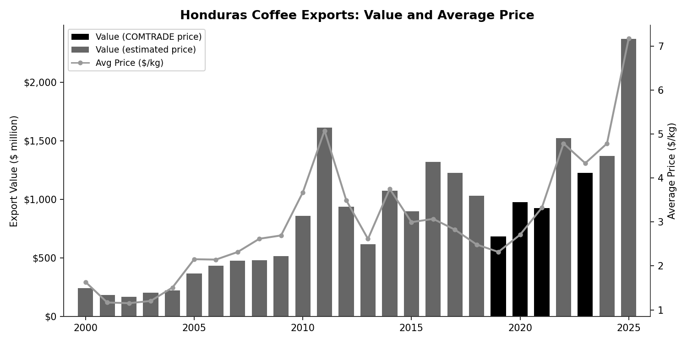

Honduran farmers are estimated to receive approximately **80% of the export price**, typical for Latin American origins with competitive intermediary markets.

Honduras's average green coffee export price has risen from $2.32/kg in 2019 to $4.34/kg in 2023, tracking the global Arabica price surge. At an 80% farmer share, that implies the farmer received roughly $1.86/kg green equivalent in 2019, rising to about $3.47/kg in 2023.

**Where the other 20% goes:**

- **Intermediary/cooperative margin**: aggregation, transport from remote hillside farms to the wet mill or dry mill
- **Processing costs**: wet milling (de-pulping, fermentation, washing), dry milling (hulling, grading)
- **IHCAFE levy**: funds sector-wide extension, research, and promotion
- **Transport to port**: from the highlands to Puerto Cortes
- **Export preparation**: quality control, documentation, container loading

**Domestic consumption:** Honduras consumes only about 335,000 bags per year, roughly 6% of production. Almost everything is exported. This makes the sector highly exposed to global price volatility with no domestic demand buffer.

**Supply-demand balance:**

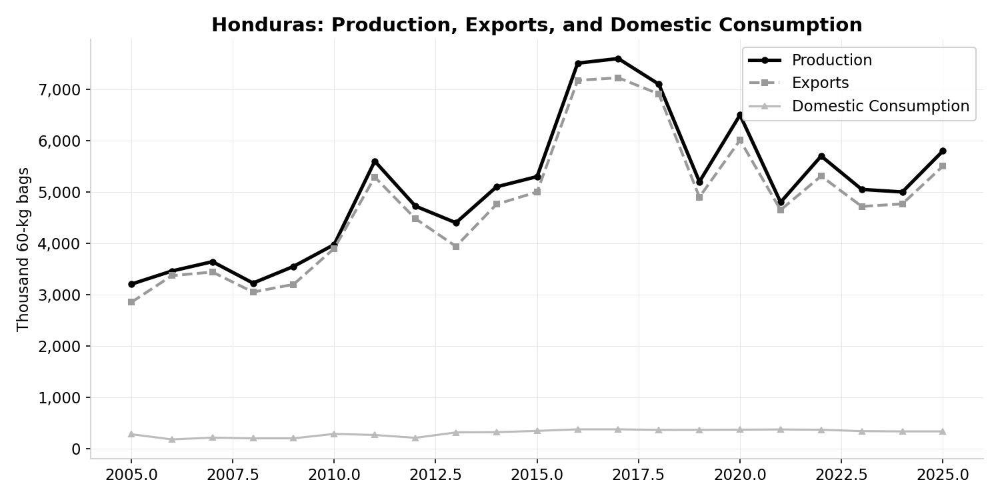

The gap between the production line and the export line is narrow. Honduras exports nearly everything it produces. Stocks are minimal. Domestic consumption is flat and low. This is a pure export-oriented value chain.

---

## Benchmark

### Position on the global supply curve

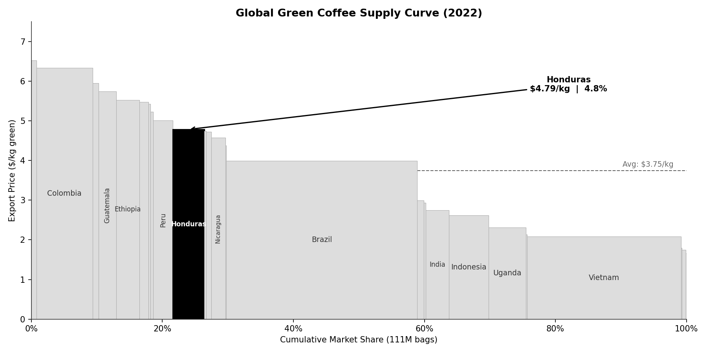

Honduras sits in the **middle of the global supply curve**, above the average price line, with a moderate market share. At $4.79/kg (2022) and 4.8% of global green coffee exports, Honduras earns more per kilogram than the large commodity producers (Brazil at $3.99, Vietnam at $2.09, Indonesia at $2.62) but less than the premium origins (Colombia at $6.34, Kenya at $6.53). This middle position reflects Honduras's status as a commercial Arabica origin — decent quality, competitive pricing, but no standout brand.

### Production: Central America's leader

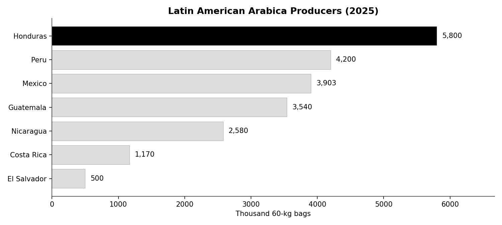

Honduras produces 5,800 thousand bags (2025 estimate), more than any Central American origin and more than Peru or Mexico. Among all global producers, Honduras ranks roughly sixth, behind Brazil, Vietnam, Colombia, Indonesia, and Ethiopia.

The production trajectory shows rapid growth from the late 1990s through 2017, a crash in 2019-2021 (la roya aftermath plus Hurricanes Eta and Iota), and a partial recovery since. Current production is about 76% of the 2017 peak.

### Prices: tracking the benchmark

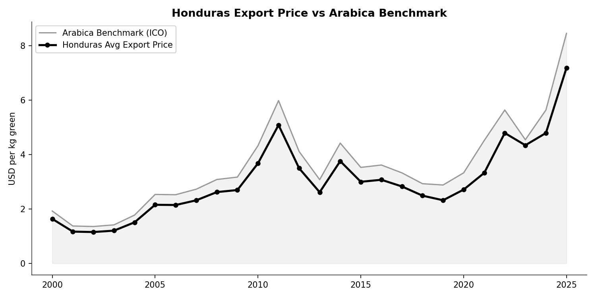

Honduras trades at or slightly below the Arabica benchmark, consistent with its position as a commercial-grade Arabica origin. The country does not command the premiums of Ethiopia or Kenya (specialty origins) or the volume discounts of Brazil (largest producer). The COMTRADE data shows Honduras closely tracking the ICO indicator, with the 2001-2003 coffee crisis, the 2011 commodity spike, and the post-2021 price surge all clearly visible.

### Yields

Honduras yields approximately **0.8 MT/ha** of green coffee, mid-range among Arabica origins. For comparison:

- Costa Rica: ~1.5 MT/ha (intensive management)
- Colombia: ~1.0 MT/ha
- **Honduras: ~0.8 MT/ha**
- Rwanda: ~0.6 MT/ha
- Ethiopia: <0.5 MT/ha

There is room for improvement through better agronomy, input use, and replanting with higher-yielding varieties. But Honduras's mountainous terrain limits mechanization, and many farms are in areas with limited road access.

### Economic context

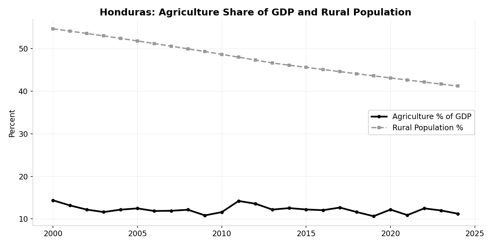

Agriculture's share of GDP has been remarkably stable at 11-12% over the past 25 years, even as the rural population has declined from 55% to 41%. This implies increasing agricultural productivity: fewer people producing the same share of output. But GDP per capita remains low ($3,426 in 2024), and the rural population that remains is disproportionately dependent on coffee.

---

## Recommendations

| Recommendation | Impact | Feasibility | Position |
|---------------|--------|-------------|----------|
| Build climate resilience (rust-resistant varieties, shade, diversification) | High | Medium | Top priority — existential for the sector |
| Improve yields through agronomy extension | High | High | High-return, proven interventions exist |
| Develop specialty market positioning for western highlands | Medium | Medium | Growing opportunity, some progress already |
| Strengthen cooperative infrastructure | Medium | Medium | Improves farmer bargaining power and quality |
| Expand domestic consumption | Low | Low | 6% domestic consumption, limited market |
| Transfer higher share of value to farmer | Low | N/A | Already at ~80% — not the binding constraint |

**Climate resilience is the top priority.** Honduras's position in the hurricane belt and its dependence on a single export crop make it uniquely vulnerable to compounding shocks. The 2020 hurricanes demonstrated that a decade of production growth can be wiped out in two weeks. Interventions include replanting with rust-resistant and drought-tolerant varieties (already underway), shade-grown systems that reduce climate exposure, soil conservation on steep hillsides, and income diversification so that a bad coffee year does not mean a bad year for the household.

**Yield improvement is the highest-return intervention.** At 0.8 MT/ha, Honduras has significant room to grow. Costa Rica achieves nearly double the yield on similar terrain. Extension services (via IHCAFE), input access (particularly fertilizer, which many Honduran farmers underuse), and tree renovation (replacing old, low-yielding stock) are proven levers. The challenge is reaching 120,000 dispersed smallholders in remote highland areas.

**Specialty positioning is an emerging opportunity.** Honduran coffees from Copan, Santa Barbara, and Marcala have begun earning recognition in specialty markets. The Cup of Excellence program in Honduras has produced lots scoring above 90 points. But the infrastructure for traceability, lot separation, and quality-consistent processing is still developing. Cooperatives are the natural vehicle for this. They can aggregate small lots, maintain traceability, and connect directly with specialty buyers.

**Farmer share is not the binding constraint.** At ~80% of the export price, Honduras's farmer share is typical for Latin America and well above Rwanda or Ethiopia. The problem is not that the chain captures too much value. It is that production is too vulnerable to external shocks and yields are too low.

---

## Discussion Questions

1. Honduras's production quadrupled between 1990 and 2017, then dropped sharply due to hurricanes and disease. Is this a growth story or a vulnerability story? How should analysts weigh past growth against demonstrated fragility?

2. Honduras produces zero Robusta, 100% Arabica. Is this a strength (higher prices per kg) or a weakness (no diversification, single species vulnerability)? Should Honduras consider introducing Robusta, as some Central American researchers have proposed?

3. Compare Honduras's position to Colombia's. Both are Latin American Arabica producers with similar farmer shares (~80%). But Colombia has the FNC, while Honduras has IHCAFE. What are the practical differences in institutional capability, and what can Honduras learn from Colombia's experience — including its mistakes?

4. The 2020 hurricanes destroyed infrastructure and displaced populations beyond the coffee sector. When a natural disaster hits a coffee-dependent region, should value chain interventions focus narrowly on coffee recovery, or should they address the broader livelihood context? What are the tradeoffs?

5. Honduras's specialty coffee segment is growing but still small. Design a realistic strategy for increasing the share of Honduran coffee sold as specialty (currently less than 10% of volume). What infrastructure, institutions, and market relationships would need to be built? What can Honduras learn from Rwanda's quality-focused approach?

---

*This case study is part of a series for the Value Chain Analysis course. See also: [Vietnam](vietnam.md), [Rwanda](rwanda.md), [Colombia](colombia.md) (archival), [Ethiopia](ethiopia.md) (archival).*

*Data last verified: March 2026*


---

<!-- ================================================ -->
<!-- PAGE: Case Studies > Colombia: Strong Institutions, Eroding Margins -->
<!-- SOURCE: case-studies/colombia.md -->
<!-- ================================================ -->

# Colombia: Strong Institutions, Eroding Margins


> **Archival note:** This case study reflects data from the 2017-2023 SIPA lectures. Some figures may be outdated. Colombia's coffee sector continues to evolve, and current conditions may differ from what is described here. The case remains valuable for understanding how institutional design shapes value chain dynamics.

## The Story

Colombia is one of the most recognized coffee origins in the world. The "Juan Valdez" brand, managed by the Federación Nacional de Cafeteros (FNC), is globally recognized. Colombian Supremo is a benchmark quality grade. The country supplies roughly 10% of global coffee volume, almost all Arabica, and commands premium prices in international markets.

The FNC is the distinctive feature of Colombia's coffee value chain, and the source of its central tension. Founded in 1927, the FNC is a unique hybrid institution, part cooperative, part research agency, part marketing organization, part quasi-governmental body. It provides extension services to farmers, operates research stations (Cenicafé), runs quality control labs, manages the Juan Valdez brand, and crucially, guarantees a purchase price to any farmer who brings coffee to an FNC buying point. This guarantee means that no Colombian coffee farmer is forced to sell at below a certain floor, a safety net that does not exist in most other origins.

But by the 2010s, the model was under strain. Farming costs had risen rapidly. Labor, inputs, and land prices all increased. Coffee leaf rust (la roya) devastated production in 2008-2012, requiring expensive tree renovation. Meanwhile, the guaranteed purchase price could not fully keep pace with rising costs. The result was that farmer margins eroded. The government spent an estimated $600 million subsidizing coffee farmers over several years to keep them afloat.

The tension is this: Colombia has arguably the strongest institutional infrastructure of any coffee-producing country. The FNC provides services that farmers in most other origins can only dream of. But that institutional strength comes at a cost, and when farming economics deteriorate, the institutions become part of the cost structure rather than a solution to it.

Colombia has approximately 550,000 coffee farmers. The sector is predominantly smallholder, but with a wider range of farm sizes than Rwanda or Ethiopia. Some Colombian farms are semi-commercial operations of 5-10 hectares; others are tiny plots of less than 1 hectare.

This is what makes Colombia worth studying closely, not just as a coffee producer, but as a case study in institutional design. The FNC model represents a deliberate, sustained attempt to redistribute value within a commodity chain toward primary producers. For roughly eight decades, it largely succeeded. Then the economics shifted. What the FNC built is genuinely impressive; what it could not control is what the case is really about.

---

## Map


**Actors:**

- **~550,000 farmers**: Mostly smallholders, wide range of farm sizes. Grow Arabica across multiple departments (Huila, Nariño, Antioquia, Tolima, Caldas, etc.). Farm size ranges from less than 1 hectare to semi-commercial operations of 5-10 hectares, with a small number of larger commercial farms.
- **FNC (Federación Nacional de Cafeteros)**: The dominant institutional player. Roles include:
  - Guaranteed purchase: any farmer can sell to FNC buying points at a published price
  - Extension services: Cenicafé research, field-level technical assistance
  - Quality control: cupping labs, export quality certification
  - Marketing: Juan Valdez brand, "100% Colombian Coffee" program
  - Price stabilization: manages the National Coffee Fund
- **Cooperatives**: FNC-affiliated cooperatives aggregate farmer production and operate buying points. They are the physical infrastructure of the guaranteed purchase system.
- **Private exporters**: Compete with the cooperative channel; some offer premiums for higher quality or certified coffees, particularly for specialty or micro-lot production from regions like Huila and Nariño.
- **Importers/traders**: International buyers, many with long-standing relationships with Colombian exporters. Colombia benefits from deep buyer familiarity, a decades-long asset built partly by FNC marketing.

**Value chain flow:**

```
Farmer → FNC Cooperative (buying point) → Exporter (cooperative or private) → International trader/importer → Roaster → Consumer
```

**Unique structural feature:** The FNC guaranteed purchase price creates a price floor that disciplines the entire chain. Private buyers must match or beat the FNC price to attract volume. This is fundamentally different from Vietnam (pure market competition) or Rwanda (CWS-mediated pricing, where farmers have limited alternatives). In Colombia, the farmer always has a credible outside option.

**The National Coffee Fund:** Funded by a levy on exports, the Fund provides the financial backing for the guaranteed purchase price, the FNC's services, and stabilization payments during price downturns. It is the fiscal mechanism that makes the FNC model work, and it is why Colombia could spend an estimated $500-700 million subsidizing farmers during the 2012-2015 crisis period without the system collapsing. The mechanism was the PIC (Protección del Ingreso Cafetero), a per-unit price floor payment delivered through FNC cooperatives and funded by the national government.

---

## Breakdown

**Farmer share of export price:** Colombian farmers earn approximately 80% of the export price, typical for Latin American origins and partly a function of the FNC's institutional design. Most coffee-producing countries deliver more than 50% to the farmer. Vietnam is best in class at ~95%. Latin America is typically around 80%. Africa shows the most variation — Ethiopia around 65%, Rwanda around 54%. Colombia's figure reflects both the efficiency of the FNC channel and the price floor discipline described above.

But here is the key analytical point: **high revenue share does not equal high margins.** If costs are also high, a farmer receiving 80% of export price can still earn less net income than a farmer receiving 65% in a lower-cost production system. This is Colombia's predicament.

**Cost structure:**

Farming costs rose rapidly across the 2000s and 2010s:

- Labor costs increased as Colombia's economy grew and agricultural workers found alternative employment in construction, manufacturing, and services
- Input costs (fertilizer, pesticides, fungicides) rose with global commodity prices
- Tree renovation costs were substantial after la roya; infected trees had to be replaced, which required capital investment and several years of reduced production during the replanting period
- Land prices increased in coffee-growing regions, particularly as other land uses (cattle, urban expansion, illicit crops at the margins) competed for agricultural land

The net effect: the gap between the cost of producing a kilogram of coffee and the price received for it (the margin) compressed sharply. The FNC guaranteed price provided a floor, but the floor was below the cost of production for many farms during this period. Government subsidies filled part of the gap; some farmers exited.

**Price positioning:**

Colombia supplies roughly 10% of the global market at a premium price. Colombian green coffee typically trades at a positive differential to the ICE "C" contract (eg C + $0.15-0.30/lb), reflecting its quality reputation. The FNC's marketing investment over decades (Cenicafé's varietal development, the Juan Valdez brand, the "100% Colombian Coffee" certification program) contributes directly to this premium.

**Export channel split:**

The majority of Colombian coffee exports flow through the cooperative/FNC channel. Private exporters have grown in share, particularly for specialty and certified coffees, but the FNC remains the dominant buyer and exporter. This is different from most origins where private traders dominate.

---

## Benchmark

**Yields:** Colombia averages approximately 1.0 MT/ha, mid-range by global standards. Higher than Rwanda or Ethiopia, lower than Vietnam or Brazil. There is meaningful potential for improvement through tree renovation (newer varieties yield more) and more intensive management. But Colombia's mountainous terrain limits mechanization and raises labor costs per unit of output. The country cannot achieve Vietnam-style yields through intensification alone.

**Production trajectory:** Relatively stable over the long run, with a significant dip during the la roya crisis (2008-2012) and a recovery through renovación cafetería (government- and FNC-funded tree replacement programs). Colombia has not experienced dramatic growth (like Vietnam's robusta expansion) or prolonged stagnation (like Rwanda's decade-long plateau). Production has oscillated around 12-14 million bags.

**Price realization:** Premium positioning, well above commodity origins. Colombia benefits from both country-of-origin recognition and the FNC's quality control infrastructure. However, the premium has been partially offset by rising costs. Earning more per kilogram than other origins does not resolve the cost problem.

**Comparison to peers:**

| Dimension | Colombia | Vietnam | Rwanda | Brazil |
|---|---|---|---|---|
| Volume (rough) | ~12-14M bags | ~30M bags | ~0.5M bags | ~60M bags |
| Primary type | Arabica | Robusta | Arabica | Arabica + Robusta |
| Farmer share | ~80% | ~95% | ~54% | 70-85% (varies by farm type) |
| Institutional support | Very strong (FNC) | Enabling (non-intermediating) | Moderate (building) | Weak-moderate |
| Cost competitiveness | Low | High | Low | High (mechanized) |
| Price premium | Yes | No | Emerging | Partial |
| Living income challenge | Yes | Less acute | Yes | Mixed |

**vs Vietnam:** Colombia earns more per kg but produces less per hectare. Vietnam's competitive advantage is cost and volume; Colombia's is quality and brand. The two countries are not really competing in the same market. Colombia cannot compete on cost; Vietnam cannot (currently) compete on quality reputation.

**vs Rwanda:** Similar challenges with farmer income and living wage. Both produce premium Arabica with strong farmer share of export price, yet both face living income shortfalls. Colombia's FNC provides institutional support (extension, research, guaranteed price) that Rwanda is only beginning to build through its exporter-led model. But more institution does not automatically mean better outcomes for farmers.

**vs Brazil:** Brazil's mechanized, large-farm model has dramatically lower unit costs. Colombian coffee production is simply more expensive; the terrain, the smallholder structure, and the labor intensity all contribute. Colombia must compete on quality and brand differentiation; competing on cost is not an option.

---

## Recommendations

From the 2017-2023 lectures:

**1. Segment strategies by producer type.** A single policy for 550,000 farms misses the heterogeneity in the sector. Different farms need different interventions:

- Small subsistence farmers (<2 ha): focus on yield improvement and cost reduction through basic agronomy. Extension services and Cenicafé's improved varieties are the priority.
- Semi-commercial farms (2-10 ha): quality improvement, certification programs, direct trade relationships. These farms can capture specialty premiums if connected to the right buyers.
- Larger commercial operations (>10 ha): efficiency, diversification, potential for value addition on-farm (wet mills, micro-lots, direct export).

**2. Address the cost structure, not just price.** The problem is not primarily that Colombian farmers receive a low share of the export price (they receive 80%). The problem is that costs have risen faster than prices. Interventions focused solely on increasing the farm-gate price — without addressing labor productivity, input efficiency, or tree renovation — will require ongoing subsidy without resolving the underlying gap. Interventions should focus on reducing costs as much as increasing prices.

**3. Evaluate the FNC model.** The FNC provides enormous value but also significant cost. Are all of its functions still necessary? Are there efficiencies to be gained? Could some services be delivered differently, through digital platforms, private sector partnerships, or reformed cooperative structures? This is a politically sensitive question (the FNC has 550,000 members who vote) but an analytically important one. The system was designed in 1927; the economy has changed.

**4. Living income as explicit policy goal.** Like Rwanda, many Colombian farmers struggle to earn a living income from coffee alone, particularly smaller producers on less than 2 hectares. The policy response cannot be: "keep the FNC price floor up and hope." It must include honest accounting of what minimum farm size and productivity level generates a living income, and what to do about farmers below that threshold (diversification, off-farm income, consolidation, exit support).

---

## Discussion Questions

1. The FNC guaranteed purchase price protects farmers from the worst of price volatility. But does it also reduce incentives for quality improvement (since farmers know they have a guaranteed buyer regardless of quality)? How would you test this hypothesis empirically? What data would you need?

2. Colombia spent an estimated $600 million subsidizing coffee farmers during the 2008-2014 period. Was this a good use of public resources? What alternatives might have achieved the same goals at lower cost — or different goals more effectively?

3. Compare Colombia's institutional model (FNC) to Vietnam's model (minimal institutional intermediation, near-pure market competition). What are the tradeoffs? Under what conditions does each model work better — for whom?

4. If you were advising the Colombian government, would you recommend reforming the FNC, expanding it, or leaving it unchanged? What specific changes would you propose, and what political economy obstacles would you anticipate?

5. Colombia and Rwanda both produce premium Arabica with strong farmer share of export price, yet both face living income challenges. What does this tell us about the limits of value chain interventions for addressing farmer poverty? What would need to be true for value chain reform to be sufficient?

---

*This case study is part of a series for the Value Chain Analysis course. See also: [Vietnam](vietnam.md), [Rwanda](rwanda.md), [Honduras](honduras.md), [Ethiopia](ethiopia.md) (archival).*

*Data from 2017-2023 lectures. Not updated for current market conditions.*


---

<!-- ================================================ -->
<!-- PAGE: Case Studies > Ethiopia: Traceability Lost and Found -->
<!-- SOURCE: case-studies/ethiopia.md -->
<!-- ================================================ -->

# Ethiopia: Traceability Lost and Found

> **Archival note:** This case study reflects data from the 2017-2020 SIPA lectures. Ethiopia's coffee sector has undergone significant changes since, including ECX reforms that have restored some traceability. Current conditions may differ materially from what is described here. The case remains valuable as a study of how market design choices affect value chain performance.

## The Story

Ethiopia is the birthplace of coffee. The country has extraordinary genetic diversity in its Arabica varieties, a centuries-old coffee culture, and some of the most distinctive flavor profiles in the world. Ethiopian Yirgacheffe, Sidamo, and Harrar are recognized grades that command premiums in specialty markets.

The country is also one of the most complex origins to analyze. Ethiopia has two distinct coffee value chains, washed and unwashed (natural), that involve different actors, different processing, and different economics. Washed coffee, processed through cooperatives, earns a significant quality premium. Unwashed coffee, which represents the majority of production, is simpler to process but trades at lower prices.

Between 2003 and 2012, the value of Ethiopia's coffee exports quadrupled. But here is the critical finding. Export volumes stayed essentially flat over the same period. The quadrupling of revenue came overwhelmingly from rising global coffee prices. Ethiopian production increased modestly over the period, but nowhere near enough to explain the revenue growth. The country rode a price wave without changing its underlying economics.

Then came the Ethiopia Commodity Exchange (ECX). Launched in 2008, the ECX was designed to solve real problems: intermediaries had exploited information asymmetry to underpay farmers, price manipulation was common, and the quality of market data was poor. The ECX aimed to bring transparency, standardized grading, and efficient price discovery to Ethiopia's commodity markets. For most commodities, it arguably succeeded. For coffee, the design had a critical flaw: most coffee, with the exception of cooperative-channel coffee, had to be traded through the exchange, where the ECX assigned quality grades and pooled coffees by region.

The unintended consequence was devastating for specialty coffee. The ECX eliminated traceability, the ability to trace a specific coffee back to a specific cooperative, washing station, or region at a granular level. When a buyer purchased "ECX Grade 2 Sidamo," they could not know which specific washing station produced it. For the specialty market, which values provenance and pays premiums for traceable, high-quality lots, this was a deal-breaker.

The market responded. Ethiopia's export differentials (the premium above the C price) dropped after the ECX eliminated traceability. Specialty buyers signaled reduced demand for Ethiopian coffee. The country was destroying value by making its best coffees anonymous.

Cooperatives, however, could bypass the ECX. The cooperative channel maintained direct traceability: a cooperative could sell a specific lot from a specific washing station directly to an international buyer. This created a two-tier system. Cooperative coffee had traceability and premiums; ECX coffee did not.

TechnoServe, an international NGO, introduced a new value chain model that worked within the cooperative channel. By improving wet processing quality, strengthening cooperative management, and connecting cooperatives directly with specialty buyers, the program helped farmers earn a higher share of the export price. Total value creation from the TechnoServe-supported cooperative model exceeded $20 million per year.

Ethiopia's central tension: the best coffee genetics on the planet, undermined by a market design that made its finest lots anonymous.

---

## Map

**Actors:**

- **An estimated 4-5 million smallholder farmers (the exact count is disputed).** Ethiopia has an enormous number of coffee farmers. Estimates vary widely, and the exact number is one of the open questions in the industry. Most are very small-scale, growing coffee alongside food crops, often in semi-forest or garden systems.
- **Collectors (sebsabis).** Local traders who buy cherry from farmers and aggregate it for sale to larger buyers. Operate in both washed and unwashed channels.
- **Cooperatives.** Farmer-owned organizations that operate washing stations and can export directly, bypassing the ECX. Historically the quality channel.
- **The ECX (Ethiopia Commodity Exchange).** The mandatory trading platform for most non-cooperative coffee. Grades coffee by quality and pools by region. Eliminates individual lot traceability.
- **Exporters.** Purchase from the ECX or directly from cooperatives. Arrange international sale and shipping.

**Two parallel chains:**

1. **Unwashed/natural channel** (majority of volume): Farmer → Collector → ECX → Exporter → Importer. Cherry is dried with the fruit on, processed at dry mills, traded through the ECX. Lower quality, lower price, no traceability.

2. **Washed/cooperative channel** (minority of volume, higher value): Farmer → Cooperative washing station → Cooperative union → Exporter/Direct buyer → Importer. Cherry is wet-processed at the cooperative's washing station. Higher quality, higher price, full traceability.

The cooperative channel is the only path to full traceability and specialty premiums, which is why interventions like TechnoServe's focused on strengthening this channel.

---

## Breakdown

**Export revenue growth.** Ethiopia's coffee export revenues quadrupled between 2003/04 and 2011/12. Export volumes stayed flat. The revenue growth was entirely price-driven. Ethiopia benefited from rising global coffee prices without increasing production. This is a cautionary data point: headline revenue growth can mask stagnation in underlying productive capacity.

**Washed vs. unwashed premium.** Ethiopian washed coffee earns a significant premium over unwashed. The exact differential varies, but it is substantial enough to justify the additional processing cost. This premium was undermined when the ECX pooled washed and unwashed coffees under common regional grades, collapsing the price signal that had previously rewarded quality investment.

**Export differentials declined.** After the ECX eliminated traceability, Ethiopia's differential over the ICE "C" price dropped. Specialty buyers who had been paying premiums for traceable Ethiopian lots reduced their purchases or shifted to other origins. The market was sending a clear signal: traceability has economic value, and destroying it destroys value.

**The cooperative channel margin.** Cooperatives can bypass the ECX, but the cooperative channel takes approximately 35% of the value between farmer and export. This covers wet processing costs (washing station operation), cooperative overhead, cooperative union levies, and transport. Whether 35% is excessive depends on the services provided and the alternatives available to farmers. In most cases, the premium earned through the cooperative channel more than offsets the margin taken — farmers in the cooperative channel capture a higher absolute share of the export price than farmers in the unwashed channel, even accounting for the 35% margin.

**TechnoServe intervention.** TechnoServe introduced a model that improved wet processing quality at cooperative washing stations, strengthened cooperative governance and management, and connected cooperatives with specialty buyers willing to pay premiums for traceable, high-quality lots. The results:
- Farmers earned a higher share of the export price
- Total value creation exceeded $20 million per year
- The model demonstrated that quality-focused interventions could work at scale in the cooperative channel

**Farmer share.** Farmer share data for Ethiopia is harder to pin down than for Vietnam or Rwanda due to the complexity of the chain and the variation between washed and unwashed channels, roughly 55-65% depending on channel. In the 2010/11 data from the lectures, farmers in the unwashed channel captured a lower share than those in the cooperative washed channel, consistent with the broader pattern that disintermediated, traceable chains return more value to producers.

---

## Benchmark

**Yields.** Ethiopia has the lowest farm yields among major coffee origins, below 0.5 MT/ha. For comparison:

| Origin | Yield (MT/ha) |
|---|---|
| Vietnam | 3.0+ |
| Brazil | 1.5-2.0 |
| Colombia | ~1.0 |
| Rwanda | ~0.6 |
| Ethiopia | <0.5 |

The low yields reflect semi-forest and garden production systems (low-density planting), minimal input use, old tree stock, and limited extension services reaching the vast majority of farmers. There is enormous upside potential, but also cultural and ecological reasons to preserve traditional production systems, which maintain genetic biodiversity and forest cover.

**Price positioning.** Ethiopia is a high-price origin when traceability is maintained. Yirgacheffe, Sidamo, and Harrar command specialty premiums. The ECX undermined this positioning for non-cooperative coffee by making provenance anonymous at the point of trade.

**Comparison to peers:**

- *vs. Vietnam:* Opposite model in almost every dimension. Vietnam has the highest yields, lowest per-kg prices, and shortest chain. Ethiopia has the lowest yields, high per-kg prices (when traceable), and a complex multi-channel chain. Vietnam's strength is efficiency; Ethiopia's is differentiation. Neither approach is strictly superior — it depends on what the market rewards.

- *vs. Colombia:* Both are premium Arabica origins with strong quality reputations. Colombia has much stronger centralized institutions (the FNC) that manage branding, extension, and price floors. Ethiopia has greater variety diversity and a more distinctive flavor profile but weaker institutional infrastructure.

- *vs. Rwanda:* Similar structural challenges: small farms, low yields, living income gaps, dependence on development interventions to improve quality. Rwanda has invested more systematically in CWS infrastructure; Ethiopia has greater scale and variety diversity. The two-channel problem (cooperative/traceable vs. middleman/anonymous) appears in both countries.

---

## Recommendations

From the 2017-2020 lectures:

**1. Restore and expand traceability.** The ECX experiment demonstrated that traceability has quantifiable economic value. Specialty buyers pay more when they can trace coffee to a specific origin, cooperative, or washing station. Policy reforms should prioritize enabling traceability throughout the chain, not just in the cooperative channel.

**2. Support cooperative channel development.** The cooperative channel is the proven path to quality premiums and farmer value capture. Strengthening cooperative governance, improving wet processing quality, and connecting cooperatives with specialty buyers (as TechnoServe demonstrated) creates measurable value. The $20M+/year figure from a single intervention suggests the returns to additional investment in this channel are substantial.

**3. Increase yields.** Ethiopia has the lowest yields among major origins. Even modest improvements, from 0.4 to 0.8 MT/ha, would roughly double farmer income per hectare without any change in price. Tree renovation, input access, and extension services are the levers. The challenge is reaching millions of dispersed farmers in remote areas. This is an area where the cooperative structure could help: cooperatives provide a natural platform for extension delivery.

**4. Address the washed/unwashed quality gap.** Expanding wet processing capacity (more washing stations, more cooperative infrastructure) would shift volume from the lower-value unwashed channel to the higher-value washed channel. This requires capital investment and training but the per-unit economics are favorable.

---

## Discussion Questions

1. The ECX was designed to bring transparency and efficiency to agricultural markets. For most commodities, it arguably succeeded. Why did it fail for specialty coffee? What does this tell us about the difference between commodity markets and specialty markets?

2. TechnoServe's intervention created $20M+/year in value through the cooperative channel. What are the limits of this model? Could it scale to cover all of Ethiopia's coffee production, or is it inherently limited to the cooperative segment?

3. Ethiopia's low yields are partly a function of traditional semi-forest production systems that maintain biodiversity and forest cover. Is there a tradeoff between yield improvement and environmental conservation? How should policymakers navigate this tradeoff?

4. Compare Ethiopia's dual-channel system (washed cooperative + unwashed ECX) with Rwanda's dual-channel system (CWS + middleman). What structural similarities and differences exist? What can each country learn from the other?

5. If you were designing a commodity exchange for Ethiopian coffee from scratch, what would you do differently from the ECX? How would you balance market efficiency, price transparency, and traceability?

---

*This case study is part of a series for the Value Chain Analysis course. See also: [Vietnam](vietnam.md), [Rwanda](rwanda.md), [Honduras](honduras.md), [Colombia](colombia.md) (archival).*

*Data from 2017-2020 lectures. Not updated for current market conditions.*


---

<!-- ================================================ -->
<!-- PAGE: Practical Skills > For Humans -->
<!-- SOURCE: lecture-notes/practical-tips.md -->
<!-- ================================================ -->

# For Humans

## Scoping the Analysis

Before you start analyzing, define what you are analyzing and why. Be specific about the product (washed Arabica in Rwanda is a different analysis than Robusta in Vietnam), the geographic boundaries (national, regional, a specific supply corridor), the time period, and which stages of the chain you will cover. Most development-focused VCAs focus on farm to export.

Know who commissioned the analysis and why. A donor designing a program needs different outputs than a government writing a national coffee strategy or a private company evaluating a sourcing decision. The purpose shapes everything.

## Before You Go

**Understand the context** before you start mapping the value chain. Read the political history. Understand the land tenure system. Know the major ethnic and regional dynamics. Learn what happened to the coffee sector during structural adjustment, during conflict (if applicable), during commodity booms and busts. Rwanda's coffee sector cannot be understood without the genocide and the government's top-down reconstruction. Ethiopia's cannot be understood without the ECX. A value chain analysis that ignores context will produce technically correct but practically useless recommendations.

**Identify the right mix of stakeholders.** Your interview list should not be limited to the obvious actors like farmers and exporters. Input suppliers know what farmers are buying and what they can afford. Transporters know the real costs of moving coffee from farm to mill to port. Government officials know the regulatory environment and where the political constraints are. NGOs and donor agencies know what interventions have been tried and which ones failed. Extension agents know what actually happens on the ground, as opposed to what headquarters thinks is happening. Cast a wide net.

**Talk through hypotheses with experts early.** Do not wait until the analysis is done to get feedback. Share your preliminary map, your early price data, and your emerging hypotheses with people who know the sector: country experts, industry veterans, experienced consultants. They will tell you what you are missing, where your numbers look wrong, and which assumptions are unrealistic. An hour of expert feedback early in the process can save weeks of wasted analysis.

## In the Field

**Get diverse opinions.** Do not rely on a single perspective. A cooperative manager will tell you the cooperative channel works well. A private trader will tell you cooperatives are inefficient. A government official will tell you the policy environment is supportive. A farmer may tell you something different from all three. Triangulate. When three independent sources give you the same story, you are probably close to the truth. When they diverge, you have found something interesting worth investigating further.

**Corroborate numbers with different sources.** This is the single most important data quality practice. If two independent sources (say, a cooperative manager and an exporter) give you the same farm-gate price for cherry in a given region, you can use that number with confidence. If they disagree by 50%, you need to investigate further. In VCA work, a number that comes from only one source should be treated as an estimate, not a fact. Label it accordingly.

**Make it easy for people to give you data.** People in the coffee industry are busy. If you want data (production figures, price records, cost structures), make it easy to share. Have a simple template ready. Offer to sign an NDA if they are concerned about confidentiality. Do not show up to a meeting with a 40-question survey and expect someone to fill it out on the spot. Short, focused asks get better responses than comprehensive but burdensome ones.

**Go both downstream and upstream.** There are two ways to trace a value chain. Downstream: start at the farm and follow the product forward through processing, trading, and export. Upstream: start at the buyer (an importer, a roaster, a retailer) and trace backward to the source. Both approaches have value. Going downstream gives you the farmer's perspective and reveals the full sequence of transformations. Going upstream gives you the buyer's perspective and reveals what the market actually demands. The best analyses do both.

## Back at the Desk

**Cross-check official statistics.** National production figures, area under cultivation, number of registered farmers: these numbers come from government agencies that may not have the budget, capacity, or incentive to maintain accurate records. Cross-check with industry sources: exporter associations, international organizations (ICO, World Bank), NGO reports, and academic studies. When official numbers and industry numbers diverge significantly, note the discrepancy and explain which source you trust more and why.

**Segment, don't generalize.** The "average farmer" is a statistical fiction. In any given country there are subsistence farmers growing coffee on tiny plots alongside food crops, semi-commercial farmers investing in quality improvements, and commercial operations running hundreds of hectares. Their cost structures, quality levels, market access, and risk profiles are fundamentally different. Your analysis and your recommendations should reflect this.

## Reporting

Structure your report for the audience.

For donors and development agencies, lead with the problem statement and proposed interventions. Put methodology at the end. Emphasize impact potential and beneficiary numbers.

For government officials, lead with national-level implications (employment, export revenue, rural development). Connect recommendations to existing policy frameworks. Be realistic about institutional capacity.

For private sector, lead with the business case. Focus on sourcing risks, quality opportunities, and competitive positioning.

For all audiences: keep the main report concise (20-30 pages), put detailed data and interview notes in appendices, use visual summaries (the map, the waterfall, the benchmark chart, the matrix), state your assumptions explicitly, and acknowledge limitations and data gaps.
