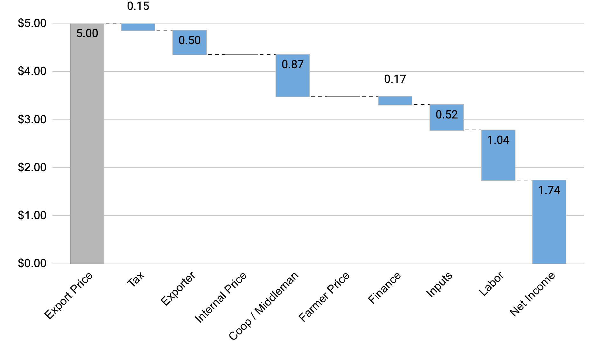

# Breaking Down Value Flows

## What It Is
Tracing how money moves through the value chain — who pays whom, how much, and what costs each actor bears. The breakdown reveals where value accumulates, where margins are thin, and where the economics create winners and losers.

{: .framework-img }

## Why It Matters
Without a breakdown, you cannot tell whether the problem is low prices, high costs, or value captured by intermediaries. A farmer earning 50% of the export price might be doing well (if the export price is high and costs are low) or might be in poverty (if the export price is low and costs consume most of what they earn). The breakdown gives you the full picture.

## How to Do It
Step-by-step, using coffee examples:

1. **Start at the export price.** This is the most publicly available data point. Sources: COMTRADE (UN trade database), national coffee boards, ICO data. Export prices are quoted in standard units — typically USD/lb or USD/kg of green coffee. For example, Rwanda Arabica might export at $2.23/lb green, while Vietnam Robusta exports at about $4.95/kg green.

2. **Work backward to the farm-gate price.** Farmer prices require literature review or field interviews. They are quoted in local currency per local unit of whatever product form the farmer sells (often cherry, not green). Key challenge: converting from local units to international standards (see Skill 3).

3. **Identify costs and margins at each intermediate stage.** Between the farmer and the export point, there are processing costs (wet milling, dry milling), transport costs, taxes and fees, and trader margins. Each needs to be estimated. Interview actors at each stage. Ask: what do you pay for the product? What do you sell it for? What are your costs?

4. **Build a waterfall chart.** The standard visualization. Bars show how value accumulates from farmer cost of production through each intermediate stage to the export price. Reading left to right: farmer costs → farmer margin → processing costs → transport → taxes/fees → trader margin → export price. Each bar is a segment. The total height is the export price.

5. **Estimate on-farm costs of production.** Notoriously hard for smallholders. Family labor is rarely costed. Land has no formal market price. Inputs may be subsidized. Published estimates vary widely. Approach with caution and state your assumptions.

Example breakdowns from real coffee value chains:

**Vietnam Robusta.** Farmers earn ~95% of the export price ($4.95/kg green, March 2025). Collector and exporter margins are razor-thin, less than 1% each. Why? Intense competition among hundreds of thousands of middlemen, no cooperative or government intermediary taking a cut.

**Rwanda Arabica.** Farmers earn about 54% of the export price ($4.92/kg green). The remaining ~46% goes to coffee washing station costs (equipment, water, labor), transport, export processing, and institutional support (partly funded by tax). The "missing" value is not waste. It is the cost of infrastructure and quality processing. Rwanda is at the low end globally; most countries deliver more than 50% to the farmer.

## Common Mistakes

1. **Confusing price with margin.** A farmer who receives $2.67/kg green is not "earning" $2.67. Their costs of production might be $2.00, leaving a margin of $0.67. Price tells you revenue; margin tells you profit. Always try to get both.

2. **Forgetting transport and processing losses.** Physical losses during processing and transport are real. The cherry-to-green conversion wastes 80-85% of the weight. Transport losses (spoilage, spillage, theft) may be 1-5%. If you don't account for these, your waterfall will not balance.

3. **Using stale price data without adjusting.** Coffee prices are volatile. A breakdown based on 2020 prices is not valid in 2025. Always specify the time period and, if possible, normalize to current market conditions.

4. **Ignoring seasonal variation.** Farm-gate prices vary significantly during the harvest season — high at the start when supply is limited, lower at peak harvest when supply floods the market. A single "average" price may hide important dynamics.

5. **Treating "farmer share" as a sufficient metric on its own.** A farmer earning 95% of the export price (Vietnam) sounds great until you realize the export price for Robusta is lower than Arabica. A farmer earning 54% (Rwanda) of a higher Arabica price may or may not earn more in absolute terms. Always look at absolute income per hectare, not just share.

## Practice Prompt

Given the following data for Rwanda Arabica coffee:

- Export price: $4.92/kg green (adjusted for +$0.40 market differential over ICE "C")
- Farm-gate price: 500 RWF/kg cherry
- Exchange rate: 0.00076 USD/RWF
- Cherry-to-green conversion ratio: 7:1 (Rwanda Arabica, high altitude)

Calculate the farmer's share of the export price. Then list what additional information you would need to build a complete waterfall from farmer cost of production through to the export price. Identify at least 4 cost categories that sit between the farmer and the export point.

