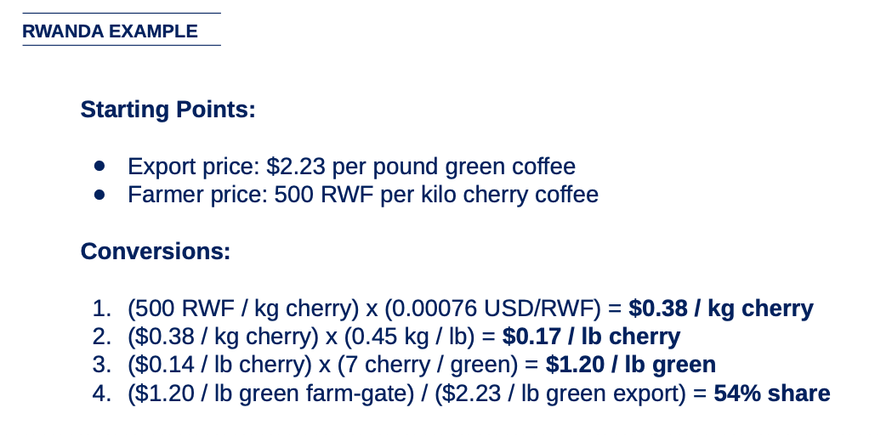

# Dealing with Unit Conversions

## What It Is
Converting between the units that local actors use and the international standards needed for cross-country comparison. Coffee farmers sell cherry by the kilo in local currency. Exporters sell green coffee by the pound in US dollars. Comparing these prices requires converting currency, weight, and product form — and getting any one wrong invalidates the entire analysis.

{: .framework-img }

## Why It Matters
Without proper conversions, you cannot compare across countries or even across stages of the same value chain. A price in RWF/kg cherry is not directly comparable to a price in USD/lb green. Most errors in VCA work trace back to a conversion mistake — wrong cherry-to-green ratio, wrong exchange rate, or mixing up kilograms and pounds halfway through. This skill is mechanical but unforgiving.

## How to Do It
Walk through the Rwanda example step by step:

**Starting points:**
- Export price: $2.23 per pound green coffee
- Farmer price: 500 RWF per kilogram cherry coffee

**Step 1: Convert currency (RWF → USD)**
(500 RWF / kg cherry) × (0.00076 USD/RWF) = $0.38 / kg cherry

**Step 2: Convert weight (kg → lb)**
($0.38 / kg cherry) × (0.45 kg/lb) = $0.17 / lb cherry

**Step 3: Convert product form (cherry → green)**
($0.17 / lb cherry) × (7 cherry/green) = $1.20 / lb green

**Step 4: Calculate farmer share**
($1.20 / lb green) / ($2.23 / lb green) = 54% farmer share

The conversion ratio of 7:1 (cherry to green) is specific to Rwanda, where high altitude pushes the ratio to the upper end of the Arabica range. Across Arabica origins generally, the ratio runs from about 6:1 to 7:1, driven by species, varietal, and agro-climatic conditions (including altitude) — not by the processing method. A washed and a natural coffee from the same origin will have essentially the same net cherry-to-green conversion. Robusta has a lower ratio of approximately 5:1, reflecting the different bean size and density.

## Key Conversion Factors for Coffee

| Conversion | Factor | Notes |
|-----------|--------|-------|
| Cherry to green (Arabica) | ~6:1 to 7:1 | Varies by varietal and agro-climate (including altitude). Rwanda ~7:1, most other origins ~6.25:1 |
| Cherry to green (Robusta) | ~5:1 | Lower ratio, reflecting different bean characteristics |
| Parchment to green | ~1.25:1 | Hulling removes the parchment layer |
| Kilograms to pounds | 1 kg = 2.205 lb | Or: 1 lb = 0.4536 kg |
| Bags to kg | 1 bag = 60 kg | Standard international jute bag |
| Bags to pounds | 1 bag = 132.28 lb | |

Common currencies encountered in coffee VCA:

- BRL (Brazil), VND (Vietnam), COP (Colombia), ETB (Ethiopia), RWF (Rwanda), UGX (Uganda), KES (Kenya), GTQ (Guatemala), HNL (Honduras)
- Always specify the date of the exchange rate used — currencies in producing countries can fluctuate significantly

## Common Mistakes

1. **Using the wrong cherry-to-green ratio for the species or origin.** The ratio varies by species (Arabica vs Robusta) and by varietal and agro-climate within Arabica — not by processing method. Using Rwanda's 7:1 ratio for a lower-altitude Arabica origin where 6.25:1 is correct will overstate the farmer's effective price in green-equivalent terms. Using an Arabica ratio for Robusta (which should be ~5:1) makes the error even larger. Always confirm the species and the locally accepted conversion factor.

2. **Mixing up "per kg" and "per lb" midway through a calculation.** This is embarrassingly common. Once you start a calculation in one unit system, stay in it until the end. Or convert everything to one standard (USD/kg green) at the outset.

3. **Not specifying which product form a price refers to.** "$3 per kilo" is meaningless without knowing whether it is per kilo of cherry, parchment, or green. Cherry at $3/kg is a high price. Green at $3/kg is a low price. Always label your units completely.

4. **Forgetting that exchange rates fluctuate.** A farm-gate price collected in March may look very different when converted at December exchange rates. For countries with significant currency volatility (Ethiopia is a prime example after the 2024 birr float), this can shift the analysis materially. State the exchange rate and date explicitly.

5. **Confusing FOB (export) price with farmgate price.** The FOB (Free On Board) price is what the buyer pays at the port of export. The farmgate price is what the farmer receives. The difference between them is the supply chain cost. These are fundamentally different numbers — do not use one where the other is needed.

## Practice Prompt

A Vietnamese farmer sells Robusta cherry at 52,000 VND per kilogram. The current exchange rate is 25,500 VND per USD. The Robusta cherry-to-green ratio is 5:1.

1. What is the farmer's effective price in USD/kg green?
2. If Vietnam's average Robusta export price is $4.95/kg green, what is the farmer's share of the export price?
3. Now convert both prices to USD/lb green. Does the farmer share percentage change? Why or why not?

---
