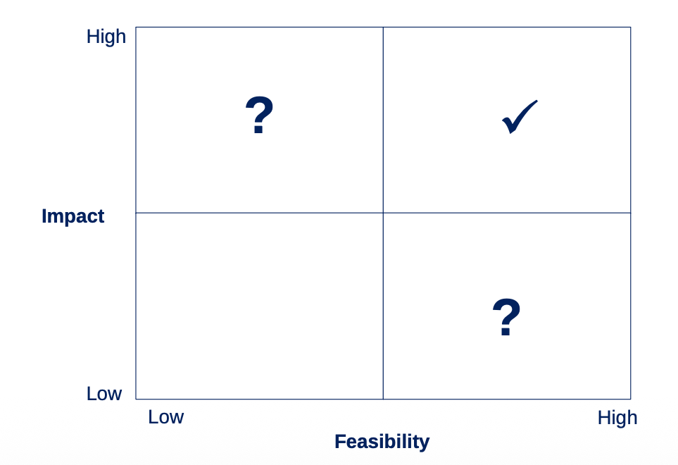

# Formulating Recommendations

## What It Is

Translating VCA findings into actionable, prioritized interventions. Not just "what should change" but "what should change first, for whom, and who pays." A VCA without recommendations is an academic exercise. Recommendations without prioritization are a wish list. The value of VCA work lies in identifying the 2-3 interventions that are both high-impact and feasible for a specific context.

{: .framework-img }

## Why It Matters

Every VCA produces a long list of potential interventions. Donors want to fund something. Governments want to show results. The pressure to recommend everything is strong. But resources are finite, attention is finite, and doing too many things at once usually means doing none of them well. Prioritization is the discipline that separates useful analysis from generic consulting.

## How to Do It

1. **Generate candidate interventions from each stage of the analysis.**
   - From the Map: Are there missing actors or broken linkages? Could a new channel be created?
   - From the Breakdown: Where are margins concentrated? Where are costs excessive? Is the farmer share appropriate for the level of service provided?
   - From the Benchmark: Where does this country underperform peers? What are peers doing differently?

   Four generic recommendations appear in almost every coffee VCA:
   - Help smallholders improve quality and productivity
   - Transfer a higher share of the export price to the farmer
   - Export roasted coffee direct to consumers
   - Boost local coffee consumption

2. **Plot on the impact-feasibility matrix.** A 2x2 grid:
   - High impact + High feasibility = priority (do this first)
   - High impact + Low feasibility = worth pursuing but harder
   - Low impact + High feasibility = easy wins, limited value
   - Low impact + Low feasibility = don't bother

   Where each recommendation lands depends entirely on country context:
   - "Transfer higher share to farmer" is LOW priority in Vietnam (already 95%) but HIGH priority in Rwanda (~54%)
   - "Boost local consumption" is feasible in Colombia (strong domestic market, Juan Valdez brand) but very low feasibility in Rwanda (98% of coffee is exported, tiny domestic market)
   - "Export roasted coffee" is high impact everywhere but low feasibility everywhere — roasting infrastructure, quality control, and market access are massive barriers

3. **Segment by producer type.** What works for a 5-hectare commercial farm in Vietnam (with irrigation and direct access to traders) will not work for a 0.1-hectare subsistence farm in Rwanda (coffee grown on a hillside alongside beans and bananas). Different farm types need different interventions:
   - Subsistence smallholders: basic agronomy training, access to inputs, guaranteed purchase
   - Semi-commercial farmers: quality improvement, cooperative strengthening, certification
   - Commercial farms: market diversification, environmental sustainability, value addition

4. **Sequence: what is the first move?** Even among high-priority recommendations, some must precede others. You cannot improve coffee quality if farmers lack basic inputs. You cannot strengthen cooperatives if they do not exist yet. Identify prerequisites and logical ordering.

## Common Mistakes

1. **Recommending things that require actors to behave against their economic interest.** "Middlemen should accept lower margins" is not a recommendation — it is a fantasy. If middlemen earn thin margins (as in Vietnam, where collector margins are <1%), there is nothing to compress. If they earn large margins, ask why: is it market power, or is it compensation for real risk and cost (transport, storage, credit provision)?

2. **Confusing "would be nice" with "is feasible given institutional capacity."** Exporting roasted coffee direct to consumers sounds great. But it requires roasting equipment, quality control labs, export packaging, food safety certification, international marketing, and distribution contracts with retailers in consuming countries. In a country that struggles to maintain rural roads, this is not a near-term recommendation.

3. **One-size-fits-all recommendations across different producer segments.** "Improve farmer productivity" means completely different things for a Brazilian estate with 500 hectares and a Rwandan hillside farm with 0.1 hectares. Specify who the recommendation targets, what it involves for them, and what scale of impact is realistic.

4. **Ignoring who pays for the intervention.** Every recommendation has a cost. Farmer training costs money — who runs it and who funds it? Price transparency platforms cost money — who builds and maintains them? Cooperative strengthening costs money — who provides the technical assistance? If your recommendation does not include a realistic funding mechanism, it is incomplete.

5. **Recommendations that do not connect back to specific findings from the analysis.** If your benchmarking showed that yields are the primary gap, but your recommendations focus on price transparency, there is a disconnect. Every recommendation should trace directly to a finding from the Map, Breakdown, or Benchmark step. If you cannot point to the evidence, the recommendation is not grounded.
